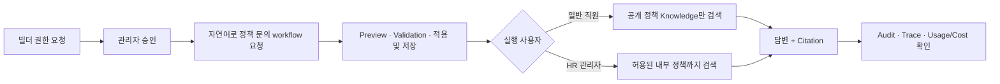
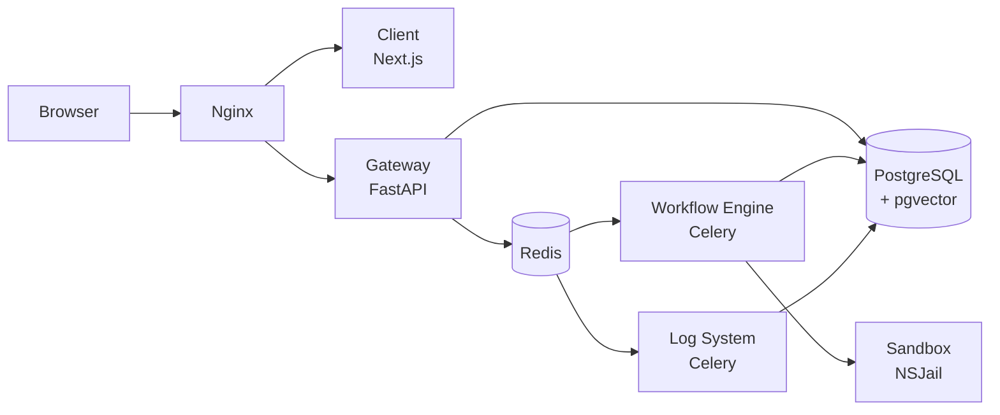

<div align="center">


# Nodease

**기업 내부 AI workflow를 자연어로 설계하고, 권한 있는 사내 지식과 연결하며,  
실행 비용과 감사 이력을 함께 운영하는 AI workflow/LLMOps 플랫폼**

[](./LICENSE)
[](https://www.python.org/)
[](https://nextjs.org/)
[](https://docs.docker.com/compose/)

[핵심 가치](#핵심-가치) · [대표 데모](#대표-데모-사내-정책-문의-자동화) · [Quick Start](#quick-start) · [Architecture](#architecture) · [Documentation](#documentation) · [Issues](https://github.com/nodease/mbased/issues)

</div>

---

## Nodease란?

Nodease는 사내 여러 팀이 AI workflow를 만들고 실행하고 배포할 수 있게 하는 기업 내부 플랫폼입니다. 기존의 시각적 workflow builder와 runtime 위에 자연어 기반 Agent Builder, Organization/Team 단위 RBAC, 권한 기반 RAG, Audit/Trace, LLM 사용량·비용 관측을 결합합니다.

목표는 AI workflow를 단순히 **만드는 도구**에서 권한·근거·비용을 함께 관리할 수 있는 **운영 가능한 플랫폼**으로 확장하는 것입니다.

> [!NOTE]
> Nodease는 Krafton Jungle 11기에서 개발한 [moduly](https://github.com/jungle-scope/moduly)를 기반으로 작업한 프로젝트입니다.

## 핵심 가치

| 가치                             | Nodease가 제공하는 방식                                                                                          |
| -------------------------------- | ---------------------------------------------------------------------------------------------------------------- |
| **자연어로 시작하는 자동화**     | Agent Builder가 업무 설명을 workflow 초안으로 만들고, 사용자가 Preview와 validation 결과를 확인한 뒤 저장합니다. |
| **권한을 지키는 사내 지식 활용** | 실행 사용자가 접근할 수 있는 Knowledge Base만 RAG 검색 후보와 citation에 포함합니다.                             |
| **근거가 남는 운영**             | 주요 행위와 node 실행을 Audit·Trace로 연결하고, 일반 조회에는 visibility·redaction 정책을 적용합니다.            |
| **비용을 아는 LLMOps**           | workflow와 LLM node의 token, 비용, latency를 관측하고 동일 입력 기반 후보 설정을 비교합니다.                     |

## 대표 데모: 사내 정책 문의 자동화

사내 정책이 바뀌어 같은 문의가 반복되는 상황을 가정합니다. 빌더는 자연어로 정책 문의 workflow를 만들고, 일반 직원과 HR 관리자는 동일한 질문을 실행합니다. Nodease는 각 사용자가 접근할 수 있는 Knowledge만 검색하기 때문에 답변 근거와 citation 범위가 역할에 따라 달라집니다.



일반 직원의 답변과 trace에는 권한이 없는 내부 문서의 이름·내용·정확한 차단 건수를 노출하지 않습니다. 최종 정책 판단과 예외 승인은 담당자가 수행합니다.

## 현재 구현 기능

| 영역                               | 현재 제공 범위                                                                                                                                          | 상태 |
| ---------------------------------- | ------------------------------------------------------------------------------------------------------------------------------------------------------- | :--: |
| **Workflow Builder & Runtime**     | 시각적 graph 편집, 테스트 실행, 배포, 수동·Schedule·Webhook·API 실행 경로                                                                               | 제공 |
| **Workflow Node**                  | Start, Webhook, Schedule, LLM, Workflow, Code, Condition, File/Variable Extraction, Answer, Loop, HTTP, Slack, Template, GitHub, Mail 등 16개 구현 node | 제공 |
| **Agent Builder**                  | 자연어 요청, 15개 node type 기반 초안, 읽기 전용 Preview, connection validation, 적용 및 저장                                                           | 제공 |
| **Organization & RBAC**            | Organization/Team membership, 역할, team·user direct permission, App 생성 권한 신청·승인                                                                | 제공 |
| **Knowledge & RAG**                | Knowledge Base 생성, 문서 업로드·색인, metadata-aware·hierarchical retrieval, citation, 권한 경계                                                       | 제공 |
| **Audit & Trace**                  | Audit 검색, workflow/node trace, correlation, payload visibility·redaction, 민감 trace 접근 기록                                                        | 제공 |
| **Usage, Budget & Cost Optimizer** | LLM token·비용·latency, workflow 월 예산, LLM node baseline/후보 A/B 비교와 검증 후 적용                                                                | 제공 |
| **LLM Provider**                   | OpenAI, Anthropic, Google credential과 model 연결                                                                                                       | 제공 |

Agent Builder가 지원하는 15개 node type에는 외부 action node도 포함되지만, credential과 대상 resource 같은 미해결 설정은 사용자가 확인해야 합니다. Preview와 `적용 및 저장` 단계는 workflow 실행, Knowledge retrieval, Slack 전송 등 외부 side effect를 수행하지 않습니다.

## 현재 경계와 Roadmap

Nodease는 활발히 개발 중입니다. 아래 항목은 현재 제공 기능과 구분해 설명합니다.

- Mail node는 IMAP 기반 메일 **검색** 기능입니다. 메일 도착 event trigger, Gmail 답장 초안 생성과 자동 발송 기능이 아닙니다.
- 자동 외부 지식 수집, 운영 수준의 Source ACL 동기화와 Collection routing 전체 경계는 계속 확장 중입니다.
- Knowledge Skill과 외부 IdP 기반 SSO는 목표 기능이며 현재 제공 기능으로 설명하지 않습니다.
- 배포 전에는 [아키텍처의 알려진 리스크](./docs/architecture.md#5-알려진-리스크)를 검토하고, secret·outbound egress·원문 payload 정책을 환경에 맞게 확정해야 합니다.

## Architecture

다음은 통합 컨테이너 실행 기준의 논리 구조입니다.



| 경로                                    | 책임                                                                         |
| --------------------------------------- | ---------------------------------------------------------------------------- |
| `apps/client/`                          | Next.js UI. Workflow 편집, Knowledge, RBAC, Admin·observability 화면         |
| `apps/gateway/`                         | FastAPI 진입점. 인증, organization context와 resource permission enforcement |
| `apps/workflow_engine/`                 | Celery 기반 workflow 실행과 node runtime                                     |
| `apps/log_system/`                      | Audit·Trace·log 계열 비동기 처리                                             |
| `apps/shared/`                          | DB model, schema, permission, LLM client, RAG와 tracing 공통 계층            |
| `apps/sandbox/`                         | NSJail 기반 Python code 실행 격리                                            |
| `docker/`, `dev/`, `infra/`, `scripts/` | 통합 컨테이너, 로컬 개발, Kubernetes/Helm과 운영 script                      |

자세한 서비스 경계와 요청 흐름은 [Architecture 문서](./docs/architecture.md)를 기준으로 합니다.

## Tech Stack

| 영역           | 기술                                                                                |
| -------------- | ----------------------------------------------------------------------------------- |
| Frontend       | Next.js 16, React 19, TypeScript, Tailwind CSS, React Flow                          |
| Gateway        | Python 3.11, FastAPI, SQLAlchemy                                                    |
| Runtime        | Celery, Redis                                                                       |
| Database       | PostgreSQL, pgvector                                                                |
| LLM/RAG        | OpenAI·Anthropic·Google client, document ingestion, metadata/hierarchical retrieval |
| Sandbox        | NSJail                                                                              |
| Infrastructure | Docker Compose, Kubernetes, Helm, Terraform                                         |
| Test           | pytest, Vitest, ESLint, Next.js build                                               |

## Quick Start

통합 Docker Compose는 Client, Gateway, Workflow Engine, Log System, PostgreSQL, Redis, Sandbox와 Nginx를 함께 실행합니다.

### Prerequisites

- Git
- Docker Engine 또는 Docker Desktop
- Docker Compose v2
- 로컬 포트 `80`, `5432`, `6379`, `8194`, `3128` 사용 가능

### 1. 저장소와 환경파일 준비

```bash
git clone https://github.com/nodease/mbased.git
cd mbased
cp docker/.env.example docker/.env
```

`docker/.env`에서 다음 값을 각각 안전한 랜덤 값으로 설정합니다.

| 변수             | 요구 형식                               |
| ---------------- | --------------------------------------- |
| `SECRET_KEY`     | 충분히 긴 무작위 문자열                 |
| `MASTER_KEY`     | Base64로 인코딩한 32바이트 키           |
| `ENCRYPTION_KEY` | Fernet 호환 URL-safe Base64 32바이트 키 |

키는 재시작 후에도 동일한 값을 유지해야 합니다. `.env` 파일과 secret 원문을 Git, 문서, log에 커밋하지 마세요. 로컬 파일 저장은 기본값인 `STORAGE_TYPE=LOCAL`을 사용할 수 있습니다.

### 2. 실행

```bash
docker compose \
  --env-file docker/.env \
  -f docker/docker-compose.yml \
  up -d --build

docker compose \
  --env-file docker/.env \
  -f docker/docker-compose.yml \
  ps
```

- Web UI: [http://localhost](http://localhost)
- API health: [http://localhost/api/v1/health](http://localhost/api/v1/health)

### 3. 종료

```bash
docker compose \
  --env-file docker/.env \
  -f docker/docker-compose.yml \
  down
```

위 명령은 container를 종료하지만 named volume의 데이터는 유지합니다.

## Development

host 기반 개발 환경에서는 PostgreSQL, Redis, pgAdmin과 Sandbox를 Docker로 실행하고, Client·Gateway·Celery worker는 host process로 실행합니다.

### Prerequisites

- Python 3.11.x
- Node.js 20.9 이상과 npm
- Docker Compose v2
- Bash

### Setup & Run

```bash
cp dev/.env.example .env
# .env의 SECRET_KEY, MASTER_KEY, ENCRYPTION_KEY를 안전한 값으로 설정합니다.

./scripts/setup.sh
./scripts/dev.sh
```

| Service  | URL                                                      |
| -------- | -------------------------------------------------------- |
| Client   | [http://localhost:3000](http://localhost:3000)           |
| Gateway  | [http://localhost:8000](http://localhost:8000)           |
| API Docs | [http://localhost:8000/docs](http://localhost:8000/docs) |
| Sandbox  | [http://localhost:8194](http://localhost:8194)           |
| pgAdmin  | [http://localhost:5050](http://localhost:5050)           |

`Ctrl+C`로 host process와 개발용 Compose 서비스를 함께 종료합니다.

## Testing

Backend, Shared, Workflow Engine, Log System, Sandbox와 Client build를 포함한 저장소 검증:

```bash
./scripts/test.sh
```

Client lint, unit test와 production build는 별도로 실행합니다.

```bash
cd apps/client
npm run lint
npm run test
npm run build
```

## Kubernetes / Helm

Kubernetes와 Helm 자산은 `infra/helm/moduly/`에 있습니다. 이 경로와 일부 resource name은 기존 Moduly 식별자를 유지합니다.

현재 chart는 환경별 image registry, ingress, database, storage와 secret 구성이 필요합니다. 따라서 범용 Quick Start가 아니라 배포 환경에 맞춰 검토해야 하는 고급 배포 자산으로 취급합니다.

## Documentation

| 문서                                                 | 설명                                             |
| ---------------------------------------------------- | ------------------------------------------------ |
| [Documentation Index](./docs/README.md)              | 활성 문서의 구조와 우선순위                      |
| [Product Requirements](./docs/PRD.md)                | 제품 목표, 사용자와 범위                         |
| [Architecture](./docs/architecture.md)               | 서비스 경계, 실행·배포 구조와 알려진 리스크      |
| [Data Model](./docs/data_model.md)                   | DB model, relation과 permission 정책             |
| [Glossary](./docs/glossary.md)                       | Nodease 공통 용어                                |
| [Architecture Decisions](./docs/decisions/README.md) | Accepted ADR과 현재 코드 적용 기준               |
| [Feature Specifications](./docs/features/)           | 기능별 requirements, API, component와 test cases |

문서가 충돌하면 Accepted ADR → PRD → Architecture → Data Model → feature 문서 순으로 판단하며, 현재 구현을 설명할 때는 실제 코드와 테스트를 함께 확인합니다.

## License

이 프로젝트는 [MIT License](./LICENSE)를 따릅니다.

---

<div align="center">
  Nodease — Build AI workflows. Govern knowledge. Trace every run.
</div>
