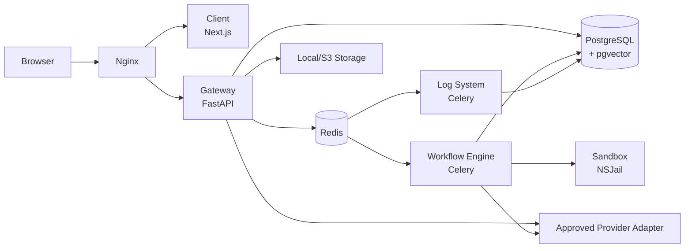

<div align="center">


# Nodease

**자연어로 AI workflow를 만들고, 권한 있는 사내 지식과 연결하며,<br/>
실행 근거와 비용까지 운영하는 기업용 AI workflow/LLMOps 플랫폼**

[](./LICENSE)
[](https://www.python.org/)
[](https://nextjs.org/)
[](https://docs.docker.com/compose/)

[핵심 기능](#핵심-기능) · [진행 중인 설계와 구현](#진행-중인-설계와-구현) · [Quick Start](#quick-start) · [Architecture](#architecture) · [Documentation](#documentation)

</div>

---

## Nodease란?

Nodease는 사내 여러 팀이 AI workflow를 생성·편집·실행·배포하고, Organization과 Team 권한 안에서 Knowledge/RAG, 외부 연동, LLM credential, Audit/Trace, 사용량과 비용을 함께 운영하도록 돕는 플랫폼입니다.

자연어 Agent Builder와 시각적 Workflow Editor를 하나의 저장 계약으로 연결하고, 실행 시점에는 Gateway와 Workflow Runtime이 권한·credential·외부 연동 준비 상태를 다시 검증합니다. 목표는 AI workflow를 단순히 만드는 도구에서 **권한, 근거, 비용과 운영 책임이 함께 남는 플랫폼**으로 확장하는 것입니다.

> [!NOTE]
> Nodease는 Krafton Jungle 11기에서 개발한 [moduly](https://github.com/jungle-scope/moduly)를 기반으로 발전시킨 프로젝트입니다. 제품과 새 문서는 Nodease 명칭을 사용하지만 일부 코드, Docker/Helm resource와 database identifier에는 호환을 위해 `Moduly` 명칭이 남아 있습니다.

## 핵심 가치

| 가치 | Nodease가 제공하는 방식 |
| --- | --- |
| **자연어로 시작하는 자동화** | Agent Builder가 자연어 요청을 typed `GraphMutation`으로 변환해 실제 Editor에 반영하고 CAS 방식으로 저장합니다. |
| **권한을 지키는 사내 지식 활용** | 실행 주체가 접근할 수 있는 Collection과 Knowledge Base만 검색 후보로 만들고, 최종 evidence를 다시 검증합니다. |
| **안전한 외부 업무 연동** | Mail처럼 resolver가 도입된 경로는 credential을 opaque reference로 연결하고 실행·배포 전에 configuration preflight를 수행합니다. Slack·GitHub의 legacy direct-secret graph field는 아직 전환 대상입니다. |
| **근거가 남는 운영** | 주요 행위, workflow/node 실행, correlation과 민감 payload 접근을 Audit·Trace 정책으로 기록합니다. |
| **비용을 아는 LLMOps** | LLM token, 비용, latency와 예산을 관측하고 후보 설정을 동일 입력으로 비교·검증합니다. |

## 대표 활용 흐름: 권한 기반 사내 정책 문의

사용자는 자연어로 정책 문의 workflow를 만들고, 실행자는 자신의 권한 범위에서만 사내 지식을 검색합니다. 권한 없는 문서는 검색 후보, 답변, citation과 일반 trace에 노출하지 않습니다.

```mermaid
flowchart LR
    A["자연어 요청"] --> B["Typed GraphMutation"]
    B --> C["Editor 적용 · CAS 저장"]
    C --> D["Knowledge·모델·parameter 확인"]
    D --> E["실행·배포 Preflight"]
    E --> F["Execution Subject 확정"]
    F --> G["Collection route · KB use 권한 확인"]
    G --> H["검색 · Final Evidence Gate"]
    H --> I["답변 · Citation"]
    I --> J["Audit · Trace · Usage/Cost"]
```



Workflow 생성과 설정 확인 단계에서는 Knowledge retrieval, Slack 전송, Gmail 초안 생성 같은 외부 부수효과를 실행하지 않습니다. 실제 test/run/deployment 경계에서 서버가 최신 권한과 configuration을 다시 검증합니다.

## 핵심 기능

| 영역 | 현재 제공 범위 | 공식 문서 |
| --- | --- | --- |
| **Workflow Builder & Runtime** | React Flow 기반 graph 편집, CAS 저장, test 실행, deployment, 수동·Webhook·API 실행과 배포 profile에서 활성화한 Schedule 실행 | [Workflow](./docs/features/workflow/requirements.md) |
| **Workflow Node** | Start부터 Gmail Draft·Mail Acknowledge까지 canonical catalog 기준 18개 실행 node | [Node Catalog ADR](./docs/decisions/ADR-0024-agent-builder-node-capability-catalog.md) · [Mail 처리 확장 ADR](./docs/decisions/ADR-0032-mail-processing-gmail-draft-idempotency.md) |
| **Agent Builder** | 자연어를 typed GraphMutation과 ParameterTask로 변환하고 Editor 적용·CAS 저장·acknowledgement로 연결 | [Agent Builder](./docs/features/agent-builder/requirements.md) |
| **Organization & RBAC** | active organization, Organization/Team membership, 역할, team·user direct permission과 resource action 강제 | [Organization](./docs/features/organization/requirements.md) |
| **Knowledge & RAG** | 1문서·source item 단위 Knowledge Base, Knowledge Collection, versioned ingestion, metadata/hierarchical retrieval, permission과 citation | [Knowledge](./docs/features/knowledge/requirements.md) |
| **LLM & Mail Credentials** | OpenAI·Anthropic·Google model 연결, organization-scoped Mail credential reference와 versioned encryption keyring | [LLM Credentials](./docs/features/llm-credentials/requirements.md) · [Mail Credentials](./docs/features/mail-credentials/requirements.md) |
| **External Actions** | HTTP, Slack, GitHub, Mail 검색, Gmail 답장 초안과 terminal acknowledgement. unresolved 설정은 실행·활성 배포 전에 차단 | [Workflow](./docs/features/workflow/component_spec.md) |
| **Audit, Trace & Security Alert** | Audit 검색, workflow/node trace, request correlation, visibility·redaction과 audit 기반 보안 알림 | [Audit/Tracing](./docs/features/audit-tracing/requirements.md) · [Security Alert](./docs/features/security-alert/requirements.md) |
| **Usage, Budget & Cost Optimizer** | LLM token·비용·latency, workflow 월 예산, baseline/candidate 비교와 검증 후 적용 | [Budget](./docs/features/budget-management/requirements.md) · [Cost Optimizer](./docs/features/cost-optimizer/requirements.md) |
| **Deployment & Preflight** | immutable deployment snapshot, 권한·credential·외부 node configuration 검증, schedule admission | [Deployment](./docs/features/deployment/requirements.md) |

### Workflow node 지원 범위

ADR-0024의 catalog baseline에 ADR-0032의 Gmail Draft·Mail Acknowledge 확장을 반영한 현재 canonical catalog에서 실행 가능한 node는 다음 18개입니다.

`Start`, `Webhook`, `Schedule`, `LLM`, `Workflow`, `Code`, `Condition`, `File Extraction`, `Variable Extraction`, `Answer`, `Loop`, `HTTP`, `Slack`, `Template`, `GitHub`, `Mail`, `Gmail Draft`, `Mail Acknowledge`

Agent Builder는 이 중 `Loop`를 제외한 17개 node type을 지원합니다. `pluginNode`는 catalog에 예약된 목표 type이지만 아직 구현 기능이 아닙니다. Credential, Knowledge, channel이나 외부 대상이 해결되지 않은 graph는 draft로 저장할 수 있지만 test, run, active deployment와 schedule dispatch는 서버 preflight에서 fail-closed합니다.

### Agent Builder 현재 계약

현재 제품 경로는 Legacy Preview session이나 별도 draft store를 사용하지 않습니다.

1. Gateway가 자연어 요청과 server-side context로 typed `GraphMutation`을 생성합니다.
2. Client가 실제 Workflow Editor에 구조 변경을 적용합니다.
3. 서버의 canonical draft service가 `graph_hash`와 `updated_at`을 사용해 CAS 저장합니다.
4. Knowledge와 configurable parameter는 card별로 확인·수정하고 acknowledgement를 남깁니다.
5. 필수 설정이 완료된 graph만 test, run과 deployment preflight를 통과할 수 있습니다.

## 진행 중인 설계와 구현

아래 항목은 Linear에서 `In Progress`인 목표 계약입니다. 현재 제공 기능으로 간주하지 않습니다.

| 영역 | 예정 범위 | 상태 |
| --- | --- | --- |
| **Agent Builder 생성 모드** | 동일한 GraphMutation/CAS 경계 위에 `guided_generate`, eligibility를 통과한 `quick_generate`, `structure_only`를 제공. Legacy Preview는 복구하지 않음 | [MBA-293](https://linear.app/yoonki1207/issue/MBA-293/architectureproductagent-builder-빠른-생성단계별-생성-계약-확정) |
| **Agent Builder Knowledge 선택** | route/use two-gate를 유지하는 Collection·KB 계층 picker와 결정적 ranking 정책 | [MBA-294](https://linear.app/yoonki1207/issue/MBA-294/agent-builderknowledge-계층형-collectionkb-선택-및-랭킹-정책-분리) |
| **Knowledge ingestion 신뢰성** | HTTP process와 분리된 durable ingestion job, lease, retry, idempotency와 stuck job 복구 | [MBA-288](https://linear.app/yoonki1207/issue/MBA-288/reliabilityknowledge-document-processsync-durable-ingestion-dispatch) |
| **RAG 평가** | Flat·Hierarchical RAG의 품질, latency와 비용을 동일 데이터로 비교하는 재현 가능한 benchmark | [MBA-279](https://linear.app/yoonki1207/issue/MBA-279/qarag-flathierarchical-rag-동일-데이터-비교-벤치마크-및-시각화) |
| **LLMOps 실행 근거** | 실행 로그에서 실제 선택 모델, routing 근거, 비용 차이와 최근 품질 평가를 함께 표시 | [MBA-242](https://linear.app/yoonki1207/issue/MBA-242/llmopsobservability-실행-로그에-모델-라우팅-근거와-비용품질-비교-표시) |
| **AI 업무 메일 비서 E2E** | 자연어 graph 생성과 Schedule → Mail → Knowledge-backed LLM → Condition → Gmail Draft/Slack → acknowledgement 시나리오 통합 검증 | [MBA-208](https://linear.app/yoonki1207/issue/MBA-208/agent-builder-ai-업무-메일-비서-시나리오-계약-및-e2e-선행-조건-보강) · [MBA-215](https://linear.app/yoonki1207/issue/MBA-215/workflowmail-ai-업무-메일-비서-실행-준비-및-e2e-검증) |
| **Deployment secret lifecycle** | 일반 조회에서 secret 원문을 분리하고 one-time issuance 또는 rotation 경계로 수렴 | [MBA-247](https://linear.app/yoonki1207/issue/MBA-247/securityappdeployment-auth-secret-조회-응답-제거-및-rotation-계약) |

## Architecture

다음은 통합 컨테이너 실행 기준의 논리 구조입니다.



| 경로 | 책임 |
| --- | --- |
| `apps/client/` | Next.js UI. Workflow Editor, Knowledge, RBAC, Admin과 observability 화면 |
| `apps/gateway/` | 인증 API 진입점. active organization과 resource permission enforcement, application composition |
| `apps/workflow_engine/` | Celery 기반 workflow 실행, node runtime과 실행 시점 재검증 |
| `apps/log_system/` | Audit·Trace·Security Alert·log 계열 비동기 처리 |
| `apps/shared/` | DB model, schema, domain, permission, credential, RAG와 tracing 공통 계층 |
| `apps/sandbox/` | NSJail 기반 Python code 실행 격리 |
| `docs/` | PRD, architecture, data model, ADR와 feature source of truth |
| `tests/` | 공통 DB/service 테스트, RAG evaluation과 load test 도구 |
| `docker/`, `dev/`, `infra/`, `scripts/` | 통합 컨테이너, 로컬 개발, Kubernetes/Helm과 운영 script |

상세 서비스 경계와 current/target 구분은 [Architecture](./docs/architecture.md)를 기준으로 합니다.

## Tech Stack

| 영역 | 기술 |
| --- | --- |
| Frontend | Next.js 16, React 19, TypeScript, Tailwind CSS, React Flow |
| Gateway | Python 3.11, FastAPI, SQLAlchemy |
| Runtime | Celery, Redis |
| Database | PostgreSQL, pgvector |
| LLM/RAG | OpenAI·Anthropic·Google client, versioned ingestion, metadata/hierarchical retrieval |
| Sandbox | NSJail |
| Infrastructure | Docker Compose, Kubernetes, Helm, Terraform |
| Test | pytest, Vitest, ESLint, Next.js build |

## Quick Start

통합 Docker Compose는 Client, Gateway, Workflow Engine, Log System, PostgreSQL, Redis, Sandbox, Nginx와 outbound proxy를 함께 실행합니다.

### Prerequisites

- Git
- Docker Engine 또는 Docker Desktop
- Docker Compose v2
- 로컬 포트 `80`, `5432`, `6379`, `8194`, `3128` 사용 가능

### 1. 저장소와 환경 파일 준비

```bash
git clone https://github.com/nodease/mbased.git
cd mbased
cp docker/.env.example docker/.env
```

`docker/.env`의 주석과 형식을 기준으로 secret을 저장소 밖에서 생성해 설정합니다.

| 변수 | 용도 |
| --- | --- |
| `SECRET_KEY` | 인증 token 서명 |
| `MASTER_KEY` | 예약·legacy 설정. 현재 Docker Gateway와 LLM credential의 `encrypted_config` 암호화에는 연결되지 않음 |
| `ENCRYPTION_KEY` | 현재 shared·legacy 암호화 경로에 필요한 Fernet 호환 URL-safe Base64 32바이트 key. Mail keyring이 비어 있을 때 `v1` fallback으로도 사용 |
| `MAIL_CREDENTIAL_ENCRYPTION_KEYS` | Mail credential용 JSON keyring. 예: `{"v1":"<Fernet-key>"}` |
| `MAIL_CREDENTIAL_ACTIVE_KEY_VERSION` | 새 Mail credential을 암호화할 active key version. JSON keyring에 같은 version이 반드시 존재해야 함 |

실제 key, token, credential과 `.env` 파일을 Git, 문서, log에 남기지 마세요. 로컬 파일 저장은 `STORAGE_TYPE=LOCAL`을 사용할 수 있습니다.

현재 shared·legacy 암호화 경로를 위해 다음 명령으로 Fernet key를 생성하고 `ENCRYPTION_KEY=<생성한-key>`를 설정합니다. 생성 결과는 secret storage에 보관하고 문서, Git이나 공유 log에 복사하지 않습니다.

```bash
docker run --rm python:3.11-slim python -c "import base64,secrets; print(base64.urlsafe_b64encode(secrets.token_bytes(32)).decode())"
```

Mail credential은 다음 중 한 방식으로 구성합니다.

- 호환 방식: `MAIL_CREDENTIAL_ENCRYPTION_KEYS`를 비워 두면 위 `ENCRYPTION_KEY`를 `v1` key로 사용합니다.
- Versioned 방식: 별도 Fernet key를 생성해 `MAIL_CREDENTIAL_ENCRYPTION_KEYS={"v1":"<Mail-Fernet-key>"}`와 `MAIL_CREDENTIAL_ACTIVE_KEY_VERSION=v1`을 설정합니다. Rotation 중에는 기존 row를 복호화할 구 key도 JSON에 유지하고 Gateway와 Workflow Worker에 동일한 keyring을 주입합니다.

> [!WARNING]
> 현재 LLM credential의 `encrypted_config`는 이름과 달리 config JSON을 평문으로 저장합니다. `MASTER_KEY`를 설정해도 이 저장 경로가 암호화되지는 않으므로 운영·공유 DB에 실제 provider key를 넣지 말고 [Data Model의 알려진 차이](./docs/data_model.md#llm_credentials)를 확인합니다.

### 2. 실행

```bash
# 이미지를 먼저 준비합니다.
docker compose \
  --env-file docker/.env \
  -f docker/docker-compose.yml \
  build

# Gateway와 그 의존성만 먼저 시작하고 migration·readiness 완료를 기다립니다.
docker compose \
  --env-file docker/.env \
  -f docker/docker-compose.yml \
  up -d --wait gateway

# Schema가 준비된 뒤 Workflow/Log worker와 나머지 서비스를 시작합니다.
docker compose \
  --env-file docker/.env \
  -f docker/docker-compose.yml \
  up -d

docker compose \
  --env-file docker/.env \
  -f docker/docker-compose.yml \
  ps
```

Docker Gateway entrypoint는 시작 전에 Alembic migration을 `heads`까지 적용합니다. 첫 기동에서 Gateway와 worker를 동시에 시작하면 worker의 schema readiness 검사가 migration보다 먼저 실행될 수 있으므로 위 순서를 유지합니다.

> [!IMPORTANT]
> `docker/.env.example`은 안전을 위해 `SCHEDULE_DISPATCH_MODE=disabled`를 기본값으로 사용합니다. 이 상태에서는 Schedule node를 편집·배포할 수 있어도 신규 schedule claim과 dispatch는 실행되지 않습니다. `claim` 활성화는 Gateway와 Workflow Worker의 동일 설정, migration/readiness, rollback을 함께 맞추는 coordinated rollout이므로 [Deployment 요구사항](./docs/features/deployment/requirements.md)을 확인한 뒤 적용합니다.

- Web UI: [http://localhost](http://localhost)
- API health: [http://localhost/api/v1/health](http://localhost/api/v1/health)

첫 접속 후 계정을 만들고 Organization을 생성하거나 초대받은 Organization을 선택합니다. Docker-only Quick Start는 demo seed를 자동 구성하지 않으며 Gateway image에도 host용 seed script가 포함되지 않습니다. 시연용 데이터가 필요하면 먼저 아래 Development 설정으로 host Python environment를 준비한 뒤 [Local Demo DB 절차](./docs/demo/local-demo-db.md)를 사용합니다.

### 3. 종료

```bash
docker compose \
  --env-file docker/.env \
  -f docker/docker-compose.yml \
  down
```

위 명령은 container를 종료하지만 named volume의 데이터는 유지합니다.

## Development

Host 개발은 PostgreSQL, Redis, pgAdmin과 Sandbox를 Docker로 실행하고 Client·Gateway·Celery worker와 Celery Beat를 host process로 실행합니다. `scripts/*.sh`는 Bash 환경을 전제로 하며 Windows에서는 Git Bash를 사용할 수 있습니다.

### Prerequisites

- Python 3.11.x
- Node.js 20.9 이상과 npm
- Docker Compose v2
- Bash

### 1. 환경과 의존성

```bash
cp dev/.env.example .env
# .env의 필수 secret과 사용할 provider 설정을 안전한 값으로 구성합니다.
./scripts/setup.sh
```

`dev/.env.example`의 Redis 설정은 host process용 `localhost`를 사용합니다. Container 내부 DNS 이름 `redis`가 필요한 통합 Docker 실행은 별도의 `docker/.env.example`과 Compose 설정을 사용합니다.

### 2. 개발 DB 시작과 Migration

`scripts/setup.sh`는 Docker 서비스를 시작하지 않고, `scripts/dev.sh`는 오래된 schema를 자동 보정하지 않습니다. 먼저 PostgreSQL을 시작하고 healthcheck 완료를 기다린 뒤 Alembic revision을 최신 상태로 맞춥니다.

```bash
docker compose -f dev/docker-compose.yml up -d --wait --wait-timeout 90 postgres
```

Windows:

```bash
cd apps/shared
../gateway/.venv/Scripts/python.exe -m alembic upgrade heads
cd ../..
```

Linux/macOS:

```bash
cd apps/shared
../gateway/.venv/bin/python -m alembic upgrade heads
cd ../..
```

Demo seed는 선택 사항입니다. `Base.metadata.create_all()`은 기존 table에 새 column을 추가하지 않으므로 migration을 대신하지 않습니다. 자세한 reset·seed 명령은 [Local Demo DB](./docs/demo/local-demo-db.md)를 따릅니다.

### 3. 실행

```bash
./scripts/dev.sh
```

| Service | URL |
| --- | --- |
| Client | [http://localhost:3000](http://localhost:3000) |
| Gateway | [http://localhost:8000](http://localhost:8000) |
| API Docs | [http://localhost:8000/docs](http://localhost:8000/docs) |
| Sandbox | [http://localhost:8194](http://localhost:8194) |
| pgAdmin | [http://localhost:5050](http://localhost:5050) |

`Ctrl+C`로 host process와 개발용 Compose 서비스를 함께 종료합니다.

## Testing

먼저 변경 도메인의 관련 테스트를 실행하고, 공유 경계나 권한·schema를 변경했을 때만 범위를 넓힙니다. 전체 회귀는 필요한 경우 PR 직전에 한 번 실행합니다.

`scripts/setup.sh`는 runtime dependency만 설치합니다. Backend pytest를 실행하기 전 각 test runner venv에 `dev` extra를 설치합니다.

```bash
# Linux/macOS. Windows에서는 .venv/bin/python을 .venv/Scripts/python.exe로 바꿉니다.
apps/gateway/.venv/bin/python -m pip install -e "apps/gateway[dev]"
apps/log_system/.venv/bin/python -m pip install -e "apps/log_system[dev]"
apps/workflow_engine/.venv/bin/python -m pip install -e "apps/workflow_engine[dev]"
```

Backend·Shared·Workflow Engine·Log System·Sandbox pytest와 Client production build를 실행하는 공통 script:

```bash
./scripts/test.sh
```

이 script의 Client 단계는 `npm run build`만 실행하며 ESLint와 Vitest는 포함하지 않습니다. Client까지 전체 검증으로 보고하려면 아래 Client 명령도 함께 실행합니다.

주요 component 검증:

| Component | Command |
| --- | --- |
| Client | `cd apps/client && npm run lint && npm run test && npm run build` |
| Gateway | `PYTHONPATH=. apps/gateway/.venv/bin/python -m pytest apps/gateway/tests` |
| Workflow Engine | `PYTHONPATH=. apps/workflow_engine/.venv/bin/python -m pytest apps/workflow_engine/tests` |
| Log System | `PYTHONPATH=. apps/workflow_engine/.venv/bin/python -m pytest apps/log_system/tests` |
| Shared | `PYTHONPATH=. apps/workflow_engine/.venv/bin/python -m pytest apps/shared/tests` |
| Sandbox | `PYTHONPATH=. apps/workflow_engine/.venv/bin/python -m pytest apps/sandbox/tests` |

Windows에서는 각 `.venv/bin/python`을 해당 `.venv/Scripts/python.exe`로 바꿉니다. 전체 명령과 변경 범위별 기준은 [AGENTS.md](./AGENTS.md)를 따릅니다.

RAG benchmark와 load test는 일반 회귀에 포함하지 않습니다. 필요한 데이터셋, 실행 서버와 credential을 준비한 뒤 각각 [Evaluation Guide](./tests/evaluation/README.md), [Load Test Guide](./tests/load/README.md)를 사용합니다.

## Security & Data Handling

- Client의 권한 차단은 UX 보조 수단이며, 최종 권한 판단은 Gateway와 Workflow Runtime이 수행합니다.
- API와 runtime은 active organization, execution subject, resource permission과 credential use 권한을 검증합니다.
- API key, token, credential 원문과 decrypted value를 response, Audit, Trace, log와 test fixture에 남기지 않는 것이 원칙입니다. 다만 현재 deployment 생성 응답은 `auth_secret` 원문을 포함할 수 있고 Slack·GitHub legacy node는 direct-secret field를 graph에 저장할 수 있으므로, 해당 응답과 graph를 secret-free로 취급하거나 공유하지 않습니다. 이 예외는 [Architecture의 알려진 리스크](./docs/architecture.md#5-알려진-리스크)에 따른 보안 정렬 대상입니다.
- Raw prompt/completion, Mail body, document content와 connector payload는 허용된 runtime 경계 밖에서 durable metadata로 보존하지 않습니다.
- Generic HTTP, Mail과 Slack은 각 provider/egress 계약을 따릅니다. Knowledge URL preview와 Connector 저장·runtime 경로 등 잔여 위험은 [Architecture의 알려진 리스크](./docs/architecture.md#5-알려진-리스크)를 확인합니다.
- Sandbox network는 기본적으로 차단하며 `SANDBOX_ENABLE_NETWORK`와 배포 NetworkPolicy를 명시적으로 검토합니다.
- Production에서는 local/demo 기본값을 사용하지 않고 secret manager, TLS, CNI/NetworkPolicy와 outbound 정책을 별도로 검증합니다.

공개 `SECURITY.md`나 취약점 접수 채널은 아직 정의되어 있지 않습니다. 민감한 문제를 일반 Issue에 secret이나 재현 credential과 함께 게시하지 마세요.

## Development & Contribution

1. 작업 전에 [AGENTS.md](./AGENTS.md), Accepted ADR과 관련 `docs/features/<feature>/test_cases.md`를 확인합니다.
2. API, UI, 권한, schema 또는 실행 동작을 바꾸면 관련 requirements/API/component/test 문서를 함께 갱신합니다.
3. 구현 전 실패 또는 characterization test를 먼저 만들고, 변경 도메인에 필요한 테스트만 반복 실행합니다.
4. 커밋 메시지는 영어 type과 한국어 내용으로 작성합니다. 예: `docs: 최신 구현 기준 README 갱신`
5. PR 제목에는 `[MBA-숫자]`를 붙이지 않고 `feat:`, `fix:`, `docs:` 같은 type을 사용합니다. Linear 이슈는 PR 본문에서 연결합니다.
6. [공통 PR template](./.github/PULL_REQUEST_TEMPLATE.md)에 변경 범위, 문서 영향과 실행한 테스트를 기록합니다.

## Kubernetes / Helm

Kubernetes와 Helm 자산은 `infra/helm/moduly/`에 있습니다. 이 경로와 일부 resource name은 기존 Moduly 식별자를 유지합니다.

현재 chart는 환경별 image registry, ingress, database, storage, secret, CNI/NetworkPolicy와 outbound 정책 검토가 필요합니다. 범용 Quick Start가 아니라 배포 환경에 맞춰 검증해야 하는 고급 배포 자산으로 취급합니다.

## 현재 경계

- Agent Builder의 현재 구현은 direct-edit 계약입니다. `quick_generate`와 `guided_generate` 제품 모드는 진행 중인 목표 설계이며 Legacy Preview를 복구하지 않습니다.
- Mail 검색, Gmail 답장 초안, acknowledgement와 Slack node 기반은 구현되어 있지만 AI 업무 메일 비서 전체 자연어 생성·provider E2E는 진행 중입니다.
- Knowledge Base는 1개 문서/source item에 대응하고 Collection은 grouping/routing 단위입니다. 자동 외부 source 수집과 모든 Source ACL 동기화 경계가 완료된 것은 아닙니다.
- Knowledge ingestion의 request 이후 durable dispatch와 Flat/Hierarchical 정량 benchmark는 진행 중입니다.
- Knowledge Skill과 외부 IdP 기반 SSO는 목표 기능이며 현재 제공 기능으로 설명하지 않습니다.
- Production release 전에는 [Architecture](./docs/architecture.md)의 알려진 리스크와 관련 ADR을 검토해야 합니다.

## Documentation

| 문서 | 설명 |
| --- | --- |
| [Documentation Index](./docs/README.md) | 활성 문서 구조와 권위 순서 |
| [Product Requirements](./docs/PRD.md) | 제품 목표, 사용자와 범위 |
| [Architecture](./docs/architecture.md) | 서비스 경계, current/target 구조와 알려진 리스크 |
| [Data Model](./docs/data_model.md) | DB model, relation과 permission 정책 |
| [Glossary](./docs/glossary.md) | Nodease 공통 용어 |
| [Architecture Decisions](./docs/decisions/README.md) | Accepted ADR과 구현 기준 |
| [Feature Specifications](./docs/features/) | 기능별 requirements, API, component와 test cases |
| [Demo DB Guide](./docs/demo/local-demo-db.md) | 로컬 demo/test profile, migration과 reset |

문서가 충돌하면 Accepted ADR → PRD → Architecture → Data Model → feature requirements/API/component/test 순으로 판단합니다. 현재 구현 상태를 설명할 때는 실제 코드와 테스트도 함께 확인합니다.

## License

이 프로젝트는 [MIT License](./LICENSE)를 따릅니다.

---

<div align="center">
  Nodease - Build AI workflows. Govern knowledge. Trace every run.
</div>
