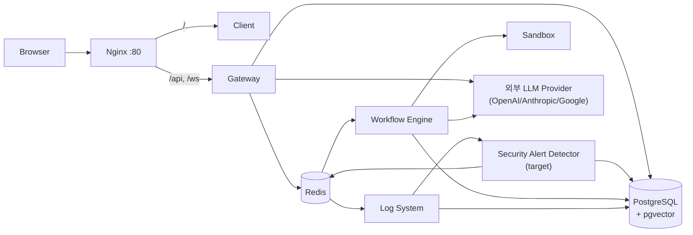

# Architecture

Status: Draft
시스템 구조, 인증 방식, 배포 구조, 외부 연동을 정의한다. 권한/감사 결정의 근거는 [decisions/](decisions/README.md)의 ADR을 따르고, 테이블 상세는 [data_model.md](data_model.md)를 따른다.

## 1. 시스템 구조

### 논리 서비스

| 구성요소 | 위치 | 책임 |
| --- | --- | --- |
| Client | `apps/client/` | Next.js. Workflow 편집, 설정, RBAC/observability UI |
| Gateway | `apps/gateway/` | FastAPI. 인증된 API 진입점과 resource permission enforcement 경계 |
| Workflow Engine | `apps/workflow_engine/` | Celery worker. Workflow 실행과 node runtime |
| Log System | `apps/log_system/` | Celery worker. audit/trace/log 계열 비동기 처리 |
| Sandbox | `apps/sandbox/` | NSJail 기반 격리 코드 실행 |
| Shared | `apps/shared/` | DB model, schema, 공통 service(permissions, llm_client, tracing/audit) |
| PostgreSQL | 컨테이너/chart | pgvector 포함 영속 저장소 |
| Redis | 컨테이너/chart | Celery broker/result, Pub/Sub |

Security Alert MVP는 [ADR-0028](decisions/ADR-0028-security-alert-detection-and-lifecycle.md)의 target architecture로 다음 컴포넌트를 추가한다. 아래 컴포넌트는 MBA-211~214와 MBA-223 구현 전이며 현재 서비스가 이미 제공한다고 해석하지 않는다.

| 구성요소 | 위치 | 책임 |
| --- | --- | --- |
| Security Alert Audit Normalizer | audit producer와 shared contract | 탐지 대상 `permission.denied`의 검증된 organization provenance와 `policy.block`의 canonical `policy_reason`을 제공한다 |
| Security Alert Detector | Log System Celery task/application boundary | 저장된 eligible audit를 동일 rule evaluator로 실시간 평가하고 alert/evidence를 원자적으로 생성·갱신한다 |
| Security Alert Reconciler | Log System periodic Celery task | durable cursor와 overlap window로 실시간 처리 누락을 복구하며 기능 활성화 이전 audit은 backfill하지 않는다 |
| Security Alert Admin Service | Gateway application/service boundary | organization owner/manager 전용 alert 조회·상태 변경, safe evidence projection, lifecycle audit transaction을 제공한다 |
| Security Alert Notification Projection | Gateway/Client notification boundary | 영속 alert를 source of truth로 두고 Sidebar summary와 `notifications.changed` 재조회 신호를 제공한다 |

Knowledge 통합 목표 구조에서는 Gateway/Shared 경계에 다음 domain service를 둔다. 아래 항목은 현재 구현 컴포넌트 전체가 아니라 [ADR-0014](decisions/ADR-0014-knowledge-base-document-atom-and-collection-boundary.md), [ADR-0015](decisions/ADR-0015-knowledge-skill-context-routing-boundary.md), [ADR-0017](decisions/ADR-0017-knowledge-integration-provisional-implementation-baseline.md), [ADR-0020](decisions/ADR-0020-knowledge-mcp-incremental-sync-boundary.md)의 target component다.

| 구성요소 | 책임 |
| --- | --- |
| Knowledge Source Connector | 외부/내부 source item과 source ACL을 adapter별로 수집한다. outbound network 접근은 중앙 guard를 통과한다. |
| OutboundEgressGuard | server-side outbound dial 전 host/IP/port/proxy/timeout/size 정책을 검증한다. protocol별 SQL/command/listing 제한은 adapter가 담당한다. |
| Content Safety Gate / Parser Isolation Worker | 외부 source artifact를 redacted canonical text로 만들기 전 file type allowlist, active content 차단, archive cap, parser sandbox, malware/content scan hook을 평가한다. |
| Shared Privacy/Redaction Service | PII/secret detector, hard baseline, output-target별 masking/hash/drop/block rule을 제공한다. Audit/Tracing과 Knowledge가 함께 사용한다 ([ADR-0014](decisions/ADR-0014-knowledge-base-document-atom-and-collection-boundary.md)). |
| Knowledge Sync Scheduler / Worker | connector sync lease, cursor, retry, dead-letter, tombstone, outbox를 관리한다. |
| Knowledge Normalizer / Ingestion Pipeline | source item을 redacted canonical text와 document version artifact로 변환하고, indexing 성공 후 active version finalization을 수행한다. |
| Knowledge Permission Helper | collection route 권한, KB `use`, source ACL freshness/requester authorization을 bulk 평가한다. Router, Builder, Workflow LLM node runtime은 permission row를 직접 조합하지 않는다. |
| Collection Router / Retrieval Orchestrator | 권한 helper가 허용한 safe candidate set에서 collection/KB를 선택하고, metadata-aware/hierarchical retrieval 결과를 merge/rerank한다. |
| Knowledge Skill Registry | Workflow Builder가 LLM node의 RAG 옵션을 구성할 때 사용할 provider-neutral Skill, version, visibility, freshness/eval 상태를 관리하는 target component다. Skill은 권한 source나 source of truth가 아니다. |
| Skill Context Loader | 후속 target component로, 빌더 단계에서 safe skill metadata와 필요한 checklist/body를 gate 통과 후 점진적으로 로드한다. MBA-145 Agent Builder MVP는 Knowledge Skill body/checklist를 prompt context로 직접 로드하지 않고 ADR-0017 기본 RAG option 후보와 KB safe metadata만 사용한다. Raw skill body, hidden source reference, raw source title/path/url은 Builder input으로 제공하지 않는다. |
| Source-of-Truth Catalog | 정책 문서, ADR/decision record, semantic definition, curated query corpus 같은 source tier와 safe reference를 관리하는 target component다. Retrieval에서는 authorized evidence 안의 ranking/tie-break/conflict hint로만 사용한다. |

### 구성도

### 요청 흐름

1. 모든 외부 요청은 Nginx 단일 진입점을 지나 Client(`/`) 또는 Gateway(`/api`, `/ws`)로 라우팅된다.
2. Gateway는 인증과 organization scope, resource permission을 판정한 뒤 동기 응답하거나 Celery task를 발행한다.
3. Workflow 실행은 Workflow Engine이 수행하고, 실행 시 user/organization/workflow/run/node 식별자를 포함한 execution context를 전달받는다.
4. audit/trace 기록은 Log System worker가 비동기로 처리한다.
5. Security Alert target flow는 audit 저장 성공 뒤 detector가 eligible event를 평가하고 alert/evidence/`security_alert.detected` audit을 같은 transaction에 기록한다. Commit 뒤 Redis notification 갱신 신호를 발행하며, periodic reconciler가 실시간 누락을 같은 evaluator와 idempotency key로 복구한다.
6. Knowledge 자동 수집은 connector adapter가 직접 네트워크를 열지 않고 `OutboundEgressGuard` 또는 승인된 client/dialer factory를 통과한다. MCP/API source도 LLM 임의 tool-use가 아니라 server-side Knowledge Source Connector allowlist adapter로만 호출한다. Retrieval/Agent 요청은 collection routing scope와 KB permission helper/source ACL helper 결과로 만든 safe candidate set만 사용한다.

### 경계 규칙

- Gateway endpoint는 얇게 유지한다. RBAC/audit/tracing 판정은 controller가 아니라 `apps/gateway/services/`, `apps/shared/services/`의 service/helper 경계에서 수행한다.
- Controller에서 DB를 직접 상세 조회해 권한을 판단하지 않는다.
- 공통 tracing/audit service가 trace 접근과 payload 처리의 경계다.
- `apps/shared/` 변경은 Gateway, Workflow Engine, Log System, Sandbox 전체에 영향을 준다.
- Security Alert detector는 target resource를 다시 조회해 organization이나 policy reason을 추론하지 않는다. Audit 생성 시점에 검증된 `audit_metadata.organization_id`와 canonical `audit_metadata.policy_reason`만 사용한다.
- Alert 탐지 실패는 원래 authorization 판단이나 사용자 응답을 변경하지 않는다. Alert 최초 생성과 lifecycle mutation은 각 canonical audit과 같은 transaction에 기록하되 notification publish 실패는 이미 commit된 alert를 rollback하지 않는다.

위 규칙은 목표 architecture rule이며, 현재 구현에 과도기 예외가 있다: Team 관리 API는 권한 판정과 team/member 조회를 `TeamService`로 이관했지만, user directory(`users.py`)와 permission 관리(`permissions.py`) 계열 endpoint에는 router에서 DB query와 permission helper를 직접 조합하는 코드가 남아 있다. 해당 영역을 수정할 때는 service 경계로의 이관을 함께 고려한다.

### Application Architecture Boundary

신규 backend business flow는 [ADR-0022](decisions/ADR-0022-incremental-hexagonal-architecture-adoption.md)의 점진적 헥사고널 아키텍처 경계를 따른다. 전면 재작성이나 대량 파일 이동이 아니라, 고위험 도메인부터 작은 use case와 port를 도입한다.

| Layer | 책임 | 금지 |
| --- | --- | --- |
| Inbound adapter | FastAPI router, Celery task, CLI 같은 진입점. request parsing, dependency 연결, command 생성, response mapping을 담당한다 | DB query로 정책 판단, transaction orchestration |
| Application use case | transaction 경계, permission/policy 호출 순서, port 호출, audit recorder/outbox port 호출을 조율한다 | SQLAlchemy query expression, provider SDK 호출, HTTP response shape 결정 |
| Domain policy | DB 없이 테스트 가능한 업무 규칙을 담는다 | DB session, FastAPI request, Celery task, storage path 접근 |
| Port | use case가 필요로 하는 외부 행위의 interface다 | 특정 ORM table CRUD를 그대로 노출하는 거대한 generic repository |
| Outbound adapter | SQLAlchemy, Celery enqueue/queue, storage, provider SDK 같은 기술 세부사항을 구현한다 | 업무 정책 독자 결정 |

이 문서에서 inbound port는 use case command/handler interface로 취급하고, `Port` 명칭은 주로 outbound port에 사용한다.

Package 기준:

| 위치 | 책임 |
| --- | --- |
| `apps/gateway/api/` | Gateway inbound adapter. Router는 가능한 한 use case dependency를 호출하고 response mapping만 수행한다 |
| `apps/gateway/application/` | Gateway use case, command/result, port, domain policy를 둔다 |
| `apps/gateway/adapters/` | Gateway SQLAlchemy repository, audit recorder, queue/storage/provider adapter를 둔다 |
| `apps/workflow_engine/application/` | Workflow runtime use case를 둔다. runtime 실행 책임은 `execution`, runtime RAG 책임은 `runtime_retrieval`처럼 명명한다 |
| `apps/workflow_engine/tasks.py` | Workflow Engine inbound adapter. Celery task는 외부 실행 이벤트를 받아 application use case로 전달한다 |
| `apps/workflow_engine/adapters/` | DB run repository, execution queue, node runtime/provider adapter 등 workflow runtime outbound adapter를 둔다 |
| `apps/shared/domain/` | Gateway와 Workflow Engine이 함께 쓰는 순수 policy 또는 contract만 둔다 |

초기 pilot과 이후 package 규칙:

- Gateway deployment scaffold 다음 단계로 deployment preflight pilot을 실제 이관했다.
- `apps/gateway/application/deployment/`는 framework-independent result/error, repository port, graph/audience policy와 use case를 소유한다.
- `apps/gateway/adapters/db/deployment_preflight_repository.py`는 SQLAlchemy model/query를 pure snapshot으로 변환한다.
- `apps/gateway/composition/deployment.py`는 concrete repository와 use case만 조립하고 정책을 판단하지 않는다.
- `apps/gateway/services/knowledge_deployment_preflight_service.py`는 기존 caller 호환 facade로서 application result를 shared response schema로, typed blocked error를 기존 HTTP 409 envelope으로 변환한다.
- `apps/gateway/application/access_management/`는 actor 중심 organization access 조회·단일 mutation policy, command/result/error와 capability별 port를 소유한다.
- `apps/gateway/adapters/db/access_management_*`와 `apps/gateway/adapters/audit/*`는 SQLAlchemy projection/mutation/lock, transaction-bound audit와 management reason redaction을 구현한다. `apps/gateway/composition/access_management.py`가 이를 조립한다.
- 기존 member/team/user-direct/App 생성 권한 경로는 일괄 이동하지 않고 같은 subject lock protocol과 transaction-bound audit을 사용하는 compatibility path로 보강한다. 기존 authorization, response/status와 latent-row 정책은 유지한다.
- 다른 도메인도 동일한 router/use case/domain policy/port/adapter 기준을 따른다. `permissions`, `knowledge`, `llm`, `workflow_management`, `runtime_retrieval` 같은 domain package는 빈 구조로 선생성하지 않고, 해당 도메인의 첫 리팩터링 PR에서 실제 use case/port와 함께 만든다.
- Deployment preflight pilot을 이후 도메인 리팩터링의 reference implementation으로 사용하되, mutation 도메인은 별도 UnitOfWork와 transaction-bound audit 요구를 추가해야 한다.
- `apps/shared/domain/*` 하위 도메인 package는 실제 cross-runtime pure policy가 생길 때만 만든다.
- Gateway workflow 관리 책임은 `workflow_management`처럼 API 관리 책임을 드러내고, Workflow Engine 실행 책임과 혼동하지 않는다.

Composition root:

- Gateway API는 `apps/gateway/api/deps.py` 또는 endpoint module의 dependency factory에서 concrete adapter와 use case를 조립한다.
- Gateway background/helper는 필요할 때만 `apps/gateway/composition.py` 또는 `apps/gateway/composition/<domain>.py`에서 조립한다.
- Workflow Engine은 Celery task boundary 또는 `apps/workflow_engine/composition/<domain>.py`에서 concrete adapter를 조립한다.
- Composition root는 concrete adapter와 application use case를 함께 import할 수 있으므로 application/domain package 안에 두지 않는다.
- Router function 본문에서 여러 concrete repository/adapter를 직접 조립하지 않는다.
- Composition root는 dependency wiring만 담당하고 업무 정책을 판단하지 않는다.

Transaction rule:

- 신규 use case의 commit owner는 use case 또는 UnitOfWork다.
- Repository adapter는 기본적으로 `commit()` 또는 `rollback()`을 호출하지 않는다. 필요한 경우 `flush()`까지만 수행한다.
- Permission, deployment activation, Knowledge lifecycle처럼 보안/운영 상태를 바꾸는 mutation은 audit 또는 durable outbox 기록 실패 시 성공으로 처리하지 않는다.
- Legacy service facade가 기존 commit을 유지하는 과도기 예외는 PR 본문에 명시한다.

신규 application/domain error는 FastAPI `HTTPException`에 직접 의존하지 않는다. Inbound adapter가 HTTP response로 변환한다. 기존 `apps/gateway/services/*`의 `HTTPException` 사용은 과도기 예외이며, 동작 보존 테스트 없이 일괄 수정하지 않는다.

| Application/domain error | HTTP status | 원칙 |
| --- | ---: | --- |
| `AuthenticationRequired` | 401 | 로그인 또는 인증 필요 |
| `ResourceHidden` | 404 | organization scope 밖 또는 safe hiding 대상 |
| `PermissionDenied` | 403 | scope 안 action 권한 부족 |
| `DeploymentPreflightBlocked` | 409 | active deployment surface 생성 차단 |
| `Conflict` / `StaleState` | 409 | stale version, 중복 mutation, lifecycle race |
| `InputValidationError` | 422 | request schema 검증과 구분되는 application-level 입력 제약 위반 |
| `ExternalAdapterUnavailable` | 502, 503 또는 timeout 계약의 504 | provider/storage/parser 같은 외부 adapter 실패 |
| `InvariantViolation` | 500 | 사용자가 해결할 수 없는 내부 불변식 위반 |

기존 API contract가 이미 다른 status를 사용한다면 리팩터링 PR에서 임의로 바꾸지 않는다. 변경이 필요하면 feature `api_spec.md`와 test case를 함께 갱신한다.

`apps/shared` import boundary:

- `apps/shared` production code는 Gateway 또는 Workflow Engine concrete implementation을 새로 import하지 않는다.
- Non-test code 검증은 `rg -n "from apps\\.gateway|import apps\\.gateway|from apps\\.workflow_engine|import apps\\.workflow_engine" apps/shared -g "*.py" -g "!apps/shared/tests/**"`를 기준으로 한다.
- 이 명령은 현재 0건이어야 통과하는 gate가 아니라 startup/development seed와 local demo seed를 포함한 known violation baseline scan이다.
- tests/manual 경로까지 포함한 전체 baseline audit은 같은 명령에서 `-g "!apps/shared/tests/**"`를 제거해 확인한다.
- 기존 위반은 startup/development seed(`apps/shared/db/seed.py`), local demo seed(`apps/shared/db/demo_seed.py`), manual/integration test 경로로 구분해 별도 정리 대상으로 본다.
- 특히 startup seed는 Gateway lifespan에서 호출될 수 있으므로 단순 test-only 예외로 보지 않는다.
- 이후 PR에서는 새 production code에 역방향 import를 추가하지 않았는지 확인한다.

Coverage 50%는 초기 baseline target이며, 기준 단위는 CI gate 적용 전에 backend Python package와 frontend Vitest suite를 구분해 확정한다. 별도 언급이 없으면 line coverage를 기준으로 하되, 숫자보다 permission, deployment, Knowledge/RAG, LLM credential, workflow runtime 같은 critical path policy/use case 테스트를 우선한다. CI threshold 적용 전에는 `pytest-cov` 또는 동등한 Python coverage tool과 Vitest coverage provider 설치 여부를 확인하고 baseline report를 먼저 만든다.

Domain refactoring checklist:

- 리팩터링 PR은 하나의 use case 또는 강하게 결합된 작은 use case 묶음만 다룬다.
- Router/Celery task는 request/event parsing, dependency 연결, command 생성, response/result mapping만 담당한다.
- Use case 입력과 출력은 API schema와 분리된 command/result로 표현한다.
- SQLAlchemy query, provider SDK 호출, storage 접근, Celery enqueue는 outbound adapter 뒤에 둔다.
- Domain policy는 DB session, FastAPI request/response, Celery task, provider/storage client를 import하지 않는다.
- Mutation use case의 commit owner는 use case 또는 UnitOfWork이며, repository adapter는 기본적으로 `commit()`/`rollback()`을 호출하지 않는다.
- Permission, deployment activation, Knowledge lifecycle처럼 보안/운영 상태를 바꾸는 mutation은 audit recorder 또는 durable outbox 기록 실패 시 성공으로 처리하지 않는다.
- Application/domain error는 FastAPI `HTTPException`에 직접 의존하지 않고, inbound adapter에서 기존 API contract에 맞게 mapping한다.
- 기존 API status, response schema, 권한 정책, audit/tracing 동작이 바뀌면 관련 feature `api_spec.md`, `component_spec.md`, `test_cases.md`를 함께 갱신한다.
- 신규 shared production code는 Gateway 또는 Workflow Engine concrete implementation을 import하지 않는다.
- 변경 전 동작 보존 test와 새 policy/use case test를 추가하거나, 테스트를 추가하지 못한 이유를 PR 본문에 명시한다.

Critical policy ownership:

- Deployment 실행 표면과 `DeploymentType` 허용 여부는 Gateway endpoint, scheduler, Workflow Engine task가 각자 문자열 분기로 판단하지 않고 shared pure policy를 통해 판정한다. Policy mapping은 직접 생성 경로까지 입력 mapping/set을 방어 복사·검증·동결하고, Gateway와 Workflow Engine의 process composition provider가 명시적으로 주입한다. Policy 객체를 queue payload로 직렬화하지 않으며 production 기본값을 환경변수나 전역 mutation으로 확장하지 않는다. Unknown surface 또는 unknown deployment type은 기본적으로 fail-closed다.
- Generic resource permission routing은 Gateway registry/service boundary가 소유한다. `workflow`, `llm_credential`, `knowledge_base`별 target model, organization lookup, effective auth resolver, team/user permission table mapping은 schema enum과 함께 contract test로 고정한다. Production permission API도 target/team/user ORM model을 직접 선택하지 않고 registry route에서 해석한다. Resource별 HTTP response와 audit action mapping은 incremental migration 동안 endpoint adapter에 남을 수 있다.
- Audit actor는 access-management 진입점이 될 수 있지만 audit visibility가 organization mutation capability를 의미하지 않는다. Audit `auditor`/`raw_auditor`는 조회 전용이고, actor access profile과 membership/team/user-direct/App-creation mutation은 ADR-0009의 membership-first organization manager 판정을 통과한 caller만 수행한다. Access-management application use case는 permission source와 transaction을 조율하며, security mutation과 canonical audit을 같은 DB transaction에 기록한다. 기존 접근 변경 API도 동일한 subject lock protocol과 transaction-bound audit 계약을 따르는 compatibility path를 사용한다. Durable outbox 일반화는 MBA-189로 미룬다 ([ADR-0023](decisions/ADR-0023-audit-actor-access-management-boundary.md)).
- Security Alert rule과 lifecycle은 [ADR-0028](decisions/ADR-0028-security-alert-detection-and-lifecycle.md) 및 `features/security-alert/`가 소유한다. Detector와 reconciler는 같은 pure evaluator를 사용하고 `audit_log.id` evidence idempotency, detection-key별 활성 alert uniqueness, lifecycle optimistic version을 DB transaction/constraint로 방어한다. Alert 조회·상태 변경은 현재 active organization owner/manager 전용이며 audit `auditor`/`raw_auditor` 권한을 재사용하지 않는다.
- Schedule job은 dispatch 전에 `Schedule.id + deployment_id` canonical row 존재를 확인하며, row가 없거나 다른 deployment를 가리키는 stale local job은 제거하고 budget check/Celery enqueue/last-run update를 수행하지 않는다. Queue consumer는 queue가 전달한 `workflow_id`, `organization_id`, `app_id`, deployment/version, execution subject를 신뢰하지 않고 DB의 active Deployment/App에서 tenant/resource context를 다시 구성한다. Multi-replica schedule claim과 end-to-end idempotency는 MBA-187의 별도 distributed scheduling 경계다.
- Knowledge Base archive/delete 같은 lifecycle mutation은 endpoint가 직접 permission cleanup, storage cleanup, retrieval exclusion, audit orchestration을 조합하지 않고 lifecycle service boundary를 통과한다. Endpoint는 인증/권한 dependency, request parsing, response/error mapping만 담당한다. MBA-182의 current hard-delete facade는 permission/storage/DB orchestration만 이 경계로 이동한 과도기 예외이며, durable audit/outbox transaction과 cleanup retry cutover는 MBA-184에서 완성한다.
- Physical storage adapter는 upload/presigned upload/delete에 공통 canonical object-name/key builder를 사용한다. 생성 가능한 key는 configured bucket의 승인 URL/key와 `uploads/` prefix를 확인하는 delete validator를 다시 통과해야 하고, Local adapter는 service-owned root containment를 확인한다. Slash/backslash, dot segment, control character, 과도한 길이의 filename/user segment는 provider/filesystem 호출 전에 거부한다. Invalid reference는 raw path를 기록하지 않는 typed adapter error로 fail-closed한다.

## 2. 인증 방식

### 사용자 인증

- 사용자 세션은 `auth_token` HttpOnly cookie 기준이다. user session용 Bearer token dependency는 없다.
- Google OAuth 로그인을 지원한다 (`/api/v1/auth/google/login` → callback).
- Bearer secret은 public run/webhook endpoint의 app secret 인증에만 사용한다.
- Webhook capture start/status/cancel helper는 public trigger 실행 표면이 아니므로 app secret 인증만으로 열지 않는다. 로그인 사용자 세션과 대상 workflow `deploy` 권한을 요구하며, captured payload는 redacted/capped preview만 반환한다.

### Organization Context

- Active organization은 `X-Organization-Id` request header로 전달한다. 서버는 session/cookie에 organization을 저장하지 않는다 ([ADR-0009](decisions/ADR-0009-active-organization-header-context.md)).
- Organization scope는 `organization_memberships` row 기준으로 판정한다. invited/suspended/removed row는 fail-closed 처리하고, membership row가 없는 legacy owner/manager만 호환 fallback을 받는다.

### RBAC

- 권한 상태는 `auth_state`(`none/viewer/operator/builder/manager`, audit용 `auditor/raw_auditor`)로 표준화한다 ([ADR-0006](decisions/ADR-0006-accept-rbac-auth-state-and-user-direct-permission.md)).
- 판정은 organization owner/manager override, team permission, user direct permission(additive allow) 중 가장 강한 허용을 적용한다. explicit deny는 없다. Source-managed KB retrieval에서는 organization manager override가 mbased KB permission/remediation은 만족시킬 수 있어도 source ACL/requester authorization gate를 우회하지 않는다.
- App/Workflow의 organization scope 밖 리소스는 `404`로 숨기고, scope 안 권한 부족은 `403 permission.denied`로 응답한다 ([ADR-0010](decisions/ADR-0010-resource-access-403-404-policy.md)). Target Knowledge resource hiding은 source ACL/source-managed KB 상태와 runtime source authorization 상태까지 포함하므로 [ADR-0017](decisions/ADR-0017-knowledge-integration-provisional-implementation-baseline.md), [ADR-0020](decisions/ADR-0020-knowledge-mcp-incremental-sync-boundary.md), [Knowledge implementation baseline](features/knowledge/implementation_baseline.md)의 provisional matrix를 따른다. 최종 JSON/SSE/API shape는 구현 PR에서 testable contract로 고정한다.

### Trace/Audit 접근

- Audit 기록은 canonical action 문자열을 사용한다 ([ADR-0008](decisions/ADR-0008-audit-action-naming-standard.md)).
- Trace 상세/payload 조회는 system admin, app owner, workflow effective `auth_state`, visibility policy를 함께 평가한다. Trace policy 관리의 system admin 판정 기본값은 deny-all이다.
- Raw payload 응답은 `trace_payload_access_events` 기록이 선행돼야 하며, 기록 실패 시 요청도 실패한다.
- Security Alert는 audit 조회 권한과 별도다. 현재 active organization owner/manager만 alert를 조회·확인·해결할 수 있으며, 일반 member와 audit 전용 `auditor`/`raw_auditor`는 접근할 수 없다. 다른 organization alert는 404로 숨긴다.

## 3. 배포 구조

세 가지 실행 모드를 용도별로 사용한다.

### 로컬 개발 — `scripts/dev.sh`

- `dev/docker-compose.yml`로 PostgreSQL, Redis, pgAdmin, Sandbox만 컨테이너로 띄우고 Gateway, worker, Client는 host process로 실행한다.
- 접속: Gateway `:8000`, Client `:3000`, Sandbox `:8194`, pgAdmin `:5050`. Workflow Engine worker는 gevent 기반 runtime과 맞춰 `-P gevent`로 실행하고, Log System worker는 로컬 안정성을 위해 `-P solo`를 사용할 수 있다. Windows 로컬 실행은 Python 로그 인코딩 오류를 피하기 위해 `PYTHONUTF8=1`, `PYTHONIOENCODING=utf-8`을 사용한다.

### 통합 컨테이너 — `docker/docker-compose.yml`

- 전체 서비스(postgres, redis, gateway, workflow_engine, log_system, frontend, sandbox, nginx, proxy)를 컨테이너로 실행한다.
- Nginx가 `:80` 단일 진입점이다: `/` → frontend, `/api`·`/ws` → gateway, `/health` → 단순 200. Squid forward proxy(`:3128`)가 아웃바운드 경로를 제공한다.

### Kubernetes — `infra/helm/moduly`

- 주요 workload는 `gateway`, `worker`, `logger`, `frontend`, `sandbox`이며, chart dependency로 PostgreSQL, Redis, `ingress-nginx`를 사용한다. Sandbox NetworkPolicy가 template에 포함된다.
- `infra/terraform`, `infra/k8s`에 프로비저닝/매니페스트 코드가 있다.

### 시작/초기화

- Gateway 컨테이너 entrypoint는 PostgreSQL readiness 대기 → `CREATE EXTENSION IF NOT EXISTS vector` → `alembic upgrade head` → Uvicorn 순으로 실행한다.
- Gateway lifespan은 audit listener 등록, pgvector extension 확인, `Base.metadata.create_all()`, default user/provider/model seed, model pricing sync, SchedulerService 초기화를 수행한다.
- Health check: Gateway `/api/v1/health`는 DB `SELECT 1`까지 확인하고, Nginx `/health`는 proxy 자체의 단순 200이다.

## 4. 외부 연동

| 연동 | 방식 | 비고 |
| --- | --- | --- |
| LLM Provider (OpenAI, Anthropic, Google) | `apps/shared/services/llm_client`의 자체 client 계층. 일반 LLM 호출은 `LLMService`가 credential/권한/허용된 fallback 정책을 판정한 뒤 client를 선택한다. Standalone RAG answer API의 explicit KB/auto collection flow는 별도 ADR 전까지 명시 `generation_model_id`와 `credential_id`를 요구하며, 일반 fallback을 자동 선택으로 해석하지 않는다 | Gateway(테스트 실행, RAG answer)와 Workflow Engine(LLM node) 모두 이 경로를 사용 |
| Google OAuth | 로그인 연동 (`GOOGLE_CLIENT_ID/SECRET`) | |
| 문서 저장소 | local 또는 S3 (`STORAGE_TYPE`, `AWS_*`) | Knowledge 문서 원본 저장 |
| 문서 파싱 | LlamaCloud (`LLAMA_CLOUD_API_KEY`) | RAG ingestion 파싱 |
| 외부 DB connector | `/api/v1/connectors` — 연결 테스트/등록/스키마 조회 | workflow에서 외부 DB 사용 |
| Workflow 노드 아웃바운드 | HTTP, GitHub, Mail node | 실행 시점 외부 호출 |
| 인바운드 트리거 | Webhook, Schedule node, public run API | app secret Bearer 인증 |

Workflow node type 계약은 [ADR-0024](decisions/ADR-0024-agent-builder-node-capability-catalog.md)의 버전 관리되는 공통 catalog를 기준으로 한다. Workflow Editor registry, React Flow renderer, Workflow Engine registry, Agent Builder allowlist는 동일한 canonical node type 집합을 검증하며, 언어별 component/class/default factory만 각 runtime 코드가 소유한다.

- 아웃바운드 통제: 통합 컨테이너 모드에서는 Squid forward proxy를 경유할 수 있고, Sandbox는 `SANDBOX_ENABLE_NETWORK`와 K8s NetworkPolicy로 네트워크를 제한한다. Knowledge source connector test/preview/fetch/sync, `/api/v1/rag/proxy/preview`, URL 기반 upload/preview(`s3FileUrl`, `apiUrl`), crawler/sitemap/API connector, DB/SSH/SaaS/object-storage probe 같은 Knowledge/RAG server-side outbound surface는 목표 구조에서 중앙 `OutboundEgressGuard`를 통과해야 한다. Workflow runtime HTTP/GitHub/Mail 노드의 전면 egress guard 적용은 이 결정의 범위가 아니며 unresolved separate egress policy/ADR이 필요하다.
- HTTP 계열 guard는 DNS resolve 후 IP 재검증, CNAME/IDNA/punycode와 IPv4 obfuscation canonicalization, redirect마다 재검증, private/link-local/metadata IP 차단, scheme allowlist, HTTPS downgrade 금지, `verify=false` 금지, sensitive header redirect stripping, compression/zip bomb 방지, timeout/size/content-type cap, rate limit, proxy/CA policy, custom HTTP client 우회 금지를 포함해야 한다. DB/SSH/SaaS/object-storage adapter는 arbitrary SQL/command 금지, read-only probe, schema/listing cap, credential scope 제한, tunnel/proxy 정책을 별도로 적용한다.

## 5. 알려진 리스크

- **`auth_secret` 원문 노출**: 현재 deployment 생성 응답이 `auth_secret` 원문을 포함할 수 있다. Secret 비노출 원칙([PRD](PRD.md) NFR-004)과 충돌하므로 보안 정렬 대상이다.
- **RAG proxy/URL preview SSRF surface**: 현재 `/api/v1/rag/proxy/preview`와 URL 기반 preview/upload 계열은 목표 `OutboundEgressGuard` 계약에 맞는 구현 검증이 필요하다. Production release 전에는 egress guard 이관 또는 명시적 risk acceptance가 필요하다.
- **Connector DB/SSH probe egress surface**: 현재 `/api/v1/connectors` test/schema 조회는 user-owned `connections`와 DB/SSH probe를 사용하며 목표 `OutboundEgressGuard` 적용이 보장됐다고 문서화하지 않는다. Production release 전에는 guard 이관, organization/owner scope 정렬, 또는 명시적 risk acceptance가 필요하다.
- **Current RAG raw artifact debt**: 현재 `document_chunks.content`, embedding input/vector index, document content/download/preview, 원본 저장소는 target redacted canonical text 모델이 보장됐다고 보지 않는다. Target cutover 전 reindex/sanitize/purge gate가 필요하다.
- **Schema 관리 이원화**: Alembic migration과 lifespan의 `Base.metadata.create_all()`이 공존한다. 운영 환경의 schema 변경 전략을 Alembic 단일 경로로 정리해야 한다.
