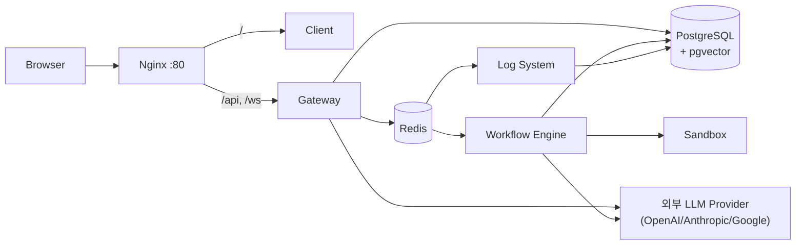

# Architecture

Status: Draft
Verified Against: current implementation baseline plus docs target model ADR-0014

시스템 구조, 인증 방식, 배포 구조, 외부 연동을 정의한다. 권한/감사 결정의 근거는 [decisions/](decisions/README.md)의 ADR을 따르고, 테이블 상세는 [data_model.md](data_model.md)를 따른다.

## 1. 시스템 구조

### 논리 서비스

| 구성요소 | 위치 | 책임 |
| --- | --- | --- |
| Client | `apps/client/` | Next.js. Workflow 편집, 설정, RBAC/observability UI |
| Gateway | `apps/gateway/` | FastAPI. 인증된 API 진입점과 resource permission enforcement 경계 |
| Workflow Engine | `apps/workflow_engine/` | Celery worker. Workflow 실행과 node runtime |
| Log System | `apps/log_system/` | Celery worker. audit/trace/log 계열 비동기 처리 |
| Sandbox | `apps/sandbox/` | NSJail 기반 격리 코드 실행 |
| Shared | `apps/shared/` | DB model, schema, 공통 service(permissions, llm_client, tracing/audit) |
| PostgreSQL | 컨테이너/chart | pgvector 포함 영속 저장소 |
| Redis | 컨테이너/chart | Celery broker/result, Pub/Sub |

Knowledge 통합 목표 구조에서는 Gateway/Shared 경계에 다음 domain service를 둔다 ([ADR-0014](decisions/ADR-0014-knowledge-base-document-atom-and-collection-boundary.md)).

| 구성요소 | 책임 |
| --- | --- |
| Knowledge Source Connector | 외부/내부 source item과 source ACL을 adapter별로 수집한다. outbound network 접근은 중앙 guard를 통과한다. |
| OutboundEgressGuard | server-side outbound dial 전 host/IP/port/proxy/timeout/size 정책을 검증한다. protocol별 SQL/command/listing 제한은 adapter가 담당한다. |
| Shared Privacy/Redaction Service | PII/secret detector, hard baseline, output-target별 masking/hash/drop/block rule을 제공한다. Audit/Tracing과 Knowledge가 함께 사용한다 ([ADR-0014](decisions/ADR-0014-knowledge-base-document-atom-and-collection-boundary.md)). |
| Knowledge Sync Scheduler / Worker | connector sync lease, cursor, retry, dead-letter, tombstone, outbox를 관리한다. |
| Knowledge Normalizer / Ingestion Pipeline | source item을 redacted canonical text와 document version artifact로 변환하고, indexing 성공 후 active version finalization을 수행한다. |
| Knowledge Permission Helper | collection route 권한, KB `use`, source ACL freshness/requester authorization을 bulk 평가한다. Router와 Agent는 permission row를 직접 조합하지 않는다. |
| Collection Router / Retrieval Orchestrator | 권한 helper가 허용한 safe candidate set에서 collection/KB를 선택하고, metadata-aware/hierarchical retrieval 결과를 merge/rerank한다. |

### 구성도

### 요청 흐름

1. 모든 외부 요청은 Nginx 단일 진입점을 지나 Client(`/`) 또는 Gateway(`/api`, `/ws`)로 라우팅된다.
2. Gateway는 인증과 organization scope, resource permission을 판정한 뒤 동기 응답하거나 Celery task를 발행한다.
3. Workflow 실행은 Workflow Engine이 수행하고, 실행 시 user/organization/workflow/run/node 식별자를 포함한 execution context를 전달받는다.
4. audit/trace 기록은 Log System worker가 비동기로 처리한다.
5. Knowledge 자동 수집은 connector adapter가 직접 네트워크를 열지 않고 `OutboundEgressGuard` 또는 승인된 client/dialer factory를 통과한다. Retrieval/Agent 요청은 collection routing scope와 KB permission helper/source ACL helper 결과로 만든 safe candidate set만 사용한다.

### 경계 규칙

- Gateway endpoint는 얇게 유지한다. RBAC/audit/tracing 판정은 controller가 아니라 `apps/gateway/services/`, `apps/shared/services/`의 service/helper 경계에서 수행한다.
- Controller에서 DB를 직접 상세 조회해 권한을 판단하지 않는다.
- 공통 tracing/audit service가 trace 접근과 payload 처리의 경계다.
- `apps/shared/` 변경은 Gateway, Workflow Engine, Log System, Sandbox 전체에 영향을 준다.

위 규칙은 목표 architecture rule이며, 현재 구현에 과도기 예외가 있다: Team 관리 API는 권한 판정과 team/member 조회를 `TeamService`로 이관했지만, user directory(`users.py`)와 permission 관리(`permissions.py`) 계열 endpoint에는 router에서 DB query와 permission helper를 직접 조합하는 코드가 남아 있다. 해당 영역을 수정할 때는 service 경계로의 이관을 함께 고려한다.

## 2. 인증 방식

### 사용자 인증

- 사용자 세션은 `auth_token` HttpOnly cookie 기준이다. user session용 Bearer token dependency는 없다.
- Google OAuth 로그인을 지원한다 (`/api/v1/auth/google/login` → callback).
- Bearer secret은 public run/webhook endpoint의 app secret 인증에만 사용한다.

### Organization Context

- Active organization은 `X-Organization-Id` request header로 전달한다. 서버는 session/cookie에 organization을 저장하지 않는다 ([ADR-0009](decisions/ADR-0009-active-organization-header-context.md)).
- Organization scope는 `organization_memberships` row 기준으로 판정한다. invited/suspended/removed row는 fail-closed 처리하고, membership row가 없는 legacy owner/manager만 호환 fallback을 받는다.

### RBAC

- 권한 상태는 `auth_state`(`none/viewer/operator/builder/manager`, audit용 `auditor/raw_auditor`)로 표준화한다 ([ADR-0006](decisions/ADR-0006-accept-rbac-auth-state-and-user-direct-permission.md)).
- 판정은 organization owner/manager override, team permission, user direct permission(additive allow) 중 가장 강한 허용을 적용한다. explicit deny는 없다. Source-managed KB retrieval에서는 organization manager override가 mbased KB permission/remediation은 만족시킬 수 있어도 source ACL/requester authorization gate를 우회하지 않는다.
- App/Workflow의 organization scope 밖 리소스는 `404`로 숨기고, scope 안 권한 부족은 `403 permission.denied`로 응답한다 ([ADR-0010](decisions/ADR-0010-resource-access-403-404-policy.md)). Target Knowledge resource hiding은 source ACL/source-managed KB 상태까지 포함하므로 [ADR-0014](decisions/ADR-0014-knowledge-base-document-atom-and-collection-boundary.md)의 resource hiding API matrix gate에서 별도로 닫아야 한다.

### Trace/Audit 접근

- Audit 기록은 canonical action 문자열을 사용한다 ([ADR-0008](decisions/ADR-0008-audit-action-naming-standard.md)).
- Trace 상세/payload 조회는 system admin, app owner, workflow effective `auth_state`, visibility policy를 함께 평가한다. Trace policy 관리의 system admin 판정 기본값은 deny-all이다.
- Raw payload 응답은 `trace_payload_access_events` 기록이 선행돼야 하며, 기록 실패 시 요청도 실패한다.

## 3. 배포 구조

세 가지 실행 모드를 용도별로 사용한다.

### 로컬 개발 — `scripts/dev.sh`

- `dev/docker-compose.yml`로 PostgreSQL, Redis, pgAdmin, Sandbox만 컨테이너로 띄우고 Gateway, worker, Client는 host process로 실행한다.
- 접속: Gateway `:8000`, Client `:3000`, Sandbox `:8194`, pgAdmin `:5050`. macOS 대응으로 Celery는 `-P solo`로 실행한다.

### 통합 컨테이너 — `docker/docker-compose.yml`

- 전체 서비스(postgres, redis, gateway, workflow_engine, log_system, frontend, sandbox, nginx, proxy)를 컨테이너로 실행한다.
- Nginx가 `:80` 단일 진입점이다: `/` → frontend, `/api`·`/ws` → gateway, `/health` → 단순 200. Squid forward proxy(`:3128`)가 아웃바운드 경로를 제공한다.

### Kubernetes — `infra/helm/moduly`

- 주요 workload는 `gateway`, `worker`, `logger`, `frontend`, `sandbox`이며, chart dependency로 PostgreSQL, Redis, `ingress-nginx`를 사용한다. Sandbox NetworkPolicy가 template에 포함된다.
- `infra/terraform`, `infra/k8s`에 프로비저닝/매니페스트 코드가 있다.

### 시작/초기화

- Gateway 컨테이너 entrypoint는 PostgreSQL readiness 대기 → `CREATE EXTENSION IF NOT EXISTS vector` → `alembic upgrade head` → Uvicorn 순으로 실행한다.
- Gateway lifespan은 audit listener 등록, pgvector extension 확인, `Base.metadata.create_all()`, default user/provider/model seed, model pricing sync, SchedulerService 초기화를 수행한다.
- Health check: Gateway `/api/v1/health`는 DB `SELECT 1`까지 확인하고, Nginx `/health`는 proxy 자체의 단순 200이다.

## 4. 외부 연동

| 연동 | 방식 | 비고 |
| --- | --- | --- |
| LLM Provider (OpenAI, Anthropic, Google) | `apps/shared/services/llm_client`의 자체 client 계층. 일반 LLM 호출은 `LLMService`가 credential/권한/허용된 fallback 정책을 판정한 뒤 client를 선택한다. Knowledge Agent answer의 explicit KB/auto collection flow는 별도 ADR 전까지 명시 `generation_model_id`와 `credential_id`를 요구하며, 일반 fallback을 자동 선택으로 해석하지 않는다 | Gateway(테스트 실행, RAG answer)와 Workflow Engine(LLM node) 모두 이 경로를 사용 |
| Google OAuth | 로그인 연동 (`GOOGLE_CLIENT_ID/SECRET`) | |
| 문서 저장소 | local 또는 S3 (`STORAGE_TYPE`, `AWS_*`) | Knowledge 문서 원본 저장 |
| 문서 파싱 | LlamaCloud (`LLAMA_CLOUD_API_KEY`) | RAG ingestion 파싱 |
| 외부 DB connector | `/api/v1/connectors` — 연결 테스트/등록/스키마 조회 | workflow에서 외부 DB 사용 |
| Workflow 노드 아웃바운드 | HTTP, GitHub, Mail node | 실행 시점 외부 호출 |
| 인바운드 트리거 | Webhook, Schedule node, public run API | app secret Bearer 인증 |

- 아웃바운드 통제: 통합 컨테이너 모드에서는 Squid forward proxy를 경유할 수 있고, Sandbox는 `SANDBOX_ENABLE_NETWORK`와 K8s NetworkPolicy로 네트워크를 제한한다. Knowledge source connector test/preview/fetch/sync, `/api/v1/rag/proxy/preview`, URL 기반 upload/preview(`s3FileUrl`, `apiUrl`), crawler/sitemap/API connector, DB/SSH/SaaS/object-storage probe 같은 Knowledge/RAG server-side outbound surface는 목표 구조에서 중앙 `OutboundEgressGuard`를 통과해야 한다. Workflow runtime HTTP/GitHub/Mail 노드의 전면 egress guard 적용은 이 결정의 범위가 아니며 unresolved separate egress policy/ADR이 필요하다.
- HTTP 계열 guard는 DNS resolve 후 IP 재검증, CNAME/IDNA/punycode와 IPv4 obfuscation canonicalization, redirect마다 재검증, private/link-local/metadata IP 차단, scheme allowlist, HTTPS downgrade 금지, `verify=false` 금지, sensitive header redirect stripping, compression/zip bomb 방지, timeout/size/content-type cap, rate limit, proxy/CA policy, custom HTTP client 우회 금지를 포함해야 한다. DB/SSH/SaaS/object-storage adapter는 arbitrary SQL/command 금지, read-only probe, schema/listing cap, credential scope 제한, tunnel/proxy 정책을 별도로 적용한다.

## 5. 알려진 리스크

- **`auth_secret` 원문 노출**: 현재 deployment 생성 응답이 `auth_secret` 원문을 포함할 수 있다. Secret 비노출 원칙([PRD](PRD.md) NFR-004)과 충돌하므로 보안 정렬 대상이다.
- **RAG proxy/URL preview SSRF surface**: 현재 `/api/v1/rag/proxy/preview`와 URL 기반 preview/upload 계열은 목표 `OutboundEgressGuard` 계약에 맞는 구현 검증이 필요하다. Production release 전에는 egress guard 이관 또는 명시적 risk acceptance가 필요하다.
- **Connector DB/SSH probe egress surface**: 현재 `/api/v1/connectors` test/schema 조회는 user-owned `connections`와 DB/SSH probe를 사용하며 목표 `OutboundEgressGuard` 적용이 보장됐다고 문서화하지 않는다. Production release 전에는 guard 이관, organization/owner scope 정렬, 또는 명시적 risk acceptance가 필요하다.
- **Current RAG raw artifact debt**: 현재 `document_chunks.content`, embedding input/vector index, document content/download/preview, 원본 저장소는 target redacted canonical text 모델이 보장됐다고 보지 않는다. Target cutover 전 reindex/sanitize/purge gate가 필요하다.
- **Schema 관리 이원화**: Alembic migration과 lifespan의 `Base.metadata.create_all()`이 공존한다. 운영 환경의 schema 변경 전략을 Alembic 단일 경로로 정리해야 한다.
