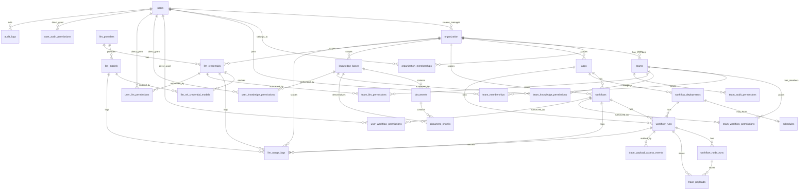

# 데이터 모델 개요 다이어그램

Status: Draft
Authority: Data Model Diagram
Source of Truth: No
Verified Against: origin/dev @ 5def9053fe5d72e7ac67fe2e27c8545a5124791d

이 문서는 [physical-data-model.md](../physical-data-model.md)의 table 참조관계를 시각화한 보조 문서다. 구현 기준은 Mermaid 다이어그램이 아니라 물리 데이터 모델 문서의 table, column, relationship 설명이다.

