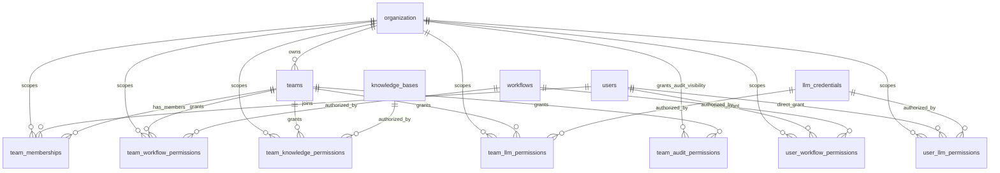

# RBAC 참조관계 다이어그램

Status: Draft
Authority: Data Model Diagram
Source of Truth: No
Verified Against: feature/mba-59 @ b92bc9e0f38588495d228fc0d17b10dfaaed03c1

이 문서는 [physical-data-model.md](../physical-data-model.md)와 [rbac-permission-policy.md](../rbac-permission-policy.md)의 현재 코드 RBAC 관련 table 참조관계를 시각화한 보조 문서다. 구현 기준은 이 다이어그램이 아니라 물리 데이터 모델과 RBAC 권한 정책 문서다.

`user_knowledge_permissions`, `user_audit_permissions`는 MVP 2/3 planned table이므로 현재 코드 기준 다이어그램에서는 제외한다.

