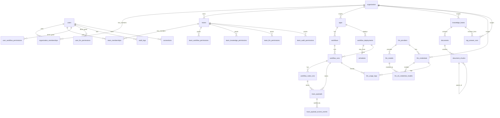

# Data Model

Status: Draft
Verified Against: current SQLAlchemy model snapshot plus docs target model ADR-0014 and ADR-0015

전역 데이터 모델의 도메인 구성, 테이블별 상세, 엔티티 관계, 공통 규칙을 정의한다. 현재 구현 테이블 상세는 SQLAlchemy 모델(`apps/shared/db/models/*`)에서 직접 추출한 것이다. nullable/index/ondelete가 코드와 다르면 코드가 기준이며, 이 문서를 갱신한다. `Target`, `목표`, `계획`으로 표시된 subsection은 아직 코드에 모두 구현됐다는 뜻이 아니며, 해당 ADR/gate가 닫힌 뒤 migration으로 반영한다. 저장 방식 결정의 근거는 [decisions/](decisions/README.md)의 ADR을 따른다.

## 설계 원칙

- 기존 table/column을 삭제·rename·대체하지 않는다. 확장은 additive table/column만 허용한다. 단, [ADR-0014](decisions/ADR-0014-knowledge-base-document-atom-and-collection-boundary.md)의 data-preservation/cutover gate가 운영 데이터 없음, backup/export, reset/reindex, rollback 한계, 기존 reference 보존을 명시 승인한 경우에만 해당 gate 범위 안에서 destructive cutover 예외를 둘 수 있다.
- Tenant 경계는 별도 `tenant_id` 없이 `organization_id`로 판정한다. Project boundary는 `apps`다.
- RBAC은 `roles`/`user_roles`/polymorphic `resource_permissions` 없이 organization membership + team permission + user direct permission으로 구성한다 ([ADR-0006](decisions/ADR-0006-accept-rbac-auth-state-and-user-direct-permission.md)).
- 감사는 `audit_logs` 단일 테이블을 canonical로 사용한다. RAG trace 전용 테이블은 만들지 않는다 ([ADR-0004](decisions/ADR-0004-audit-log-rag-trace-storage.md)).
- Dashboard는 aggregate table/materialized view 없이 기존 run/log/usage 테이블 raw query로 시작한다.

## 도메인별 테이블

현재 코드 기준 활성 테이블은 33개다. `legacy_llm_provider`, `legacy_llm_credentials`는 migration `e4956fcd7e2b`에서 DROP됐고 모델도 주석 처리돼 있다.

| 도메인 | 테이블 |
| --- | --- |
| 사용자/조직 | `users`, `organization`, `organization_memberships`, `teams`, `team_memberships` |
| 권한 | `team_workflow_permissions`, `team_knowledge_permissions`, `team_llm_permissions`, `team_audit_permissions`, `user_workflow_permissions`, `user_llm_permissions` |
| 앱/워크플로우 | `apps`, `workflows`, `workflow_deployments`, `schedules`, `workflow_runs`, `workflow_node_runs` |
| 추적/감사 | `trace_payloads`, `trace_payload_access_events`, `trace_redaction_policies`, `trace_retention_policies`, `trace_visibility_policies`, `audit_logs` |
| Knowledge/RAG | `knowledge_bases`, `documents`, `document_chunks`, `rag_answer_runs` |
| LLM | `llm_providers`, `llm_models`, `llm_credentials`, `llm_rel_credential_models`, `llm_usage_logs` |
| 외부 연동 | `connections` |

## 엔티티 관계



- `rag_answer_runs`와 trace/usage 테이블은 FK가 아니라 opaque `correlation_id`(application-level convention)로만 연결한다 ([ADR-0013](decisions/ADR-0013-rag-answer-trace-usage-correlation-boundary.md)). 다이어그램에 없는 이유다.
- `apps.workflow_id`와 `workflows.app_id`는 상호 참조(순환 FK)다.
- JSONB metadata에 id를 넣는 방식(`audit_metadata`, `meta_info` 등)은 관계가 아니라 application convention이다.

## 공통 컬럼과 규칙

| 항목 | 규칙 |
| --- | --- |
| PK | `id` UUID (`uuid4` 기본값) |
| 시각 | `created_at`/`updated_at` 사용 (일부 테이블은 없음 — 테이블 상세 참조) |
| `organization_id` | 조직 scope FK. 기존에 nullable인 컬럼(`workflows`, `apps`, `knowledge_bases`, `llm_credentials`, `llm_usage_logs`)은 non-null로 바꾸지 않는다 |
| `auth_state` | DB enum이 아닌 VARCHAR(50). 허용값은 RBAC 요약의 application-level 표준을 따른다 |
| `options`/`flags` | 조직/팀/권한 계열 테이블의 공통 확장 슬롯. `options` JSONB NOT NULL, `flags` BIGINT NOT NULL (`>= 0` CHECK) |
| `audit_logs.status` | `success`/`failure`만 저장. 정책 결과(`pass/warn/block`)는 `audit_metadata.policy_result`에 저장 |
| classification | `documents.meta_info.classification` metadata convention. 전용 column을 만들지 않는다 ([ADR-0007](decisions/ADR-0007-mvp2-classification-metadata-storage.md)) |
| `correlation_id` | FK가 아닌 application-level 식별 convention. 권한/scope 판정에 사용하지 않는다 |
| Secret | credential 원문/API key/token/`encrypted_config`·`encrypted_password` 값은 응답·로그·trace에 노출하지 않는다 |

## 테이블 상세

표기: 제약 열의 `FK→`는 outgoing FK이고 괄호는 ondelete 동작이다. NULL/NOT NULL은 각 행에 명시한다. ondelete 표기가 없는 FK는 기본 동작(RESTRICT/NO ACTION)이다.

### 사용자/조직

#### `users`

사용자 계정. 실행 actor, resource owner의 기준이다.

| 컬럼 | 타입 | 제약 |
| --- | --- | --- |
| id | UUID | PK |
| email | VARCHAR(255) | NOT NULL, UNIQUE |
| name | VARCHAR(255) | NOT NULL |
| password | VARCHAR(255) | NULL (소셜 로그인 시) |
| social_provider | VARCHAR(50) | NOT NULL |
| social_id | VARCHAR(255) | NULL, UNIQUE |
| avatar_url | VARCHAR(255) | NULL |
| deactivated_at | DATETIME | NULL — 비활성 사용자 판정 기준 |
| last_login_at | DATETIME | NULL |
| created_at / updated_at | DATETIME | NOT NULL |

#### `organization`

조직 범위(tenant-like boundary). 테이블명이 단수형이다.

| 컬럼 | 타입 | 제약 |
| --- | --- | --- |
| id | UUID | PK |
| name | VARCHAR(255) | NOT NULL |
| options | JSONB | NOT NULL |
| flags | BIGINT | NOT NULL, CK `flags >= 0` |
| created_by | UUID | NOT NULL, FK→users.id |
| managed_by | UUID | NULL, FK→users.id |
| is_active | BOOLEAN | NOT NULL |
| created_at / updated_at | DATETIME | NOT NULL |
| deactivated_at | DATETIME | NULL |

- `created_by`/`managed_by`는 membership row가 없는 legacy 데이터에서만 manager fallback으로 사용한다.

#### `organization_memberships`

user와 organization의 직접 소속. organization scope와 manager 판정의 우선 기준이다.

| 컬럼 | 타입 | 제약 |
| --- | --- | --- |
| id | UUID | PK |
| organization_id | UUID | NOT NULL, FK→organization.id |
| user_id | UUID | NOT NULL, FK→users.id |
| membership_state | VARCHAR(50) | NOT NULL, CK: `invited/active/suspended/removed` |
| organization_auth_state | VARCHAR(50) | NOT NULL, CK: `member/manager` |
| invited_by | UUID | NULL, FK→users.id |
| invited_at / accepted_at / removed_at | DATETIME | NULL |
| options / flags | JSONB / BIGINT | NOT NULL, CK `flags >= 0` |
| created_at / updated_at | DATETIME | NOT NULL |

- UNIQUE `(organization_id, user_id)`. 조회 인덱스: `(organization_id, membership_state)`, `(user_id, membership_state)`.
- `active` row만 scope로 인정한다. `invited/suspended/removed`는 fail-closed.

#### `teams`

조직 내 권한 부여 단위.

| 컬럼 | 타입 | 제약 |
| --- | --- | --- |
| id | UUID | PK |
| organization_id | UUID | NOT NULL, FK→organization.id |
| name | VARCHAR(255) | NOT NULL |
| options / flags | JSONB / BIGINT | NOT NULL, CK `flags >= 0` |
| description | TEXT | NULL |
| created_by | UUID | NOT NULL, FK→users.id |
| managed_by | UUID | NULL, FK→users.id |
| is_active | BOOLEAN | NOT NULL |
| is_auto_add | BOOLEAN | NOT NULL — 신규 멤버 자동 배정 여부 |
| created_at / updated_at | DATETIME | NOT NULL |
| deactivated_at | DATETIME | NULL |

- UNIQUE `(organization_id, name)`, UNIQUE `(id, organization_id)` — 후자는 permission 테이블의 복합 FK 대상이다.

#### `team_memberships`

사용자의 팀 배정. team permission 계산의 전제다.

| 컬럼 | 타입 | 제약 |
| --- | --- | --- |
| id | UUID | PK |
| user_id | UUID | NOT NULL, FK→users.id |
| grantee_organization_id | UUID | NOT NULL, FK→organization.id |
| team_id | UUID | NOT NULL, FK→teams.id |
| assigned_by | UUID | NOT NULL, FK→users.id |
| assigned_at | DATETIME | NOT NULL |
| options / flags | JSONB / BIGINT | NOT NULL, CK `flags >= 0` |

- UNIQUE `(grantee_organization_id, user_id, team_id)`.
- `(grantee_organization_id, team_id)`는 `teams(organization_id, id)`를 참조하는 **복합 FK**다. team이 grantee organization 안에 있음을 DB 수준에서 강제한다.

### 권한

#### Team permission 공통 구조

`team_workflow_permissions`, `team_knowledge_permissions`, `team_llm_permissions`, `team_audit_permissions`는 대상 리소스 컬럼만 다르고 구조가 같다.

| 컬럼 | 타입 | 제약 |
| --- | --- | --- |
| id | UUID | PK |
| *(resource 컬럼)* | UUID | NOT NULL — 아래 표 참조 |
| auth_state | VARCHAR(50) | NOT NULL (CHECK 없음 — application-level 검증) |
| grantee_organization_id | UUID | NOT NULL, FK→organization.id |
| team_id | UUID | NOT NULL, FK→teams.id |
| assigned_by | UUID | NOT NULL, FK→users.id |
| assigned_at | DATETIME | NOT NULL |
| options / flags | JSONB / BIGINT | NOT NULL, CK `flags >= 0` |

- 공통: `(grantee_organization_id, team_id)` → `teams(organization_id, id)` 복합 FK.

| 테이블 | resource 컬럼 | resource FK | UNIQUE |
| --- | --- | --- | --- |
| `team_workflow_permissions` | workflow_id | workflows.id | (grantee_organization_id, workflow_id, team_id) |
| `team_knowledge_permissions` | knowledge_base_id | knowledge_bases.id | (grantee_organization_id, knowledge_base_id, team_id) |
| `team_llm_permissions` | llm_credential_id | llm_credentials.id | (grantee_organization_id, llm_credential_id, team_id) |
| `team_audit_permissions` | target_organization_id | organization.id | (grantee_organization_id, target_organization_id, team_id) |

#### User direct permission 공통 구조

`user_workflow_permissions`, `user_llm_permissions`. additive allow 전용이다.

| 컬럼 | 타입 | 제약 |
| --- | --- | --- |
| id | UUID | PK |
| *(resource 컬럼)* | UUID | NOT NULL — 아래 표 참조 |
| grantee_organization_id | UUID | NOT NULL, FK→organization.id |
| user_id | UUID | NOT NULL, FK→users.id |
| auth_state | VARCHAR(50) | NOT NULL, CK: `none/viewer/operator/builder/manager` |
| assigned_by | UUID | NOT NULL, FK→users.id |
| assigned_at | DATETIME | NOT NULL |
| options / flags | JSONB / BIGINT | NOT NULL, CK `flags >= 0` |

| 테이블 | resource 컬럼 | 복합 FK (resource가 grantee org 안임을 강제) | UNIQUE |
| --- | --- | --- | --- |
| `user_workflow_permissions` | workflow_id | (workflow_id, grantee_organization_id) → workflows(id, organization_id) | (grantee_organization_id, user_id, workflow_id) |
| `user_llm_permissions` | llm_credential_id | (llm_credential_id, grantee_organization_id) → llm_credentials(id, organization_id) | (grantee_organization_id, user_id, llm_credential_id) |

- team permission 테이블에는 `auth_state` CHECK가 없고 user direct 테이블에만 있다. legacy 값(`read/write/execute/admin`)은 application-level에서 normalize한다.

### 앱/워크플로우

#### `apps`

project/endpoint boundary.

| 컬럼 | 타입 | 제약 |
| --- | --- | --- |
| id | UUID | PK |
| organization_id | UUID | NULL, FK→organization.id |
| name | VARCHAR | NOT NULL |
| description | TEXT | NULL |
| icon | JSONB | NULL |
| workflow_id | UUID | NULL, FK→workflows.id — primary workflow |
| active_deployment_id | UUID | NULL, **FK 없음** (application-level 참조) |
| url_slug | VARCHAR | NOT NULL, UNIQUE — public endpoint 경로 |
| auth_secret | VARCHAR | NOT NULL — public run/webhook Bearer secret |
| is_api_enabled | BOOLEAN | NOT NULL |
| api_req_per_minute / api_req_per_hour | INTEGER | NOT NULL — rate limit |
| is_market | BOOLEAN | NOT NULL |
| forked_from | UUID | NULL, FK 없음 |
| created_by | UUID | NOT NULL, FK→users.id |
| created_at / updated_at | DATETIME | NOT NULL |

#### `workflows`

편집 대상 workflow. node는 별도 테이블 없이 `graph` JSONB 안의 id로 참조한다.

| 컬럼 | 타입 | 제약 |
| --- | --- | --- |
| id | UUID | PK |
| organization_id | UUID | NULL, FK→organization.id |
| app_id | UUID | NOT NULL, FK→apps.id |
| graph | JSONB | NULL — 노드/엣지 정의 |
| features / env_variables / runtime_variables | JSONB | NULL |
| created_by | UUID | NOT NULL, FK→users.id |
| updated_by | UUID | NULL, FK→users.id |
| created_at / updated_at | DATETIME | NOT NULL |

- UNIQUE `(id, organization_id)` — user direct permission의 복합 FK 대상.

#### `workflow_deployments`

배포 snapshot과 버전.

| 컬럼 | 타입 | 제약 |
| --- | --- | --- |
| id | UUID | PK |
| app_id | UUID | NOT NULL, FK→apps.id (CASCADE) |
| version | INTEGER | NOT NULL |
| type | VARCHAR(13) | NOT NULL — deployment type (schedule 포함) |
| graph_snapshot | JSONB | NOT NULL — 배포 시점 graph 고정본 |
| config / input_schema / output_schema | JSONB | NULL |
| description | VARCHAR | NULL |
| created_by | UUID | NOT NULL, FK→users.id |
| created_at | DATETIME | NOT NULL |
| is_active | BOOLEAN | NOT NULL |

#### `schedules`

schedule deployment의 실행 설정. deployment와 1:1이다.

| 컬럼 | 타입 | 제약 |
| --- | --- | --- |
| id | UUID | PK |
| deployment_id | UUID | NOT NULL, FK→workflow_deployments.id (CASCADE), **UNIQUE** |
| node_id | VARCHAR | NOT NULL — graph 내 schedule node id |
| cron_expression | VARCHAR | NOT NULL |
| timezone | VARCHAR | NOT NULL |
| last_run_at / next_run_at | DATETIME | NULL (next_run_at INDEX) |
| created_at / updated_at | DATETIME | NOT NULL |

#### `workflow_runs`

workflow 실행 이력. usage/trace/dashboard raw query의 원천이다.

| 컬럼 | 타입 | 제약 |
| --- | --- | --- |
| id | UUID | PK |
| workflow_id | UUID | NOT NULL, FK→workflows.id (CASCADE) |
| user_id | UUID | NOT NULL, FK→users.id (CASCADE) |
| app_id | UUID | NULL, FK→apps.id (SET NULL) |
| deployment_id | UUID | NULL, FK→workflow_deployments.id (SET NULL) |
| workflow_version | INTEGER | NULL |
| status | VARCHAR(7) | NOT NULL |
| trigger_mode | VARCHAR(9) | NOT NULL — manual/api/schedule/webhook 등 |
| inputs | JSONB | NOT NULL |
| outputs | JSONB | NULL |
| error_message | TEXT | NULL |
| started_at | DATETIME | NOT NULL |
| finished_at | DATETIME | NULL |
| duration | FLOAT | NULL |
| meta_info | JSONB | NULL |
| correlation_id / request_id | VARCHAR(255) | NULL, INDEX |
| workflow_task_id | VARCHAR(255) | NULL — Celery task id |
| trace_metadata | JSONB | NULL — redaction-safe summary만 |
| redaction_applied / pii_detected | BOOLEAN | NOT NULL |
| redaction_policy_id / retention_policy_id / visibility_policy_id | UUID | NULL, **FK 없음** (적용 시점 정책 id 기록) |
| payload_storage_mode | VARCHAR(32) | NOT NULL |
| retention_purged_at | DATETIME | NULL |
| total_tokens | INTEGER | NULL |
| total_cost | NUMERIC(10,6) | NULL |

#### `workflow_node_runs`

node 단위 실행 이력.

| 컬럼 | 타입 | 제약 |
| --- | --- | --- |
| id | UUID | PK |
| workflow_run_id | UUID | NOT NULL, FK→workflow_runs.id (CASCADE) |
| node_id / node_type | VARCHAR | NOT NULL — graph 내 string 참조 |
| status | VARCHAR(7) | NOT NULL |
| inputs / process_data | JSONB | NOT NULL |
| outputs | JSONB | NULL |
| error_message | TEXT | NULL |
| started_at | DATETIME | NOT NULL |
| finished_at | DATETIME | NULL |
| duration | FLOAT | NULL |
| trace_metadata | JSONB | NULL |
| redaction_applied / pii_detected | BOOLEAN | NOT NULL |
| redaction_policy_id | UUID | NULL, FK 없음 |
| parent_node_run_id | UUID | NULL, FK→workflow_node_runs.id (SET NULL) — loop/중첩 실행 |
| sequence | INTEGER | NULL |
| retry_count | INTEGER | NOT NULL |

### 추적/감사

#### `trace_payloads`

실행/노드 단위 trace payload 저장소. workflow run이 있는 실행에만 사용한다.

| 컬럼 | 타입 | 제약 |
| --- | --- | --- |
| id | UUID | PK |
| workflow_run_id | UUID | NOT NULL, FK→workflow_runs.id (CASCADE) |
| workflow_node_run_id | UUID | NULL, FK→workflow_node_runs.id (CASCADE) |
| scope | VARCHAR(16) | NOT NULL — run/node |
| payload_kind | VARCHAR(64) | NOT NULL — 예: `rag.retrieval` |
| sequence | INTEGER | NULL |
| attempt | INTEGER | NOT NULL |
| redacted_payload | JSONB | NULL |
| raw_payload_encrypted | TEXT | NULL — 암호화 저장 |
| redaction_applied / pii_detected / secret_detected | BOOLEAN | NOT NULL |
| redaction_metadata | JSONB | NULL |
| storage_mode | VARCHAR(32) | NOT NULL |
| retention_expires_at / retention_purged_at | DATETIME | NULL |
| created_at | DATETIME | NOT NULL |

- 조회 인덱스 `ix_trace_payloads_latest_view(workflow_run_id, scope, workflow_node_run_id, payload_kind, created_at, sequence, attempt)`, retention 스캔 인덱스 별도.

#### `trace_payload_access_events`

trace payload 접근 감사. raw 응답은 이 기록이 선행돼야 한다.

| 컬럼 | 타입 | 제약 |
| --- | --- | --- |
| id | UUID | PK |
| payload_id | UUID | NULL, FK→trace_payloads.id (SET NULL) |
| workflow_run_id | UUID | NOT NULL, FK→workflow_runs.id (CASCADE) |
| actor_user_id | UUID | NULL, FK→users.id (SET NULL) |
| actor_user_ref | VARCHAR(128) | NULL — user 삭제 후에도 남는 참조 |
| view_level | VARCHAR(32) | NOT NULL |
| allowed | BOOLEAN | NOT NULL — 거부 시도도 기록 |
| reason_code | VARCHAR(128) | NOT NULL |
| created_at | DATETIME | NOT NULL |

#### `trace_redaction_policies` / `trace_retention_policies` / `trace_visibility_policies`

trace 정책 3종. 공통으로 `scope_type` VARCHAR(32) NOT NULL + `scope_id` UUID NULL(FK 없음)로 global/app scope를 표현하고, `is_active` BOOLEAN, `updated_by` FK→users.id (SET NULL), `created_at/updated_at`을 가진다.

| 테이블 | 고유 컬럼 |
| --- | --- |
| `trace_redaction_policies` | redaction_enabled, raw_payload_storage_enabled, prompt_completion_storage_enabled, pii_detection_enabled, store_redacted_copy_only, sensitive_headers/json_paths/keywords, regex_rules (JSONB), replacement |
| `trace_retention_policies` | metadata/raw_payload/redacted_payload/prompt_completion/failed_trace retention_days (INTEGER), retention_action |
| `trace_visibility_policies` | owner_trace/redacted/raw/prompt_completion access_enabled, admin_raw/prompt_completion access_enabled, deny_owner_trace_access, default_view_level |

- 물리 schema는 `organization` scope도 담을 수 있으나 현재 management API는 `global`/`app`만 지원한다.
- Trace redaction policy는 현재 trace payload 저장/조회 경계의 구현이다. Target KB integration에서는 detector/masking engine을 shared privacy/redaction boundary로 분리하고, trace-specific storage/visibility/retention은 Audit/Tracing 도메인에 남긴다 ([ADR-0014](decisions/ADR-0014-knowledge-base-document-atom-and-collection-boundary.md)).

#### `audit_logs`

canonical 감사 로그. action 값은 [ADR-0008](decisions/ADR-0008-audit-action-naming-standard.md)을 따른다.

| 컬럼 | 타입 | 제약 |
| --- | --- | --- |
| id | UUID | PK |
| occurred_at | DATETIME | NOT NULL |
| actor_id | UUID | NULL, FK→users.id (SET NULL) |
| actor_type | VARCHAR(6) | NOT NULL |
| category | VARCHAR(11) | NOT NULL |
| action | VARCHAR(100) | NOT NULL — canonical action 문자열 |
| target_type | VARCHAR(100) | NULL |
| target_id | VARCHAR(255) | NULL — UUID가 아닌 문자열(다형 참조, FK 없음) |
| before / after | JSONB | NULL — data-change diff |
| status | VARCHAR(7) | NOT NULL — success/failure |
| audit_metadata | JSONB | NULL — policy_result, correlation_id 등 |

- 검색 인덱스: occurred_at, actor_id, category, action, `(target_type, target_id)`.

### Knowledge/RAG

#### `knowledge_bases`

현재 구현 기준 RAG data source 상위 단위. 목표 KB 통합 모델에서는 `knowledge_bases`가 문서/source item 1개에 대응하는 permission, retrieval, sync, lifecycle atom으로 재정의된다 ([ADR-0014](decisions/ADR-0014-knowledge-base-document-atom-and-collection-boundary.md)).

| 컬럼 | 타입 | 제약 |
| --- | --- | --- |
| id | UUID | PK |
| organization_id | UUID | NULL, FK→organization.id |
| name | VARCHAR(255) | NOT NULL |
| description | TEXT | NULL |
| embedding_model | VARCHAR(50) | NOT NULL |
| top_k | INTEGER | NOT NULL |
| similarity_threshold | FLOAT | NOT NULL |
| user_id | UUID | NOT NULL, FK→users.id — owner |
| created_at / updated_at | DATETIME | NOT NULL |

#### `documents`

현재 구현 기준 RAG 문서 단위. 목표 모델에서는 canonical content/version artifact가 `document_versions`로 전환된다. `documents.meta_info`는 [ADR-0012](decisions/ADR-0012-metadata-aware-hierarchical-rag-boundary.md)의 current metadata source이며, target cutover 후 canonical metadata source는 별도 gate에서 확정한다.

| 컬럼 | 타입 | 제약 |
| --- | --- | --- |
| id | UUID | PK |
| knowledge_base_id | UUID | NOT NULL, FK→knowledge_bases.id |
| filename | VARCHAR | NOT NULL |
| file_path | VARCHAR | NULL |
| source_type | VARCHAR(4) | NOT NULL |
| content_hash | VARCHAR(64) | NULL |
| status | VARCHAR(50) | NOT NULL — 색인 상태 |
| error_message | TEXT | NULL |
| chunk_size / chunk_overlap | INTEGER | NOT NULL |
| meta_info | JSONB | NOT NULL — classification 등 metadata convention의 source of truth |
| embedding_model | VARCHAR | NULL |
| created_at | DATETIME | NOT NULL |
| updated_at | DATETIME | NULL |

#### `document_chunks`

retrieval 최소 단위. pgvector 임베딩과 hierarchical chunk 구조를 가진다. 목표 모델에서 `content`, embedding input, retrieval-visible text artifact는 redacted canonical text에서 생성된다 ([ADR-0014](decisions/ADR-0014-knowledge-base-document-atom-and-collection-boundary.md)).

현재 구현의 `document_chunks.content`, embedding input, vector index, 원본 문서 저장소는 redacted canonical text 보장을 전제로 작성된 것이 아니다. Target cutover는 reindex/sanitize/purge 계획과 raw artifact retention gate를 닫은 뒤 진행한다.

| 컬럼 | 타입 | 제약 |
| --- | --- | --- |
| id | UUID | PK |
| document_id | UUID | NOT NULL, FK→documents.id |
| document_version_id | UUID | Target NULL/FK→document_versions.id — target cutover 후 canonical version FK |
| knowledge_base_id | UUID | NOT NULL, FK→knowledge_bases.id (denormalized) |
| content | TEXT | NOT NULL |
| embedding | VECTOR | NOT NULL — pgvector |
| chunk_index | INTEGER | NOT NULL |
| parent_chunk_id | UUID | NULL, FK→document_chunks.id (SET NULL) — hierarchical retrieval |
| chunk_level | VARCHAR(32) | NULL |
| section_path | JSONB | NULL |
| heading | VARCHAR(512) | NULL |
| token_count | INTEGER | NOT NULL |
| metadata | JSONB | NOT NULL — `documents.meta_info`의 denormalized cache. 충돌 시 document 우선 ([ADR-0012](decisions/ADR-0012-metadata-aware-hierarchical-rag-boundary.md)) |

- 인덱스: `(knowledge_base_id, chunk_level)`, parent_chunk_id.

#### `rag_answer_runs`

standalone RAG Agent answer의 실행 anchor. raw query/answer/chunk content는 저장하지 않는다 ([ADR-0013](decisions/ADR-0013-rag-answer-trace-usage-correlation-boundary.md)).

| 컬럼 | 타입 | 제약 |
| --- | --- | --- |
| id | UUID | PK |
| organization_id | UUID | NOT NULL, FK→organization.id |
| user_id | UUID | NULL, FK→users.id (SET NULL) |
| actor_user_ref | JSONB | NULL |
| knowledge_base_id | UUID | NULL, FK→knowledge_bases.id (SET NULL) |
| knowledge_base_ref | JSONB | NULL |
| correlation_id | VARCHAR(255) | NOT NULL — trace/usage와의 느슨한 연결 키 |
| status | VARCHAR(32) | NOT NULL, CK: `requested/running/completed/failed/cancelled/blocked` |
| query_hash / answer_hash | VARCHAR(128) | NULL — HMAC, `hash_version`과 함께 사용 |
| hash_version | VARCHAR(64) | NULL |
| retrieval_summary / citation_summary / answer_summary / policy_result / usage_summary | JSONB | NOT NULL — redaction-safe allowlist |
| generation_model_id | UUID | NULL, FK→llm_models.id (SET NULL) |
| generation_model_snapshot | JSONB | NULL |
| generation_credential_id | UUID | NULL, FK→llm_credentials.id (SET NULL) |
| generation_credential_ref | JSONB | NULL |
| error_code | VARCHAR(100) | NULL |
| retention_expires_at | DATETIME | NOT NULL |
| created_at | DATETIME | NOT NULL |
| started_at / completed_at | DATETIME | NULL |

- 조회 인덱스 `(organization_id, correlation_id, created_at)`, retention 인덱스 별도.

#### Target KB integration model

아래 테이블은 [ADR-0014](decisions/ADR-0014-knowledge-base-document-atom-and-collection-boundary.md)와 [ADR-0015](decisions/ADR-0015-knowledge-skill-context-routing-boundary.md)의 목표 구조다. 이 subsection은 현재 코드에 모두 구현됐다는 뜻이 아니다. Migration 작성 전에는 data-preservation gate, ID vocabulary, active-version finalization, source ACL materialization, resource hiding API matrix, Knowledge Skill visibility/freshness/eval gate를 닫아야 한다.

```text
knowledge_collections
  -> knowledge_collection_items
      -> knowledge_bases
          -> document_versions
              -> document_chunks
knowledge_skills
  -> knowledge_skill_versions
      -> knowledge_skill_source_refs
      -> knowledge_skill_evaluations
```

| 목표 테이블 | 역할 | 핵심 제약 |
| --- | --- | --- |
| `knowledge_collections` | collection/grouping/routing/UX/ops 단위 | `organization_id`, safe display name/description, source connector ref, system-managed flag, sync status. Source-derived display fields는 redacted/capped/display-policy-approved 값만 저장한다. |
| `knowledge_collection_items` | collection과 document-level KB의 link | collection membership은 child KB content retrieval 권한을 부여하지 않는다. Linking에는 collection manage와 KB manage가 모두 필요하다. |
| Collection permission storage (TBD) | collection `read`/`route`/`manage`/`sync` 권한 저장 | resource-specific team/user table로 둘지 별도 subject table로 둘지는 [ADR-0014](decisions/ADR-0014-knowledge-base-document-atom-and-collection-boundary.md)의 collection permission storage gate에서 결정한다. 구현 전까지는 helper contract만 공식화한다. |
| `knowledge_bases` | document/source item 단위 permission/retrieval/sync/lifecycle atom | target 의미는 `granularity=document`로 고정한다. Source-managed KB는 protected source identity와 sync state를 갖고, KB `use`와 source ACL gate를 모두 통과해야 retrieval 대상이 된다. Target column 후보에는 `active_document_version_id`, `source_identity_id`, lifecycle/sync state가 포함된다. |
| `document_versions` | document-level KB의 canonical content/index version | `staging/indexing/ready/failed/superseded` 상태. Active version pointer swap은 indexing 성공 후 transaction/outbox 계약에 따라 수행한다. `content_hash`, chunking fingerprint, embedding model reference는 실제 artifact finalization과 같은 boundary에서 확정해야 한다. `source_tier`, approval state, source freshness, version provenance를 이 table 또는 canonical metadata source에 둘지 G9에서 확정한다. |
| `knowledge_source_identities` | source item identity의 protected 저장소 | 사용자-facing resource가 아니며 source-managed KB와 1:1 관계를 목표로 한다. Raw source id/url은 HMAC/hash ref 또는 protected encrypted field로만 다룬다. Key version, rotation/backfill, tombstone matching, safe external reference format은 gate에서 확정한다. |
| `raw_knowledge_artifacts` | opt-in protected raw source content 저장소 또는 encrypted object storage metadata | RAG/embedding/prompt에는 사용하지 않는다. `organization_id`, `knowledge_base_id`, `document_version_id`, `source_identity_id`, storage ref, encryption key version, content hash, retention/legal hold/purge state가 필요하다. Raw value/object key는 audit/trace/log/router/citation summary에 노출하지 않는다 ([ADR-0014](decisions/ADR-0014-knowledge-base-document-atom-and-collection-boundary.md)). |
| `source_acl_principals` / `source_acl_facts` | source 사용자/그룹/ACL 원천 사실 | Raw principal email/path/title/url은 기본 노출 금지. Safe ref, HMAC, key version, rotation/backfill 정책이 필요하다. |
| `source_knowledge_permission_grants` | source ACL provenance를 permission helper가 소비할 수 있게 materialize한 table | 저장 필드는 gate에서 확정한다. Source permission action/provenance, source authorization state, freshness epoch, requester subject ref를 KB permission `auth_state`와 구분해야 한다. Raw source permission 값은 source ACL facts 또는 safe metadata에 둔다. 이 table은 mbased KB `use` gate를 자동 대체하지 않는다. Source-owned KB `use` grant를 별도로 만들 경우 storage table, freshness gate, revocation, audit-safe provenance, manual grant와의 결합 방식을 Auth/RBAC와 Knowledge의 source ACL materialization gate에서 확정해야 한다. |
| `knowledge_ingestion_outbox` | indexing/finalization/cleanup side effect 조정 | active version finalization, orphan cleanup, object storage/vector index cleanup, retry/dead-letter, recovery scanner의 기준 record다. Idempotency key, owner/fencing token, target artifact reference, retryability, safe reason code가 필요하다. External index success 후 DB finalize failure, DB finalize success 후 cleanup failure를 복구할 수 있어야 하며 pre-finalized artifact는 retrieval-visible하면 안 된다. |
| `knowledge_skills` | Workflow Builder가 LLM node의 RAG 옵션을 구성할 때 참고하는 provider-neutral 절차/context/routing artifact | `organization_id`, safe display name/description, owner/review state, visibility policy, publication state가 필요하다. Skill은 권한 source나 source of truth가 아니며 child KB content permission을 부여하지 않는다. |
| `knowledge_skill_versions` | skill body/checklist/routing rule의 version | raw source content, raw source title/path/url, raw principal, raw ACL fact, restricted document list, hidden KB id, raw prompt/completion/provider response를 저장하지 않는다. `freshness_state`, `last_validated_at`, `eval_status`, `source_version_refs` 또는 safe refs가 필요하다. |
| `knowledge_skill_source_refs` | skill이 참조하는 source-of-truth tier, safe reference, 빌더 단계 routing hint | 정책 문서, ADR/decision record, semantic definition, curated query corpus 같은 tier와 safe source/version ref만 저장한다. Collection/KB route hint가 필요하면 display-policy-approved safe reference로 저장하고, 실행 시점 permission helper와 교집합 처리해야 한다. Raw source id/url/path/title은 protected identity gate 없이 저장하지 않는다. |
| `knowledge_skill_evaluations` | golden question/regression 결과 | eval fixture는 raw restricted content를 포함하지 않고, safe question id, expected behavior, pass/fail/bucketed score, evaluated_at, evaluator ref를 저장한다. |

Target permission helper는 mbased KB permission gate와 source ACL/requester authorization gate를 분리해 평가한다. Manual team/user KB grant와 organization manager override는 mbased KB gate를 만족시킬 수 있지만 source-managed KB의 source ACL freshness/requester authorization gate를 우회하지 않는다. Source ACL provenance는 source ACL gate의 입력이며, KB `use` permission 자체를 자동 부여하는 행으로 해석하지 않는다. 자동 수집된 document-level KB에 대해 KB `use`를 어떤 경로로 materialize할지는 source ACL materialization gate에서 닫는다. Helper는 allow/deny뿐 아니라 sanitized reason code, source ACL freshness state, freshness epoch, audit-safe metadata를 반환해야 하며 router/retrieval이 grant row를 직접 조합하지 않는다. `source_knowledge_permission_grants`의 최종 column 이름은 source permission action, source authorization state, provenance, KB permission `auth_state`가 섞이지 않도록 source ACL materialization gate에서 확정한다.

Target retrieval에서 `document_chunks.content`, embedding input, retrieval-visible text artifact는 redacted canonical text에서 생성된다. Raw source content는 organization/source policy가 opt-in한 경우에만 `raw_knowledge_artifacts` 또는 encrypted object storage + metadata table에 분리 저장할 수 있다. Raw content는 RAG, embedding, prompt 구성, Agent answer stream, durable citation summary에 사용하지 않는다. Raw 조회는 별도 raw/compliance permission, fresh source ACL, audit, retention, purge policy를 통과해야 한다 ([ADR-0014](decisions/ADR-0014-knowledge-base-document-atom-and-collection-boundary.md)).

Target ingestion은 processed identity와 retrieval artifact visibility를 분리하지 않는다. `content_hash`나 fingerprint가 새 값이면 그 값에 대응하는 redacted canonical text, chunks, embeddings, index namespace, active version이 모두 committed 상태여야 한다. 현재 구현의 조기 `content_hash` commit이나 delete-then-insert chunk replacement pattern은 목표 모델의 finalization gate를 통과하기 전까지 target-safe한 것으로 보지 않는다. Active version finalization은 fencing token, outbox retry/dead-letter, recovery scanner, pre-finalized artifact visibility 차단, external index/DB finalize mismatch 복구 계약이 닫힌 뒤 구현한다.

Target Knowledge Skill은 Workflow Builder가 LLM node의 RAG 옵션을 구성하는 데 필요한 context/routing/procedure metadata를 제공하지만 source of truth나 permission source가 아니다. Skill metadata/body/resource도 organization, skill visibility, display policy, freshness/eval gate를 통과한 safe field만 Builder에 제공한다. 빌더 단계 skill selection은 실행 시점 data access 권한으로 전파되지 않고, 생성된 LLM node의 RAG 옵션은 execution subject 기준 Knowledge permission helper를 다시 통과해야 한다. Skill code execution은 별도 sandbox/approval/egress/resource-cap gate가 닫히기 전까지 target model에 포함하지 않는다 ([ADR-0015](decisions/ADR-0015-knowledge-skill-context-routing-boundary.md)).

### LLM

#### `llm_providers`

LLM provider catalog.

| 컬럼 | 타입 | 제약 |
| --- | --- | --- |
| id | UUID | PK |
| name / type / auth_type / doc_url | TEXT | NOT NULL |
| description / base_url | TEXT | NULL |
| created_at / updated_at | DATETIME | NOT NULL |

#### `llm_models`

model catalog와 가격 정보.

| 컬럼 | 타입 | 제약 |
| --- | --- | --- |
| id | UUID | PK |
| provider_id | UUID | NOT NULL, FK→llm_providers.id (CASCADE) |
| model_id_for_api_call | TEXT | NOT NULL |
| name / type | TEXT | NOT NULL |
| context_window | INTEGER | NOT NULL |
| input_price_1k / output_price_1k | NUMERIC(10,6) | NULL — 비용 계산 원천 |
| is_active | BOOLEAN | NOT NULL |
| metadata | JSONB | NULL |
| created_at / updated_at | DATETIME | NOT NULL |

#### `llm_credentials`

사용자/조직 credential. 원문은 암호화 저장한다.

| 컬럼 | 타입 | 제약 |
| --- | --- | --- |
| id | UUID | PK |
| provider_id | UUID | NOT NULL, FK→llm_providers.id (CASCADE) |
| user_id | UUID | NOT NULL, FK→users.id (CASCADE) |
| organization_id | UUID | NULL, FK→organization.id |
| credential_name | TEXT | NOT NULL |
| encrypted_config | TEXT | NOT NULL — 응답/로그 노출 금지 |
| config_preview | TEXT | NULL |
| is_valid | BOOLEAN | NOT NULL |
| quota_type | TEXT | NOT NULL |
| quota_limit / quota_used | BIGINT | NOT NULL |
| last_used_at | DATETIME | NULL |
| created_at / updated_at | DATETIME | NOT NULL |

- UNIQUE `(id, organization_id)` — user direct permission의 복합 FK 대상.

#### `llm_rel_credential_models`

credential-model 사용 가능 관계.

| 컬럼 | 타입 | 제약 |
| --- | --- | --- |
| id | UUID | PK |
| credential_id | UUID | NOT NULL, FK→llm_credentials.id (CASCADE) |
| model_id | UUID | NOT NULL, FK→llm_models.id (CASCADE) |
| is_verified | BOOLEAN | NOT NULL — 검증된 관계만 runtime 사용 |
| priority | INTEGER | NOT NULL — fallback 순서 |
| created_at | DATETIME | NOT NULL |

#### `llm_usage_logs`

LLM token/cost/latency 원천.

| 컬럼 | 타입 | 제약 |
| --- | --- | --- |
| id | UUID | PK |
| user_id | UUID | NOT NULL, FK→users.id |
| organization_id | UUID | NULL, FK→organization.id |
| credential_id | UUID | NOT NULL, FK→llm_credentials.id (SET NULL) — current model has a NOT NULL/SET NULL mismatch; future usage-log schema changes must resolve this by making the FK nullable or changing delete behavior |
| model_id | UUID | NOT NULL, FK→llm_models.id (SET NULL) — current model has a NOT NULL/SET NULL mismatch; future usage-log schema changes must resolve this by making the FK nullable or changing delete behavior |
| workflow_id | UUID | NULL, FK→workflows.id |
| workflow_run_id | UUID | NULL, FK→workflow_runs.id (SET NULL) |
| node_id | TEXT | NULL — graph 내 string 참조 |
| prompt_tokens / completion_tokens | INTEGER | NOT NULL |
| total_cost | NUMERIC(10,6) | NULL |
| latency_ms | INTEGER | NOT NULL |
| status | TEXT | NOT NULL |
| error_message | TEXT | NULL |
| created_at | DATETIME | NOT NULL |

- RAG 전용 FK(`rag_answer_run_id`)를 추가하지 않는다. standalone answer와의 연결은 correlation convention이다.

### 외부 연동

#### `connections`

외부 DB data source. 현재 user 소유이며 `organization_id`와 `created_at/updated_at`이 없다.

현재 `connections`는 organization-scoped resource가 아니므로, target Knowledge source connector나 KB sync가 connection을 사용할 때 workflow/KB 권한만으로 connection 사용 권한이 자동 충족된다고 해석하지 않는다. Organization/owner scope, secret manage/use 경계, egress guard 이관은 connector gate에서 정리해야 한다.

| 컬럼 | 타입 | 제약 |
| --- | --- | --- |
| id | UUID | PK |
| user_id | UUID | NOT NULL, FK→users.id |
| name | VARCHAR | NOT NULL |
| description | TEXT | NULL |
| type | VARCHAR | NOT NULL — DB 종류 |
| host / database / username | VARCHAR | NOT NULL |
| port | INTEGER | NOT NULL |
| encrypted_password | TEXT | NOT NULL |
| use_ssh | BOOLEAN | NOT NULL |
| ssh_host / ssh_username / ssh_auth_type | VARCHAR | NULL |
| ssh_port | INTEGER | NULL |
| encrypted_ssh_password / encrypted_ssh_private_key | TEXT | NULL |

## RBAC 요약

권한 상세 matrix와 판정의 최종 근거는 [ADR-0006](decisions/ADR-0006-accept-rbac-auth-state-and-user-direct-permission.md)과 `apps/shared/services/permissions` 구현이다.

### `auth_state` 표준값

| `auth_state` | 포함 permission |
| --- | --- |
| `none` | 없음 (거부) |
| `viewer` | `read` |
| `operator` | `read`, `execute`, `use` |
| `builder` | `read`, `write`, `execute`, `use` |
| `manager` | `read`, `write`, `execute`, `use`, `deploy`, `manage` |
| `auditor` | `read` (audit 전용) |
| `raw_auditor` | `read`, `view_raw` (audit 전용) |

- 강도 순서: `none < viewer < operator < builder < manager`, `auditor < raw_auditor < manager`.
- Legacy row 호환: `read → viewer`, `execute → operator`, `write → builder`, `admin → manager`로 normalize한다. normalize 후에도 유효하지 않은 값은 `none`으로 fail-closed.

### 판정 순서

1. 인증 후 `X-Organization-Id`로 active organization을 결정한다.
2. `organization_memberships` row로 scope를 판정한다. invited/suspended/removed는 fail-closed, membership row가 없는 legacy owner/manager만 fallback으로 manager 인정.
3. 대상 resource가 요청 organization 밖이면 거부한다(404로 숨김). Knowledge target의 source ACL/hidden/deleted/archived/resource-unverified 상태는 이 전역 요약만으로 구현하지 않고 ADR-0014 resource hiding API matrix gate에서 닫는다.
4. organization owner/manager는 scope 안에서 mbased resource permission `manager`로 판정한다. Source-managed KB retrieval에서는 이 override가 source ACL/requester authorization gate를 우회하지 않는다.
5. team permission과 user direct permission 중 **가장 강한 허용**을 적용한다. user direct는 additive allow 전용이며 team 권한을 낮추지 못한다. explicit deny는 없다.
6. permission row 없음 또는 `auth_state='none'`이면 거부한다.
7. trace raw payload처럼 별도 visibility policy가 있으면 추가 평가하고, 거부/민감 action은 audit에 기록한다.

### Team Template

신규 조직 생성 시 기본 권한 preset이다. 실제 권한은 permission row가 결정한다.

| Template | Workflow | Knowledge | LLM | Audit |
| --- | --- | --- | --- | --- |
| `Admin` | manager | manager | manager | manager |
| `Builder` | builder | builder | builder | none |
| `Operator` | operator | operator | operator | none |
| `Viewer` | viewer | viewer | viewer | none |
| `Auditor` | viewer | viewer | viewer | auditor |

## 계획 테이블

아직 코드에 없고 [ADR-0006](decisions/ADR-0006-accept-rbac-auth-state-and-user-direct-permission.md) 승인 범위에 포함된 목표 테이블이다. 도입 시점은 필요해지는 feature 작업에서 결정한다.

| 테이블 | 목표 역할 |
| --- | --- |
| `user_knowledge_permissions` | 특정 user에게 knowledge base 직접 추가 권한 부여 |
| `user_audit_permissions` | 특정 user에게 audit visibility 직접 추가 권한 부여 |

## 만들지 않는 테이블

기존 결정으로 확정된 항목이다. 아래를 추가하는 설계는 관련 ADR과 충돌한다.

| 항목 | 대체 기준 |
| --- | --- |
| `roles`, `user_roles`, polymorphic `resource_permissions` | organization membership + team/user permission table |
| `audit_events` | `audit_logs` |
| `rag_retrieval_traces` | `trace_payloads.payload_kind='rag.retrieval'` |
| `trace_payloads.rag_answer_run_id`, `llm_usage_logs.rag_answer_run_id` FK | `correlation_id` convention ([ADR-0013](decisions/ADR-0013-rag-answer-trace-usage-correlation-boundary.md)) |
| 독립 `projects` table | `apps`가 project boundary |
| workflow node table, node-level permission | `workflows.graph` 내부 참조 |
| `user_app_permissions`, `user_document_permissions`, `user_model_permissions`, `user_connection_permissions` | 각각 workflow 권한, KB 권한, credential-model relation, connection owner/manager 규칙으로 대체 |
| dashboard aggregate table, materialized view | raw query |
