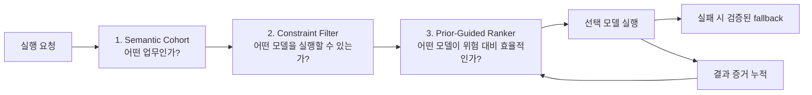
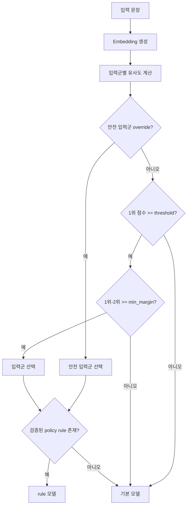

# Nodease 모델 라우터 3종 총체 분석 보고서

Status: Draft

Verified Against: feature/mba-270 @ 99397f80bec6e8d511e3c83b5bbb59bd02035014 + working tree

## 1. 문서 목적

Nodease에는 현재 서로 다른 문제를 풀기 위한 모델 라우팅 로직 세 가지가 있다.

1. `semantic_cohort_v1`: 입력의 업무 의미를 분류하고 저장 정책의 규칙을 적용한다.
2. `constraint_difficulty_v1`: 입력과 워크플로우의 구조적 난이도를 계산하고 검증된 모델만 선택한다.
3. `prior_guided_adaptive_v1`: 모델의 사전 성능 정보와 누적 증거를 함께 사용해 품질 위험을 반영한 비용·지연 최적화를 수행한다.

이 문서는 세 로직을 같은 기준으로 비교한다. 특히 다음 질문에 답한다.

- 각 라우터는 어떤 입력을 받아 무엇을 판단하는가?
- 실제 배포 실행에 연결된 로직과 실험 전용 로직은 무엇인가?
- 각 로직은 품질, 비용, 지연 시간, 새 모델 도입 문제를 어떻게 다루는가?
- 세 로직은 경쟁 관계인가, 조합 가능한가?
- 현재 실험 결과로 어디까지 말할 수 있으며 무엇을 더 검증해야 하는가?

## 2. 먼저 알아야 할 핵심 결론

세 로직은 같은 일을 세 방식으로 구현한 대체재가 아니다. 서로 다른 질문에 답한다.

| 로직 | 답하는 질문 | 현재 상태 | 한 문장 평가 |
| --- | --- | --- | --- |
| `semantic_cohort_v1` | 이 요청은 어떤 업무 입력군에 속하는가? | 운영 runtime 연결 | 업무 의미를 가장 잘 반영하지만, 검증된 입력군·모델이 부족하면 기본 모델에 머문다. |
| `constraint_difficulty_v1` | 이 요청을 처리할 수 있고 이미 충분히 검증된 모델은 무엇인가? | 독립 실험 | 안전하지만 exact evidence를 요구해 새 모델이 증거를 얻지 못하는 순환이 생긴다. |
| `prior_guided_adaptive_v1` | 실행 가능한 후보 중 품질 하한을 지키며 총비용과 지연을 줄일 모델은 무엇인가? | 독립 실험 | 세 로직 중 새 모델 도입 문제를 가장 직접적으로 해결하지만, 사전 성능 데이터의 신뢰성과 실제 Provider 검증이 남아 있다. |

가장 중요한 상태 차이는 다음과 같다.

- 현재 일반 배포 실행은 `ModelRouter.resolve_policy()`와 `SemanticRouteMatcher.match()`를 사용한다.
- `constraint_difficulty_v1`과 `prior_guided_adaptive_v1`은 실험 runner에서만 호출된다.
- 따라서 고정 fixture 실험에서 새 전략이 좋은 결과를 냈어도 현재 배포 traffic의 모델 선택은 바뀌지 않는다.

장기적으로 가장 자연스러운 구성은 세 책임을 순서대로 결합하는 것이다.



즉, 의미 분류와 실행 가능성 검사와 경제성 평가는 서로 대체하지 않고 결합할 수 있다.

## 3. 공통 용어

| 용어 | 쉬운 설명 | 코드에서의 의미 |
| --- | --- | --- |
| 후보 모델 | 이번 요청에 선택될 가능성이 있는 모델 | `ConstraintModelCandidate` 또는 active policy의 모델 ID |
| Hard Gate | 점수를 계산하기 전에 무조건 제외하는 조건 | 권한 없음, context window 부족, strict structured output 미지원 등 |
| 입력군 | 의미가 비슷한 요청 묶음 | Semantic cohort |
| Constraint Signature | 요청 난이도를 나타내는 구조적 지문 | 입력/RAG 길이, 출력 계약, schema, downstream, 파일 입력 등의 조합 |
| Evidence | 모델이 실제로 얼마나 잘 동작했는지 보여주는 실행 증거 | 성공률, schema 통과율, downstream 성공률, fallback률, 품질 점수 |
| Prior | 로컬 실행 증거가 없을 때 사용하는 모델의 시작 추정값 | 예상 품질, 불확실성, 지연, fallback률 |
| Posterior | Prior에 실제 증거를 반영해 갱신한 추정값 | `posterior_quality_mean` 등 |
| 품질 하한 | 불확실성을 감안한 보수적 품질 점수 | 평균 품질에서 위험 여유를 뺀 `quality_lower_bound` |
| Fallback | 첫 번째 모델 호출이 실패할 때 사용할 대체 모델 | `fallback_model_id` |

## 4. 라우터 1: `semantic_cohort_v1`

### 4.1 해결하려는 문제

같은 LLM 노드라도 문의의 의미에 따라 필요한 모델이 다를 수 있다.

- 단순 사용 안내는 저비용 모델로 처리할 수 있다.
- 결제·권한·보안처럼 위험한 문의는 더 안정적인 모델이 필요할 수 있다.
- JSON 계약이 같더라도 업무 의미와 위험은 다를 수 있다.

`semantic_cohort_v1`은 입력 문장을 embedding으로 바꾼 뒤, 정책에 저장된 입력군 예문들과 비교해 가장 가까운 입력군을 찾는다. 그 입력군에 검증된 모델 규칙이 있으면 해당 모델을 선택한다.

### 4.2 실제 실행 순서

1. LLM 노드가 현재 배포의 active policy를 읽는다.
2. `_resolve_semantic_query_vector()`가 라우팅에 사용할 입력을 embedding한다.
3. `ModelRouter.resolve_policy()`가 policy의 `semantic_router` catalog를 읽는다.
4. `SemanticRouteMatcher.match()`가 각 입력군의 대표 예문과 유사도를 계산한다.
5. 1위 점수가 입력군 threshold를 넘는지 확인한다.
6. 1위와 2위 점수 차이가 `min_margin`을 넘는지 확인한다.
7. 안전 입력군 신호가 있으면 일반 입력군보다 우선할 수 있다.
8. 매칭된 입력군을 조건으로 가진 검증된 rule을 찾는다.
9. rule 모델을 실행 주체가 사용할 수 있으면 선택한다.
10. 매칭 실패, 애매함, 모델 권한 없음이면 policy의 기본 모델로 닫는다.



### 4.3 점수 계산 방식

현재 matcher는 policy 설정에 따라 다음 집계 방식을 지원한다.

- `centroid`: 입력군 예문 벡터의 중심과 비교한다.
- `max`: 입력군에서 가장 가까운 예문 하나의 점수를 사용한다.
- `top_k_mean`: 입력군별로 가까운 예문 상위 K개의 평균을 사용한다.
- 그 외 집계: 전체 대표 예문 중 상위 K개를 모아 입력군별로 집계한다.

최근 요구사항에서 권장한 방식은 입력군별 여러 예문을 두고 상위 유사도 평균을 사용하는 것이다. 대표 문장 하나의 우연한 고점보다 안정적이고, 중심점 하나가 넓은 의미를 뭉개는 문제도 줄인다.

최종 판정은 점수 하나만 보지 않는다.

```text
matched =
  top_score >= route.threshold
  AND (runner_up이 없거나 top_score - runner_up_score >= min_margin)
```

### 4.4 안전장치

- 도메인 키워드를 runtime Python 상수에 하드코딩하지 않는다.
- 안전 관련 lexical signal은 policy catalog에 저장된다.
- 안전 입력군은 별도 override threshold를 넘은 경우에만 우선한다.
- 저비용 rule이 있어도 안전 입력군과 충돌하면 기본 모델을 유지할 수 있다.
- trace에는 입력 원문이나 embedding을 남기지 않고 점수, threshold, margin, catalog version만 남긴다.
- 현재 실행 주체가 사용할 수 없는 모델은 rule에 있어도 선택하지 않는다.

### 4.5 장점

- 실제 업무 의미를 라우팅 조건으로 사용할 수 있다.
- 같은 구조의 입력도 사용 안내, 결제, 보안 등으로 나눌 수 있다.
- 입력군별 모델 정책을 사용자에게 설명하기 쉽다.
- 여러 대표 예문, threshold, margin, 안전 override를 지원한다.
- 현재 배포 runtime과 trace에 실제 연결되어 있다.

### 4.6 한계

- 입력군과 대표 예문의 품질에 크게 의존한다.
- 검증된 입력군 rule이 없으면 의미 매칭에 성공해도 기본 모델을 사용한다.
- 새 모델이 입력군 rule에 들어오려면 별도 Replay/Judge 검증 과정이 필요하다.
- trend 변화로 새 입력군이 생기면 발견·명명·예문 보강·검증까지 시간이 걸린다.
- 의미는 잘 분류해도 context window, strict output 지원 여부 같은 구조 제약을 의미 점수만으로 보장할 수 없다.

### 4.7 핵심 코드

- `apps/workflow_engine/workflow/nodes/llm/llm_node.py`
  - `_resolve_semantic_query_vector()`
  - `ModelRouter.resolve_policy()` 호출
- `apps/workflow_engine/services/model_router.py`
  - `resolve_policy()`
  - rule, 기본 모델, fallback, 실행 주체 가용 모델 판정
- `apps/workflow_engine/services/model_routing_semantic_router.py`
  - `SemanticRouteMatcher.match()`
  - 유사도, threshold, margin, safety override 판정
- `apps/workflow_engine/services/model_routing_adaptive_validation.py`
  - 검증된 cohort rule을 active policy에 반영

## 5. 라우터 2: `constraint_difficulty_v1`

### 5.1 해결하려는 문제

의미 입력군을 만들지 않아도 요청이 요구하는 기술 조건은 계산할 수 있다.

- 입력과 prompt가 얼마나 긴가?
- RAG context가 얼마나 큰가?
- 자유 텍스트인가, JSON인가, strict JSON Schema인가?
- Schema가 단순한가, 중첩 구조를 가진 복잡한 형태인가?
- 다음 노드가 출력 타입을 엄격하게 요구하는가?
- 파일 입력이 있는가?
- 필수 입력이 빠졌는가?

`constraint_difficulty_v1`은 이 특징으로 요청의 `ConstraintSignature`를 만들고, 해당 조건을 처리할 수 있는 모델 중 동일 signature에서 품질 gate를 통과한 가장 저렴한 모델을 선택한다.

### 5.2 Feature 추출

`ConstraintDifficultyFeatureExtractor.extract()`는 다음 값을 만든다.

| 특징 | 값 예시 | 판단 목적 |
| --- | --- | --- |
| `context_input_bucket` | small / medium / large | 입력+prompt 길이 요구 |
| `rag_context_bucket` | none / small / medium / large | 검색 문서 context 요구 |
| `output_contract` | text / json / strict_json_schema | 출력 형식 요구 |
| `schema_complexity` | none / simple / complex | 구조화 출력 난이도 |
| `downstream_strictness` | none / lenient / strict | 후속 노드 계약 강도 |
| `file_input` | true / false | 파일 처리 필요 여부 |
| `required_input_missing` | true / false | 실행 전 필수 입력 누락 |
| `required_capability_tier` | low / balanced / high | 위 조건을 합친 보수적 난이도 |

토큰 수는 provider billing과 완전히 같은 값이 아니라 실행 전 위험 검사용 추정치다. `tiktoken` 결과에 10% 여유를 더하고, 실패하면 UTF-8 byte 기준으로 보수적으로 추정한다.

### 5.3 Hard Gate

`ConstraintDifficultyCandidateFilter`는 점수 계산 전에 다음 모델을 제외한다.

1. 실행 주체가 사용할 수 없는 모델
2. 필요한 context 길이를 처리할 수 없는 모델
3. strict JSON Schema가 필수인데 이를 지원하지 않는 모델
4. 요청 자체에 필수 입력이 빠진 경우

여기서 capability tier는 공식 기능 지원 여부를 뜻하는 Hard Gate가 아니라 보수적 난이도 분류다. 요청이 `high`인데 high 후보가 없으면 실행 가능한 후보 중 가장 강한 tier로 닫는다.

### 5.4 품질 gate와 선택

동일한 `ConstraintSignature`에 대해 모델별 증거를 찾는다. 다음 기준을 모두 통과해야 검증 모델이 된다.

| 기준 | 현재 값 |
| --- | ---: |
| 최소 표본 | 3회 |
| 실행 성공률 | 98% 이상 |
| Schema 통과율 | JSON 계열에서 98% 이상 |
| Downstream 성공률 | strict downstream에서 99% 이상 |
| Fallback 비율 | 2% 이하 |
| 자유형 출력 품질 점수 | 0.85 이상 |

통과한 모델이 있으면 예상 직접 비용이 가장 싼 모델을 선택한다. 통과한 모델이 없으면 안전 기본 모델을 유지한다.

### 5.5 장점

- 업무 도메인별 키워드나 수동 입력군 없이 동작한다.
- 실행 가능성 검사를 의미 분류보다 먼저 명시적으로 수행한다.
- 쉬운 요청의 성공 증거를 더 어려운 요청에 잘못 재사용하지 않는다.
- 선택 이유와 제외 이유가 구조적이라 설명과 테스트가 쉽다.
- 품질 검증 없는 저비용 하향을 하지 않아 보수적이다.

### 5.6 핵심 구조적 한계: 검증-라우팅 순환

이 전략은 모델이 동일 signature에서 최소 3회의 성공 증거를 가져야 선택한다. 그러나 선택되지 않은 새 모델은 운영 실행 기회를 얻지 못하므로 증거도 쌓이지 않는다.

```text
증거가 없어서 선택하지 않음
→ 선택되지 않아 실행되지 않음
→ 실행되지 않아 증거가 생기지 않음
→ 계속 선택하지 않음
```

이 때문에 안전 기본 모델에 고착될 수 있다. 현재 60개 fixed fixture의 cold-start 조건에서는 60회 모두 `gpt-4.1` 기본 모델을 선택했다. 품질은 유지했지만 비용과 지연을 줄이지 못했다.

### 5.7 그 밖의 한계

- exact signature 비교가 너무 세분화되면 증거가 여러 칸으로 흩어진다.
- 자유형 출력은 별도 품질 점수가 없으면 계속 기본 모델을 사용한다.
- capability tier는 현재 catalog 값의 정확도에 의존한다.
- 운영 DB policy, LLM runtime, UI에 연결되어 있지 않다.
- 현재 역할은 최종 라우터보다 Hard Gate 및 안전 기준의 비교 기준에 가깝다.

### 5.8 핵심 코드

- `apps/workflow_engine/services/model_routing_constraint_difficulty.py`
  - `ConstraintDifficultyFeatureExtractor`
  - `ConstraintDifficultyCandidateFilter`
  - `ConstraintDifficultyRouter`
  - `ConstraintValidationEvidence`

## 6. 라우터 3: `prior_guided_adaptive_v1`

### 6.1 해결하려는 문제

이 전략은 `constraint_difficulty_v1`의 검증-라우팅 순환을 줄이기 위해 추가됐다. 핵심 차이는 로컬 검증 여부를 모델의 입장권으로 사용하지 않는다는 점이다.

- 로컬 증거가 없어도 모델 catalog 또는 전역 profile의 예상 성능으로 첫 점수를 만든다.
- 로컬 증거가 생기면 모델을 잠금 해제하는 대신 기존 추정값을 갱신한다.
- 표본이 적을수록 불확실성을 크게 보고 보수적으로 평가한다.
- 실패와 fallback이 쌓이면 다음 선택에서 자동으로 불리해진다.

### 6.2 입력 데이터

이 전략은 제약 라우터와 같은 `ConstraintSignature`와 Hard Gate를 사용한다. 추가로 다음을 받는다.

| 입력 | 의미 |
| --- | --- |
| `ConstraintModelPrior` | 모델의 시작 품질, 불확실성, 예상 지연, fallback률 |
| 관련 Evidence | 같은 signature 또는 더 어려운 호환 signature의 실행 결과 |
| `ConstraintExplorationContext` | 저위험 탐색 허용 여부, 비율, 남은 예산, 요청 키 |

명시적 prior가 없으면 모델 capability tier별 기본값을 사용한다.

| Tier | 시작 품질 | 불확실성 | 예상 지연 |
| --- | ---: | ---: | ---: |
| low | 0.78 | 0.12 | 500ms |
| balanced | 0.88 | 0.08 | 900ms |
| high | 0.95 | 0.05 | 1,500ms |

이 값은 실제 벤치마크가 아니라 현재 실험용 catalog default다. 운영 도입 전 provider·모델별 실제 profile로 대체해야 한다.

### 6.3 증거 재사용 규칙

증거의 관련도는 다음처럼 가중된다.

- 같은 signature: `1.0`
- 요청보다 더 어려운 호환 signature에서 성공한 증거: `0.65`
- downstream 강도와 요구 tier가 같은 부분 호환 증거: `0.35`
- 쉬운 요청 증거를 더 어려운 요청에 재사용: `0.0`
- text와 JSON처럼 출력 계약이 호환되지 않음: `0.0`
- 파일 없는 증거를 파일 입력 요청에 재사용: `0.0`

예를 들어 긴 RAG+복잡 Schema에서 성공한 모델의 증거는 짧은 JSON 요청에 일부 재사용할 수 있다. 반대 방향은 허용하지 않는다.

### 6.4 품질 추정

먼저 Prior와 누적 Evidence를 가중 평균해 예상 품질을 갱신한다.

```text
posterior_mean =
  (prior_mean × prior_strength + evidence_quality × effective_samples)
  / (prior_strength + effective_samples)
```

표본이 쌓일수록 불확실성은 줄어든다.

```text
uncertainty = adjusted_prior_uncertainty
              / sqrt(1 + effective_samples / prior_strength)
```

평균만 믿으면 표본이 적은 모델을 과대평가할 수 있으므로 품질 하한을 계산한다.

```text
quality_lower_bound = posterior_mean - beta × uncertainty
```

`beta`는 요청 난이도에 따라 커진다.

| 요구 tier | beta | 의미 |
| --- | ---: | --- |
| low | 1.0 | 비교적 적극적인 선택 허용 |
| balanced | 1.5 | 불확실성을 더 크게 차감 |
| high | 1.96 | 높은 위험에서 보수적으로 판단 |

품질 하한이 다음 floor 이상인 후보만 일반 선택 대상이 된다.

| 요구 tier | 품질 floor |
| --- | ---: |
| low | 0.72 |
| balanced | 0.82 |
| high | 0.90 |

### 6.5 비용과 효용 계산

직접 호출 가격만 보면 싼 모델이 자주 실패해 오히려 비싸질 수 있다. 따라서 예상 총비용에 fallback 비용을 포함한다.

```text
expected_total_cost =
  direct_model_cost
  + expected_fallback_rate × fallback_model_cost
```

최종 효용은 품질 하한에서 비용과 지연 패널티를 뺀 값이다.

```text
utility =
  quality_lower_bound
  - 0.14 × (expected_total_cost / default_model_cost)
  - 0.02 × (expected_latency / default_model_latency)
```

품질 floor를 통과한 후보 중 utility가 가장 높은 모델을 선택한다. 통과 모델이 없으면 안전 기본 모델을 유지한다.

### 6.6 제한된 탐색

증거를 얻으려면 일부 새 모델을 실행해야 한다. 그러나 모든 요청에 무작위 탐색을 하면 품질 사고와 비용 증가가 생긴다.

현재 실험 로직은 다음 조건에서만 탐색 후보를 허용한다.

- 요청 tier가 low다.
- strict downstream이 아니다.
- strict JSON Schema 요청이 아니다.
- 요청 키를 hash한 결정론적 sampling 결과가 설정 비율 안에 든다.
- 남은 탐색 예산보다 예상 총비용이 작다.
- 현재 선택보다 싸고, 평균 품질은 floor 이상이며, 불확실성이 충분히 크다.

같은 `request_key`는 항상 같은 sampling 결과를 내므로 테스트와 재현이 가능하다.

### 6.7 장점

- 새 모델이 로컬 검증 증거가 없다는 이유만으로 영구 제외되지 않는다.
- 증거가 쌓이면 품질 평균과 불확실성이 함께 갱신된다.
- 실패 증거가 optimistic prior를 실제로 교정한다.
- fallback 비용을 포함해 겉보기 가격이 아닌 예상 총비용을 비교한다.
- 고위험 요청은 더 높은 품질 하한과 더 큰 불확실성 차감을 적용한다.
- 낮은 위험에서만 예산 제한 탐색이 가능하다.

### 6.8 한계와 위험

- prior가 부정확하면 초기 선택도 잘못될 수 있다.
- 현재 tier default는 실제 모델별 benchmark가 아니라 실험 상수다.
- 품질·비용·지연 가중치 `0.14`, `0.02`는 제품 목표로 calibration되지 않았다.
- 탐색 예산과 사용 횟수를 DB transaction으로 관리하는 운영 구현이 없다.
- Provider별 실제 가격, rate limit, context capability 변화와 동기화해야 한다.
- 현재 fixed fixture의 품질 점수는 실제 출력에 대한 blind 평가가 아니다.
- 운영 active policy와 LLM runtime에 연결되어 있지 않다.

### 6.9 핵심 코드

- `apps/workflow_engine/services/model_routing_constraint_difficulty.py`
  - `ConstraintModelPrior`
  - `ConstraintExplorationContext`
  - `PriorGuidedCandidateScore`
  - `PriorGuidedAdaptiveRouter`

## 7. 세 라우터 비교

| 비교 기준 | Semantic Cohort | Constraint Difficulty | Prior-Guided Adaptive |
| --- | --- | --- | --- |
| 업무 의미 이해 | 강함 | 사용 안 함 | 사용 안 함 |
| 구조 제약 검사 | policy 일반 조건 중심 | 강함 | 강함 |
| 새 모델 cold start | 검증 rule 전에는 기본 모델 | 거의 불가능 | prior와 제한 탐색으로 가능 |
| 품질 보수성 | 검증된 rule만 활성화 | 매우 높음 | 불확실성 기반으로 조절 |
| 비용 최적화 | 입력군별 검증 모델에 의존 | 검증 후보 중 최저 직접비용 | fallback 포함 총비용과 지연 반영 |
| trend 대응 | 입력군 발견·갱신 필요 | 구조가 같으면 영향 적음 | 구조 증거와 prior 갱신 |
| 설명 가능성 | 입력군·유사도·rule | signature·gate | prior·하한·utility·증거 |
| 현재 운영 연결 | 예 | 아니오 | 아니오 |
| 현재 가장 큰 위험 | 검증 모델 부족과 기본 모델 고착 | 검증-라우팅 순환 | prior와 가중치의 현실성 부족 |

## 8. 동일 요청을 세 라우터가 보는 방식

예시 요청:

```json
{
  "customerTier": "enterprise",
  "message": "결제 API 장애로 정산 파일 생성이 실패했습니다. 보상 기준도 확인해 주세요."
}
```

노드 조건:

- RAG 사용
- strict JSON Schema 출력
- 다음 변수 추출 노드가 필수 필드를 요구
- 사용 가능 모델: `gpt-4o-mini`, `gpt-4.1-mini`, `gpt-4.1`

### Semantic Cohort

1. 문장 embedding을 만든다.
2. `보안/SLA 고위험`, `계정 및 결제 문제`, `일반 사용 안내` 입력군과 비교한다.
3. 고위험 입력군 유사도가 threshold와 margin을 넘으면 해당 입력군을 선택한다.
4. 고위험 입력군의 검증 rule이 `gpt-4.1`이면 이를 선택한다.
5. rule이 없으면 의미 매칭은 성공했어도 기본 모델을 사용한다.

### Constraint Difficulty

1. 요청 의미의 `결제`, `장애`, `보상`은 읽지 않는다.
2. RAG 크기, strict JSON, schema 복잡도, downstream strict 여부를 계산한다.
3. 요청을 balanced 또는 high signature로 분류한다.
4. strict output 미지원 또는 context 부족 모델을 제외한다.
5. 동일 signature에서 품질 gate를 통과한 모델 중 가장 싼 모델을 선택한다.
6. exact evidence가 없으면 `gpt-4.1` 안전 기본 모델을 유지한다.

### Prior-Guided Adaptive

1. Constraint Difficulty와 같은 Hard Gate를 적용한다.
2. 각 모델의 prior와 관련 증거를 합쳐 품질 하한을 계산한다.
3. strict downstream과 높은 tier 때문에 더 큰 beta와 높은 품질 floor를 사용한다.
4. fallback 포함 예상 총비용과 지연을 반영해 utility를 계산한다.
5. floor를 통과한 후보 중 utility가 가장 높은 모델을 선택한다.
6. 고위험 요청이므로 불확실한 모델 탐색은 하지 않는다.

## 9. Fixed-Fixture 실험 분석

### 9.1 실험 조건

- 실제 Provider 호출 없음
- 총 60개 입력: 세 워크플로우 유형별 20개
- 비교 전략: 고가 고정, 저가 고정, Semantic, Constraint, Prior-Guided
- RAG retrieval 결과는 전략 간 공유
- `(입력 fingerprint, 모델)` 결과 matrix를 공유해 같은 모델 중복 실행을 제거
- node-local exact validation evidence는 0개인 cold-start 조건

### 9.2 결과

| 전략 | 선택 모델 | 성공률 | Schema | Downstream | 총비용 | 평균 지연 | 평균 품질 |
| --- | --- | ---: | ---: | ---: | ---: | ---: | ---: |
| 고가 고정 | gpt-4.1 | 100.0% | 100.0% | 100.0% | $1.397640 | 1410.5ms | 0.960 |
| 저가 고정 | gpt-4o-mini | 93.3% | 80.0% | 80.0% | $0.104823 | 360.5ms | 0.700 |
| Semantic fixture | gpt-4.1-mini, gpt-4o-mini | 93.3% | 80.0% | 80.0% | $0.271428 | 593.8ms | 0.830 |
| Constraint Difficulty | gpt-4.1 | 100.0% | 100.0% | 100.0% | $1.397640 | 1410.5ms | 0.960 |
| Prior-Guided Adaptive | gpt-4.1, gpt-4.1-mini | 100.0% | 100.0% | 100.0% | $0.673464 | 943.8ms | 0.907 |

### 9.3 수치 해석

`Prior-Guided Adaptive`는 고가 고정과 비교해 다음 결과를 냈다.

- 총비용 약 51.8% 감소
- 평균 지연 약 33.1% 감소
- 성공률, Schema, Downstream 통과율 유지
- 평균 품질 점수 약 0.053 감소
- 기본 모델 사용 횟수: 기존 Constraint 60/60회, Prior-Guided 20/60회

즉, fixed fixture에서는 검증-라우팅 순환을 줄이면서 계약 실패 없이 중간 모델을 도입했다.

그러나 이 결과만으로 운영 채택을 결정할 수는 없다.

1. 출력 품질은 실제 Provider 결과를 사람에게 가린 blind 비교로 측정하지 않았다.
2. prior는 실제 장기 운영 profile이 아니라 fixture다.
3. 60개 입력이 실제 production 분포를 대표한다는 보장이 없다.
4. Provider 오류, rate limit, 가격 변화, credential 권한 변화가 포함되지 않았다.
5. 운영 교체 자동 판정도 `blind_quality_non_inferior` 미검증으로 최종 실패 상태다.

따라서 현재 실험이 증명한 것은 알고리즘 구조와 결과 재사용 계약이 동작한다는 점이다. 실제 품질과 운영 경제성은 아직 증명하지 않았다.

## 10. 현재 코드에서 혼동하기 쉬운 부분

### 10.1 `ModelRouter.resolve()`는 네 번째 신규 전략이 아니다

`apps/workflow_engine/services/model_router.py`에는 실행 횟수에 따라 `cold_start`, `warming_up`, `optimized`를 나누는 `resolve()`도 남아 있다. 반면 현재 저장 policy runtime의 핵심 경로는 `resolve_policy()`다.

이 보고서의 세 전략은 명시적인 strategy ID를 가진 다음 구현을 기준으로 한다.

- `semantic_cohort_v1`
- `constraint_difficulty_v1`
- `prior_guided_adaptive_v1`

기존 stage 기반 `resolve()`를 제품 정책으로 계속 유지할지, 호환 코드로만 둘지는 별도 정리가 필요하다. 두 경로의 이름이 비슷해 코드 독자가 운영 source of truth를 혼동할 수 있다.

### 10.2 실험 dispatcher는 운영 전환 스위치가 아니다

`ConstraintRoutingStrategyDispatcher`는 세 strategy ID를 호출할 수 있지만 주석대로 실험용 얇은 dispatch다. 이 클래스로 `prior_guided_adaptive_v1`을 호출할 수 있다는 사실은 배포 runtime이 그 전략을 사용한다는 뜻이 아니다.

### 10.3 현재 생성 보고서와 requirements의 과거 수치

현재 working tree에서 생성한 fixed-fixture report에는 `Prior-Guided Adaptive`의 51.8% 비용 감소가 기록돼 있다. `requirements.md`의 FR-015 끝부분에는 이전 실험의 약 3.7% 절감, 2,063회 손익분기 수치가 남아 있다. 두 수치는 서로 다른 구현 시점의 결과이므로 최종 커밋 전에 최신 실험 ID와 결과 기준을 명확히 나눠야 한다.

## 11. 권장 최종 구조

세 라우터 중 하나를 골라 나머지를 버리는 방식은 권장하지 않는다. 다음 파이프라인이 Nodease의 Workflow-Aware Adaptive Routing 방향에 가장 잘 맞는다.

### 단계 1. 실행 주체와 기능 Hard Gate

먼저 다음을 만족하지 않는 모델을 제거한다.

- 실행 주체 credential 사용 권한
- 조직과 배포에서 허용된 모델
- context window
- strict structured output 지원
- 파일/멀티모달 등 필수 capability
- 사용자가 명시적으로 제외한 모델

이 단계는 Constraint 라우터의 후보 filter를 공통 서비스로 승격해 사용할 수 있다.

### 단계 2. Semantic Cohort 판정

입력 의미를 입력군에 매칭한다. 안전 입력군, threshold, margin, 대표 예문, trend 변화 처리는 현재 Semantic Router를 유지한다.

### 단계 3. 입력군 안에서 Prior-Guided ranking

해당 입력군과 구조 signature에 대해 후보별 다음 값을 계산한다.

- 전역/Provider prior
- 해당 노드·입력군의 Replay 및 운영 증거
- 품질 하한
- fallback 포함 예상 총비용
- 예상 지연
- 불확실성

품질 floor를 통과한 후보 중 utility가 가장 높은 모델을 policy rule에 반영한다.

### 단계 4. 제한된 증거 수집

새 모델은 처음부터 trusted로 자동 승격하지 않는다. low-risk cohort에서만 월간 검증 예산과 표본 비율 안에서 Replay 또는 canary를 수행한다. strict schema, strict downstream, high-risk cohort는 별도 검증을 먼저 요구한다.

### 단계 5. Runtime은 저장된 policy만 평가

요청마다 Judge나 optimizer를 호출하지 않는다. 정책 갱신 작업이 위 계산을 수행하고 versioned active policy를 저장한다. runtime은 다음만 수행한다.

1. 입력군 매칭
2. 저장 rule 평가
3. 실행 직전 모델 권한 재검사
4. 선택 모델 실행
5. 필요 시 검증된 fallback 1회
6. 선택 근거 trace 기록

## 12. 운영 도입 전 필요한 작업

### P0. 실제 품질 검증

- 실제 Provider 결과로 대표 입력셋 실행
- 모델/전략 이름을 가린 blind 평가
- Schema, downstream, critical single failure 확인
- 워크플로우 유형별 비용과 지연 비교

### P1. Prior source of truth

- 수동 tier 기본값이 아니라 provider/model/version별 benchmark profile 정의
- profile의 생성 시점, 표본 수, 출처, 만료 정책 저장
- 가격과 capability catalog 변경 시 policy stale 처리

### P1. 통합 policy optimizer

- Semantic cohort별 후보 집합과 Constraint signature를 연결
- Prior-Guided score를 policy refresh에 사용
- 결과를 `llm_node_model_routing_policy_updates`와 trace에 저장
- 기존 검증 evidence와 Cost Optimizer Replay evidence를 중복 없이 결합

### P1. 탐색 예산과 동시성

- 월간 검증 예산 DB 저장
- exploration 선택과 비용 차감을 transaction으로 처리
- 동시 요청에서 예산 초과 및 중복 후보 실행 방지
- 동일 policy version 기준 idempotency 보장

### P2. Calibration

- `QUALITY_FLOOR`, `LCB_BETA`, `COST_WEIGHT`, `LATENCY_WEIGHT`를 실제 목표와 데이터로 조정
- workflow 위험도별 품질 손실 허용 범위 정의
- 표본이 적을 때의 prior strength와 불확실성 감소 속도 검증

### P2. 관측성과 UI

- 선택 모델, 기본 모델, fallback 모델
- 매칭 입력군과 후보별 유사도
- Hard Gate 제외 모델과 이유
- 후보별 품질 평균·하한·불확실성
- 예상 직접비용과 fallback 포함 총비용
- policy version과 증거 출처

민감한 입력 원문, embedding, credential 정보는 노출하지 않는다.

## 13. 최종 평가

### `semantic_cohort_v1`

계속 운영 기반으로 유지할 가치가 있다. Nodease가 워크플로우와 업무 맥락을 이해하는 라우터를 지향한다면 의미 입력군은 중요한 제품 기능이다. 다만 입력군별 검증 모델이 부족할 때 기본 모델에 고착되는 문제를 단독으로 해결하지는 못한다.

### `constraint_difficulty_v1`

독립 최종 라우터로는 지나치게 보수적이다. 그러나 Hard Gate, 요청 난이도 signature, 증거 호환성 규칙은 매우 유용하다. 이 로직은 버리기보다 공통 전처리와 안전 기준으로 분해해 재사용하는 것이 적절하다.

### `prior_guided_adaptive_v1`

현재 세 구현 중 검증-라우팅 순환을 가장 직접적으로 해결한다. fixed fixture에서는 비용·지연을 크게 줄이면서 계약 성공률을 유지했다. 그러나 prior와 가중치가 실험 상수이고 실제 blind 품질 검증이 없으므로 곧바로 운영 runtime을 교체하면 안 된다.

### 최종 권고

운영 `semantic_cohort_v1`을 즉시 교체하지 않는다. Constraint의 Hard Gate와 signature를 공통 계층으로 추출하고, Prior-Guided ranking을 policy refresh의 후보 평가기로 통합하는 방향으로 실제 Provider 실험을 진행한다. 즉 최종 형태는 다음과 같다.

```text
Semantic Cohort로 업무 유형 판정
→ Constraint Hard Gate로 실행 불가능 모델 제거
→ Prior-Guided ranking으로 품질 하한 내 최적 모델 선정
→ versioned policy 저장
→ runtime은 저장 policy만 빠르게 평가
```

이 구조가 세 구현의 장점을 가장 많이 살리고, 현재의 기본 모델 고착과 무분별한 저가 모델 탐색을 동시에 줄인다.

## 14. 코드 읽기 순서

세 구현을 직접 확인하려면 다음 순서가 가장 이해하기 쉽다.

1. `apps/workflow_engine/services/model_routing_semantic_router.py`
   - `SemanticRouteMatcher.match()`
   - 입력군 점수, threshold, margin을 먼저 이해한다.
2. `apps/workflow_engine/services/model_router.py`
   - `resolve_policy()`
   - 의미 매칭 결과가 실제 policy rule과 모델 선택으로 연결되는 방식을 본다.
3. `apps/workflow_engine/workflow/nodes/llm/llm_node.py`
   - `_resolve_semantic_query_vector()`와 runtime 호출 경계를 본다.
4. `apps/workflow_engine/services/model_routing_constraint_difficulty.py`
   - `ConstraintDifficultyFeatureExtractor`
   - `ConstraintDifficultyCandidateFilter`
   - `ConstraintDifficultyRouter`
   - `PriorGuidedAdaptiveRouter`
5. `apps/workflow_engine/services/model_routing_constraint_experiment.py`
   - 같은 입력과 모델 결과를 전략 간 재사용하는 실험 구조를 본다.
6. `apps/workflow_engine/tests/services/test_constraint_difficulty_router.py`
   - 각 gate, prior 갱신, 탐색 금지 조건을 구체적인 예로 확인한다.
7. `tests/experiments/test_constraint_difficulty_routing_experiment.py`
   - 60개 비교 실험의 완료 조건과 채택 기준을 확인한다.

## 15. 이해 확인 질문

1. Semantic Router가 입력군을 정확히 맞췄는데도 기본 모델을 사용할 수 있는 이유는 무엇인가?
2. Constraint Router에서 새 모델이 영원히 선택되지 않을 수 있는 순환은 어떻게 생기는가?
3. Prior-Guided Router가 평균 품질 대신 품질 하한을 사용하는 이유는 무엇인가?
4. 싼 모델의 직접 호출 비용 외에 fallback 비용을 포함해야 하는 이유는 무엇인가?
5. 왜 Prior-Guided Router를 매 요청 runtime에서 계산하지 않고 policy refresh에서 계산하는 편이 적절한가?
6. 세 로직을 `의미 분류 → 실행 가능성 검사 → 위험 조정 최적화` 순서로 조합하면 각 단계가 어떤 책임을 가지는가?
