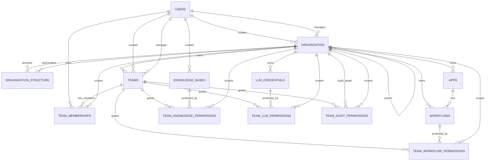

# RBAC Relationship Model

## 작성 기준

이 문서는 현재 소스의 RBAC 관련 DB 모델을 기준으로 관계를 설명한다.

주요 참조 모델:

- `apps/shared/db/models/organization.py`
- `apps/shared/db/models/team.py`
- `apps/shared/db/models/user.py`
- `apps/shared/db/models/app.py`
- `apps/shared/db/models/workflow.py`
- `apps/shared/db/models/llm.py`
- `apps/shared/db/models/knowledge.py`

이 문서는 권한 API 정책이 아니라, DB 관계가 어떤 의미를 가지는지 정리한 문서다. DB가 직접 보장하는 관계와 서비스 코드가 정책으로 보장해야 하는 관계를 구분한다.

## 핵심 요약

현재 RBAC 구조는 Organization을 권한 경계로 두고, Team을 Organization 내부의 사용자 그룹으로 사용한다. User는 TeamMembership을 통해 Team에 들어가며, Team은 리소스별 권한 테이블을 통해 Workflow, KnowledgeBase, LLM Credential, Audit 대상 Organization에 대한 권한을 가진다.

```text
Organization
  -> Team
      -> TeamMembership
      -> TeamWorkflowPermission
      -> TeamKnowledgePermission
      -> TeamLLMPermission
      -> TeamAuditPermission
```

Team은 사용자 그룹 또는 tag에 가까운 개념이다. Team 자체에는 권한 단계가 없다. 권한 단계는 리소스별 권한 테이블의 `auth_state`에 저장된다.

Organization membership은 별도 `organization_memberships` 테이블로 표현하지 않는다. 대신 유저가 특정 Organization의 Team에 들어간 사실, 즉 `team_memberships(grantee_organization_id, user_id, team_id)`를 통해 간접적으로 표현한다. 이 방식을 채택하려면 "Organization에 속한 유저는 반드시 하나 이상의 Team에 들어간다"는 서비스 정책이 필요하다.

## 주요 엔티티

### User

`users`는 서비스 사용자다.

주요 RBAC 관련 컬럼:

| 컬럼 | 의미 |
| --- | --- |
| `id` | User ID |
| `organization_id` | 사용자의 기본 또는 현재 Organization으로 해석 가능한 단일 FK |
| `email` | 로그인/식별용 이메일 |
| `name` | 사용자 이름 |

`users.organization_id`는 단일 FK이므로, 이것만으로는 유저가 여러 Organization에 소속되는 구조를 표현하지 못한다. 멀티 Organization 소속은 `team_memberships`를 통해 간접 표현한다.

따라서 현재 구조에서 `users.organization_id`는 "유일한 소속 조직"이라기보다 다음 중 하나로 해석하는 것이 안전하다.

- 기본 Organization
- 최근 선택한 Organization
- 회원가입 직후 배정된 초기 Organization
- 레거시 호환용 Organization FK

멀티 Organization RBAC의 source of truth로 삼기에는 부족하다.

### Organization

`organization`은 권한 경계이자 리소스 소유 범위다.

주요 컬럼:

| 컬럼 | 의미 |
| --- | --- |
| `id` | Organization ID |
| `parent_id` | 상위 Organization |
| `name` | Organization 이름 |
| `created_by` | Organization 생성자 |
| `managed_by` | Organization 관리자 |
| `is_active` | 활성 여부 |
| `deactivated_at` | 비활성화 시간 |

관계:

- 한 User는 여러 Organization을 생성할 수 있다.
- 한 User는 여러 Organization의 `managed_by`가 될 수 있다.
- 한 Organization은 하나의 `created_by`를 가진다.
- 한 Organization은 0개 또는 1개의 `managed_by`를 가진다.
- 한 Organization은 `parent_id`를 통해 다른 Organization의 하위 조직이 될 수 있다.

주의할 점:

- 현재 모델에는 `owner_id`가 없다.
- `created_by`는 생성자 이력이고, `managed_by`는 관리자 표시다.
- 소유권 이전을 명확히 표현하려면 `owner_id` 또는 owner Team 정책이 추가로 필요하다.

### OrganizationStructure

`organization_structure`는 Organization 계층 조회를 빠르게 하기 위한 closure table이다.

주요 컬럼:

| 컬럼 | 의미 |
| --- | --- |
| `ancestor_id` | 상위 Organization |
| `descendant_id` | 하위 Organization |
| `depth` | 두 Organization 사이 거리 |

예시:

```text
admin
  -> company
      -> department
```

저장되는 관계:

```text
ancestor_id   descendant_id   depth
admin         admin           0
admin         company         1
admin         department      2
company       company         0
company       department      1
department    department      0
```

이 구조를 사용하면 상위 Organization이 하위 Organization 범위의 리소스를 조회할 수 있는지 빠르게 판단할 수 있다.

### Team

`teams`는 Organization이 보유하는 사용자 그룹이다.

주요 컬럼:

| 컬럼 | 의미 |
| --- | --- |
| `id` | Team ID |
| `organization_id` | Team을 소유한 Organization |
| `name` | Team 이름 |
| `description` | Team 설명 |
| `created_by` | Team 생성자 |
| `managed_by` | Team 관리자 |
| `is_active` | 활성 여부 |
| `is_auto_add` | 자동 추가 여부 |

관계:

- 한 Organization은 여러 Team을 보유할 수 있다.
- 한 Team은 정확히 하나의 Organization에 속한다.
- 같은 Organization 안에서는 Team 이름이 중복될 수 없다.
- 한 User는 여러 Team을 생성하거나 관리할 수 있다.

Team은 역할, 그룹, tag에 가까운 개념이다. 예를 들어 다음과 같은 Team이 가능하다.

```text
owner
admin
developer
viewer
billing
security
marketing
project-alpha
```

Team 자체에는 `auth_state`가 없다. 같은 Team이라도 Workflow A에는 `read`, Workflow B에는 `admin`, LLM Credential C에는 `none`일 수 있기 때문이다.

### TeamMembership

`team_memberships`는 User가 어떤 Team에 들어갔는지 저장한다.

주요 컬럼:

| 컬럼 | 의미 |
| --- | --- |
| `id` | row ID |
| `grantee_organization_id` | Team이 속한 Organization |
| `user_id` | Team에 들어간 User |
| `team_id` | Team |
| `assigned_by` | Team에 넣은 User |
| `assigned_at` | Team에 넣은 시간 |

관계:

- 한 User는 여러 Team에 들어갈 수 있다.
- 한 Team에는 여러 User가 들어갈 수 있다.
- 한 User는 여러 Organization의 Team에 들어갈 수 있다.
- 한 User가 같은 Organization의 같은 Team에 중복으로 들어갈 수 없다.

`team_memberships`에는 `auth_state`가 없다. 이 테이블은 권한을 저장하지 않고, "누가 어떤 Team에 속하는가"만 저장한다.

이 구조에서 Organization membership은 다음처럼 간접 표현된다.

```text
team_memberships.user_id = user_a
team_memberships.grantee_organization_id = org_1
team_memberships.team_id = team_x
```

이 row가 존재한다는 것은 다음을 의미한다.

```text
user_a는 org_1의 team_x에 속한다.
따라서 user_a는 org_1에 소속된 것으로 볼 수 있다.
```

이 해석이 항상 맞으려면, Organization에 속한 모든 유저가 최소 하나의 TeamMembership을 가져야 한다. 보통은 `member` 또는 `default` Team을 자동 생성하고, Organization에 들어온 모든 유저를 그 Team에 넣는 방식이 필요하다.

## 리소스 권한 관계

리소스 권한은 Team 단위로 부여한다. User에게 직접 리소스 권한을 주지 않고, User가 속한 Team을 통해 권한을 얻는다.

공통 컬럼:

| 컬럼 | 의미 |
| --- | --- |
| `grantee_organization_id` | 권한을 받는 Team의 Organization |
| `team_id` | 권한을 받는 Team |
| `auth_state` | 해당 리소스에 대한 권한 단계 |
| `assigned_by` | 권한을 부여한 User |
| `assigned_at` | 권한 부여 시간 |

권한 단계는 문자열로 저장한다.

```text
none
read
execute
write
manage
admin
```

권한 비교는 문자열 직접 비교가 아니라 서비스 코드의 우선순위로 처리해야 한다.

```text
none    = 0
read    = 1
execute = 2
write   = 3
manage  = 4
admin   = 5
```

### TeamWorkflowPermission

`team_workflow_permissions`는 Team이 Workflow에 대해 어떤 권한을 가지는지 저장한다.

관계:

- 한 Team은 여러 Workflow에 권한을 가질 수 있다.
- 한 Workflow는 여러 Team에 의해 접근될 수 있다.
- 같은 Organization 안에서 같은 Team과 같은 Workflow 조합은 중복될 수 없다.

예시:

```text
Team developer -> Workflow A -> write
Team viewer    -> Workflow A -> read
Team admin     -> Workflow A -> admin
```

Workflow 자체는 `workflows.organization_id`를 가진다. 따라서 Workflow 접근을 판단할 때는 다음 두 범위를 모두 확인해야 한다.

- Workflow가 속한 Organization
- Team이 속한 Organization

현재 DB의 composite FK는 Team과 `grantee_organization_id`의 일치만 보장한다. Workflow의 `organization_id`와 `grantee_organization_id`가 일치해야 하는지, 또는 상위/하위 조직 접근을 허용할지는 서비스 정책으로 판단해야 한다.

### TeamKnowledgePermission

`team_knowledge_permissions`는 Team이 KnowledgeBase에 대해 어떤 권한을 가지는지 저장한다.

관계:

- 한 Team은 여러 KnowledgeBase에 권한을 가질 수 있다.
- 한 KnowledgeBase는 여러 Team에 의해 접근될 수 있다.
- 같은 Organization 안에서 같은 Team과 같은 KnowledgeBase 조합은 중복될 수 없다.

`knowledge_bases`는 `organization_id`를 가진다. 따라서 KnowledgeBase는 Organization 소유 리소스로 해석할 수 있다.

접근 판단 시에는 다음을 확인해야 한다.

- 요청 User가 해당 Team에 속해 있는가
- Team이 해당 KnowledgeBase에 필요한 `auth_state` 이상을 가지는가
- KnowledgeBase의 `organization_id`가 허용된 Organization 범위 안에 있는가

### TeamLLMPermission

`team_llm_permissions`는 Team이 LLM Credential에 대해 어떤 권한을 가지는지 저장한다.

관계:

- 한 Team은 여러 LLM Credential에 권한을 가질 수 있다.
- 한 LLM Credential은 여러 Team에 의해 접근될 수 있다.
- 같은 Organization 안에서 같은 Team과 같은 LLM Credential 조합은 중복될 수 없다.

`llm_credentials`는 `organization_id`를 가진다. 따라서 LLM Credential은 Organization 소유 리소스로 해석할 수 있다.

접근 판단 시에는 다음을 확인해야 한다.

- 요청 User가 해당 Team에 속해 있는가
- Team이 해당 LLM Credential에 필요한 `auth_state` 이상을 가지는가
- LLM Credential의 `organization_id`가 허용된 Organization 범위 안에 있는가

### TeamAuditPermission

`team_audit_permissions`는 Team이 특정 Organization 범위의 Audit 데이터를 볼 수 있는지 저장한다.

관계:

- 한 Team은 여러 target Organization에 대한 Audit 권한을 가질 수 있다.
- 한 target Organization의 Audit 데이터는 여러 Team에 의해 접근될 수 있다.
- 같은 Organization 안에서 같은 Team과 같은 target Organization 조합은 중복될 수 없다.

주요 컬럼:

| 컬럼 | 의미 |
| --- | --- |
| `grantee_organization_id` | 권한을 받는 Team의 Organization |
| `target_organization_id` | Audit 대상 Organization |
| `team_id` | 권한을 받는 Team |
| `auth_state` | Audit 접근 권한 |

예시:

```text
admin-org의 audit-team이 company-org의 audit log를 read 할 수 있다.
```

이 경우:

```text
grantee_organization_id = admin-org
target_organization_id = company-org
team_id = audit-team
auth_state = read
```

Audit 권한은 같은 Organization 내부 권한뿐 아니라, 상위 조직이 하위 조직의 Audit 데이터를 볼 수 있는 구조에도 사용할 수 있다.

## App, Workflow, LLM, Knowledge 관계

### App

`apps`는 `organization_id`를 가진다.

관계:

- 한 Organization은 여러 App을 가질 수 있다.
- 한 App은 0개 또는 1개의 Organization에 속할 수 있다.
- App은 `workflow_id`로 대표 Workflow를 참조할 수 있다.

현재 TeamAppPermission은 없다. App 접근은 Workflow 접근과 겹치므로, App 자체 권한보다 Workflow 권한을 통해 간접 처리하는 방향이다.

### Workflow

`workflows`는 `organization_id`와 `app_id`를 가진다.

관계:

- 한 Organization은 여러 Workflow를 가질 수 있다.
- 한 App은 여러 Workflow를 가질 수 있다.
- Team은 `team_workflow_permissions`를 통해 Workflow 권한을 가진다.

### LLM Credential

`llm_credentials`는 `organization_id`와 `user_id`를 가진다.

관계:

- 한 Organization은 여러 LLM Credential을 가질 수 있다.
- 한 User는 여러 LLM Credential을 만들 수 있다.
- Team은 `team_llm_permissions`를 통해 LLM Credential 권한을 가진다.

### KnowledgeBase

`knowledge_bases`는 `organization_id`와 `user_id`를 가진다.

관계:

- 한 Organization은 여러 KnowledgeBase를 가질 수 있다.
- 한 User는 여러 KnowledgeBase를 만들 수 있다.
- Team은 `team_knowledge_permissions`를 통해 KnowledgeBase 권한을 가진다.

## Organization membership 해석

현재 구조에는 별도 `organization_memberships` 테이블이 없다.

대신 다음 관계를 통해 Organization membership을 해석할 수 있다.

```text
User -> TeamMembership -> Team -> Organization
```

더 구체적으로는 다음 조건이 성립할 때 User가 Organization에 소속됐다고 볼 수 있다.

```text
team_memberships.user_id = users.id
team_memberships.team_id = teams.id
team_memberships.grantee_organization_id = teams.organization_id
teams.organization_id = organization.id
```

이 해석은 다음 장점이 있다.

- Team을 조직 내 역할과 tag로 동시에 사용할 수 있다.
- 별도 Organization membership 테이블 없이 유저의 조직 소속을 표현할 수 있다.
- `owner`, `admin`, `member`, `viewer` 같은 Team으로 조직 내 역할을 표현할 수 있다.

하지만 다음 정책이 반드시 필요하다.

- Organization 생성 시 기본 Team을 만든다.
- Organization에 유저를 초대하거나 추가할 때 기본 TeamMembership을 만든다.
- TeamMembership이 하나도 없는 User는 해당 Organization의 멤버로 보지 않는다.
- Organization에서 유저를 제거할 때 해당 Organization의 모든 TeamMembership을 제거하거나 비활성화한다.
- `users.organization_id`는 Organization membership의 source of truth로 사용하지 않는다.

## Team을 역할로 사용하는 방식

조직 내 역할을 Team으로만 관리한다면 다음처럼 모델링할 수 있다.

```text
Organization A
  Team owner
  Team admin
  Team member
  Team viewer
  Team billing
  Team security
```

User가 `owner` Team에 들어가면 Organization Owner처럼 취급할 수 있다. User가 `admin` Team에 들어가면 Organization Admin처럼 취급할 수 있다.

이 방식의 장점:

- 역할과 그룹을 하나의 모델로 통합한다.
- GitHub의 Team 기반 권한 모델과 유사한 방식으로 확장할 수 있다.
- 리소스 권한은 Team 단위로 부여하므로 User별 권한 중복이 줄어든다.

주의할 점:

- DB에는 `owner_id`가 없으므로 "Owner는 한 명만 존재한다"는 제약을 DB가 직접 보장하지 않는다.
- `owner` Team에 여러 User가 들어갈 수 있다.
- Owner를 반드시 한 명으로 제한하려면 서비스 코드에서 `owner` TeamMembership이 1개만 존재하도록 검사하거나, 별도 `owner_id`를 추가해야 한다.

따라서 현재 구조는 "여러 Owner가 가능한 Team 기반 RBAC"에는 자연스럽다. 반대로 "Organization마다 Owner는 정확히 한 명"이라는 정책에는 추가 제약이 필요하다.

## DB가 직접 보장하는 관계

현재 DB 모델이 직접 보장하는 핵심 관계는 다음과 같다.

### Team은 하나의 Organization에 속한다

`teams.organization_id -> organization.id`

한 Team은 하나의 Organization에 속한다.

### 같은 Organization 안에서 Team 이름은 중복될 수 없다

`UNIQUE(organization_id, name)`

같은 Organization 안에서는 같은 이름의 Team을 중복 생성할 수 없다.

### Team 관련 row는 Team의 Organization과 일치해야 한다

`teams`에는 다음 unique constraint가 있다.

```text
UNIQUE(id, organization_id)
```

Team 관련 테이블은 다음 composite FK를 가진다.

```text
(team_id, grantee_organization_id)
  -> teams(id, organization_id)
```

적용 대상:

- `team_memberships`
- `team_workflow_permissions`
- `team_knowledge_permissions`
- `team_llm_permissions`
- `team_audit_permissions`

이 제약은 다음 잘못된 데이터를 막는다.

```text
team_a.organization_id = org_1
team_memberships.team_id = team_a
team_memberships.grantee_organization_id = org_2
```

즉 Team이 실제로는 `org_1` 소속인데, TeamMembership이나 권한 row에서 `org_2` 소속처럼 저장되는 것을 막는다.

### 같은 Organization, 같은 User, 같은 Team membership은 중복될 수 없다

`team_memberships`에는 다음 unique constraint가 있다.

```text
UNIQUE(grantee_organization_id, user_id, team_id)
```

따라서 같은 User가 같은 Organization의 같은 Team에 중복으로 들어갈 수 없다.

### 같은 Organization, 같은 Team, 같은 Resource 권한은 중복될 수 없다

리소스별 권한 테이블에는 각각 unique constraint가 있다.

```text
team_workflow_permissions:
UNIQUE(grantee_organization_id, workflow_id, team_id)

team_knowledge_permissions:
UNIQUE(grantee_organization_id, knowledge_base_id, team_id)

team_llm_permissions:
UNIQUE(grantee_organization_id, llm_credential_id, team_id)

team_audit_permissions:
UNIQUE(grantee_organization_id, target_organization_id, team_id)
```

따라서 같은 Team이 같은 리소스에 대해 여러 권한 row를 중복으로 가질 수 없다. 권한 변경은 row를 추가하는 것이 아니라 기존 row의 `auth_state`를 변경하는 방식이어야 한다.

## 서비스 정책으로 보장해야 하는 관계

DB만으로는 충분히 보장되지 않는 관계도 있다. 이 부분은 서비스 코드에서 명확히 처리해야 한다.

### Organization membership의 기준

별도 `organization_memberships`가 없으므로 다음 정책을 정해야 한다.

```text
User가 Organization의 TeamMembership을 하나 이상 가지면
그 User는 해당 Organization의 member다.
```

이 정책을 선택한다면 Organization 가입/탈퇴 API는 TeamMembership을 기준으로 동작해야 한다.

### 기본 Team 정책

Organization membership을 TeamMembership으로 간접 표현하려면 기본 Team이 필요하다.

권장 정책:

```text
Organization 생성 시 member Team을 자동 생성한다.
Organization에 User를 추가할 때 member TeamMembership을 자동 생성한다.
```

이 정책이 없으면 "Organization에는 속했지만 어떤 Team에도 들어가지 않은 User"를 표현할 방법이 애매해진다.

### Owner 정책

현재 DB에는 `owner_id`가 없다.

가능한 정책은 두 가지다.

1. Team 기반 Owner

```text
owner Team에 들어간 User를 Organization Owner로 본다.
```

이 방식은 Team 기반 RBAC와 잘 맞는다. 다만 Owner를 정확히 한 명으로 제한하려면 서비스 코드에서 owner TeamMembership 개수를 검사해야 한다.

2. 별도 owner_id 추가

```text
organization.owner_id -> users.id
```

이 방식은 "Organization마다 Owner는 한 명"이라는 정책을 DB 모델로 명확히 표현한다. 다만 Team 기반 역할 모델과 owner_id 모델을 함께 관리해야 한다.

### 리소스 Organization과 Team Organization의 범위

Composite FK는 Team과 `grantee_organization_id`의 일치만 보장한다. 리소스 자체가 어느 Organization에 속하는지는 별도로 확인해야 한다.

예를 들어 Workflow 접근 시 다음을 확인해야 한다.

```text
team_workflow_permissions.grantee_organization_id == teams.organization_id
workflow.organization_id가 요청 Organization 범위 안에 있음
```

상위 Organization이 하위 Organization의 리소스에 접근할 수 있다면 `organization_structure`를 사용해 범위를 확인해야 한다.

### KnowledgeBase Organization 소유

`knowledge_bases.organization_id`가 KnowledgeBase의 소유 Organization이다.

새 KnowledgeBase를 생성할 때는 요청 User의 현재 Organization context를 `organization_id`로 저장해야 한다. 기존 데이터는 마이그레이션에서 `users.organization_id`를 기준으로 가능한 범위만 백필한다. `users.organization_id`가 없는 기존 KnowledgeBase는 `organization_id`가 `NULL`로 남을 수 있으므로, 서비스 코드에서 legacy/private 데이터로 취급할지 별도 정리할지 정책을 정해야 한다.

## 접근 판단 흐름

Team 기반 RBAC에서 리소스 접근은 다음 흐름으로 판단한다.

### 공통 흐름

```text
1. 요청 User를 식별한다.
2. 요청 Organization context를 결정한다.
3. User가 해당 Organization의 어떤 Team에 속하는지 조회한다.
4. 요청 리소스에 연결된 Team 권한 row를 조회한다.
5. User의 Team 목록과 리소스 권한 Team 목록의 교집합을 구한다.
6. 교집합 Team 중 active Team만 남긴다.
7. 해당 권한 row의 auth_state가 필요한 권한 이상인지 확인한다.
8. 리소스 Organization이 요청 Organization 범위 안에 있는지 확인한다.
```

### Workflow 예시

```text
User A가 Workflow W를 실행하려고 한다.

1. User A의 team_memberships 조회
2. Workflow W의 team_workflow_permissions 조회
3. 두 결과의 team_id 교집합 확인
4. 해당 row의 auth_state >= execute 인지 확인
5. Workflow W의 organization_id가 요청 Organization 또는 하위 Organization인지 확인
```

### LLM Credential 예시

```text
User A가 LLM Credential C를 사용하려고 한다.

1. User A의 team_memberships 조회
2. Credential C의 team_llm_permissions 조회
3. 두 결과의 team_id 교집합 확인
4. 해당 row의 auth_state >= read 또는 execute 인지 확인
5. Credential C의 organization_id가 요청 Organization 범위 안에 있는지 확인
```

### Audit 예시

```text
User A가 Organization B의 audit 데이터를 보려고 한다.

1. User A의 team_memberships 조회
2. target_organization_id = Organization B인 team_audit_permissions 조회
3. 두 결과의 team_id 교집합 확인
4. 해당 row의 auth_state >= read 인지 확인
5. Organization B가 요청 Organization 범위 안에 있는지 organization_structure로 확인
```

## 관계 다이어그램



## 현재 구조의 적합성 판단

현재 구조는 Team 기반 RBAC로 해석하면 충분히 말이 된다.

적합한 점:

- Team을 사용자 그룹으로 두고, 리소스 권한을 Team 단위로 부여한다.
- Team 자체와 권한 단계를 분리해 리소스별 권한 차이를 표현할 수 있다.
- Composite FK로 Team과 Organization 범위가 어긋나는 데이터를 막는다.
- TeamMembership을 통해 User가 여러 Organization의 Team에 들어가는 구조를 표현할 수 있다.
- OrganizationStructure로 상위/하위 조직 범위 접근을 표현할 수 있다.

주의할 점:

- 별도 `organization_memberships`가 없으므로 Organization 소속은 TeamMembership으로 간접 해석해야 한다.
- `users.organization_id`는 멀티 Organization membership의 source of truth가 아니다.
- `owner_id`가 없으므로 단일 Owner 정책은 DB가 직접 보장하지 않는다.
- Owner/Admin 같은 조직 내 역할을 Team으로 관리한다면, 기본 Team과 owner Team 정책이 반드시 필요하다.
- 기존 `KnowledgeBase` 중 생성자의 Organization이 없는 데이터는 `organization_id`가 `NULL`일 수 있으므로 legacy 처리 정책이 필요하다.

결론:

```text
현재 구조는 "Team을 조직 내 역할/tag로 사용하고,
TeamMembership을 Organization membership의 source of truth로 삼는다"는 전제에서는
RBAC 구조로 사용할 수 있다.

다만 단일 Owner와 명시적 Organization membership을
DB 레벨에서 강하게 보장하려면 추가 컬럼이나 제약이 필요하다.
```
