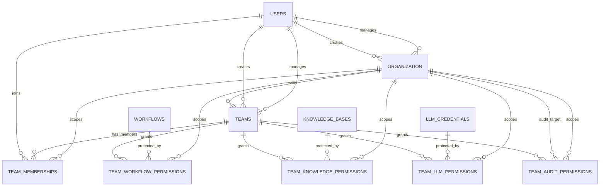

# RBAC Relationship Model

## 핵심 요약

현재 RBAC 구조는 Organization을 권한 경계로 두고, Team을 Organization 내부의 사용자 그룹으로 사용한다.

User는 직접 `organization_id`를 가지지 않는다. User의 Organization 소속은 `TeamMembership`으로 해석한다.

```text
User
  -> TeamMembership
  -> Team
  -> Organization
```

Organization 상하관계는 사용하지 않는다. 따라서 `organization.parent_id`와 `organization_structure`는 없다.

## User

`users`는 서비스 사용자다.

RBAC 관점의 주요 컬럼:

| 컬럼 | 의미 |
| --- | --- |
| `id` | User ID |
| `email` | 로그인/식별용 이메일 |
| `name` | 사용자 이름 |
| `deactivated_at` | 계정 비활성화 시간. `NULL`이면 활성 계정 |
| `last_login_at` | 마지막 인증 세션 생성 시간 |

`users.organization_id`는 없다.

User가 속한 Organization은 다음 방식으로 찾는다.

```text
SELECT DISTINCT team_memberships.grantee_organization_id
FROM team_memberships
WHERE team_memberships.user_id = :user_id
```

## Organization

`organization`은 권한 경계이자 리소스 소유 범위다.

주요 컬럼:

| 컬럼 | 의미 |
| --- | --- |
| `id` | Organization ID |
| `name` | Organization 이름 |
| `options` | Organization 설정값 |
| `flags` | Organization 상태 bitmask |
| `created_by` | Organization 생성자 |
| `managed_by` | Organization 관리자 |
| `is_active` | 활성 여부 |
| `deactivated_at` | 비활성화 시간 |

주의할 점:

- Organization 계층은 없다.
- 상위 조직이 하위 조직을 조회하는 정책도 없다.
- 여러 Organization을 묶는 기능이 필요해지면 별도 group/account 모델을 추가한다.

## Team

`teams`는 Organization이 보유하는 사용자 그룹이다.

주요 컬럼:

| 컬럼 | 의미 |
| --- | --- |
| `id` | Team ID |
| `organization_id` | Team을 소유한 Organization |
| `name` | Team 이름 |
| `options` | Team 설정값 |
| `flags` | Team 상태 bitmask |
| `description` | Team 설명 |
| `created_by` | Team 생성자 |
| `managed_by` | Team 관리자 |
| `is_active` | 활성 여부 |
| `is_auto_add` | 자동 추가 여부 |

Team 자체에는 `auth_state`가 없다. 권한 단계는 리소스별 permission table에 저장한다.

## TeamMembership

`team_memberships`는 User가 어떤 Team에 들어갔는지 저장한다.

주요 컬럼:

| 컬럼 | 의미 |
| --- | --- |
| `id` | row ID |
| `grantee_organization_id` | Team이 속한 Organization |
| `user_id` | Team에 들어간 User |
| `team_id` | Team |
| `assigned_by` | Team에 넣은 User |
| `assigned_at` | Team에 넣은 시간 |
| `options` | 멤버십 설정값 |
| `flags` | 멤버십 상태 bitmask |

`team_memberships`에는 `auth_state`가 없다. 이 테이블은 권한을 저장하지 않고, "누가 어떤 Team에 속하는가"만 저장한다.

`grantee_organization_id`는 composite FK로 `teams.organization_id`와 일치해야 한다.

```text
(team_id, grantee_organization_id)
  -> teams(id, organization_id)
```

따라서 다음 row가 존재하면:

```text
team_memberships.user_id = user_a
team_memberships.grantee_organization_id = org_1
team_memberships.team_id = team_x
```

다음처럼 해석한다.

```text
user_a는 org_1의 team_x에 속한다.
따라서 user_a는 org_1에 소속된 것으로 볼 수 있다.
```

## 리소스 권한 관계

리소스 권한은 Team 단위로 부여한다. User에게 직접 리소스 권한을 주지 않고, User가 속한 Team을 통해 권한을 얻는다.

공통 컬럼:

| 컬럼 | 의미 |
| --- | --- |
| `grantee_organization_id` | 권한을 받는 Team의 Organization |
| `team_id` | 권한을 받는 Team |
| `auth_state` | 해당 리소스에 대한 권한 단계 |
| `assigned_by` | 권한을 부여한 User |
| `assigned_at` | 권한 부여 시간 |
| `options` | 권한 설정값 |
| `flags` | 권한 row 상태 bitmask |

권한 단계:

```text
none
read
execute
write
manage
admin
```

권한 비교는 문자열 직접 비교가 아니라 서비스 코드의 우선순위로 처리한다.

## 리소스별 권한 테이블

| 리소스 | 권한 테이블 | 대상 컬럼 |
| --- | --- | --- |
| Workflow | `team_workflow_permissions` | `workflow_id` |
| KnowledgeBase | `team_knowledge_permissions` | `knowledge_base_id` |
| LLM Credential | `team_llm_permissions` | `llm_credential_id` |
| Audit target Organization | `team_audit_permissions` | `target_organization_id` |

각 permission table은 다음을 보장한다.

- 같은 Organization 안에서 같은 Team과 같은 Resource 조합은 중복될 수 없다.
- Team과 `grantee_organization_id`가 어긋나는 row는 DB가 거부한다.
- 권한 변경은 새 row 추가가 아니라 기존 row의 `auth_state` 변경으로 처리한다.

## DB가 직접 보장하는 관계

### Team은 하나의 Organization에 속한다

```text
teams.organization_id -> organization.id
```

### 같은 Organization 안에서 Team 이름은 중복될 수 없다

```text
UNIQUE(organization_id, name)
```

### Team 관련 row는 Team의 Organization과 일치해야 한다

```text
(team_id, grantee_organization_id)
  -> teams(id, organization_id)
```

적용 대상:

- `team_memberships`
- `team_workflow_permissions`
- `team_knowledge_permissions`
- `team_llm_permissions`
- `team_audit_permissions`

### 같은 Organization, 같은 User, 같은 Team membership은 중복될 수 없다

```text
UNIQUE(grantee_organization_id, user_id, team_id)
```

### 같은 Organization, 같은 Team, 같은 Resource 권한은 중복될 수 없다

```text
team_workflow_permissions:
UNIQUE(grantee_organization_id, workflow_id, team_id)

team_knowledge_permissions:
UNIQUE(grantee_organization_id, knowledge_base_id, team_id)

team_llm_permissions:
UNIQUE(grantee_organization_id, llm_credential_id, team_id)

team_audit_permissions:
UNIQUE(grantee_organization_id, target_organization_id, team_id)
```

## 서비스 정책으로 보장해야 하는 관계

### Organization membership의 기준

별도 `organization_memberships`가 없으므로 다음 정책을 사용한다.

```text
User가 Organization의 TeamMembership을 하나 이상 가지면
그 User는 해당 Organization의 member다.
```

### 기본 Team 정책

Organization membership을 TeamMembership으로 표현하려면 기본 Team이 필요하다.

권장 정책:

```text
Organization 생성 시 member Team을 자동 생성한다.
Organization에 User를 추가할 때 member TeamMembership을 자동 생성한다.
```

### Owner/Admin 정책

Owner/Admin 같은 조직 내 역할은 Team 이름 또는 `team_memberships.options`로 표현한다.

예시:

```text
teams.name = owner
team_memberships.options = {"role": "manager"}
```

정확히 한 명의 owner만 허용해야 한다면 서비스 코드에서 검사해야 한다.

## 접근 판단 흐름

```text
1. 요청 User를 식별한다.
2. 요청 Organization context를 결정한다.
3. User가 해당 Organization의 어떤 Team에 속하는지 조회한다.
4. 요청 리소스에 연결된 Team 권한 row를 조회한다.
5. User의 Team 목록과 리소스 권한 Team 목록의 교집합을 구한다.
6. 교집합 Team 중 active Team만 남긴다.
7. 해당 권한 row의 auth_state가 필요한 권한 이상인지 확인한다.
8. 리소스 organization_id와 grantee_organization_id 정책 일치 여부를 확인한다.
```

## 관계 다이어그램


