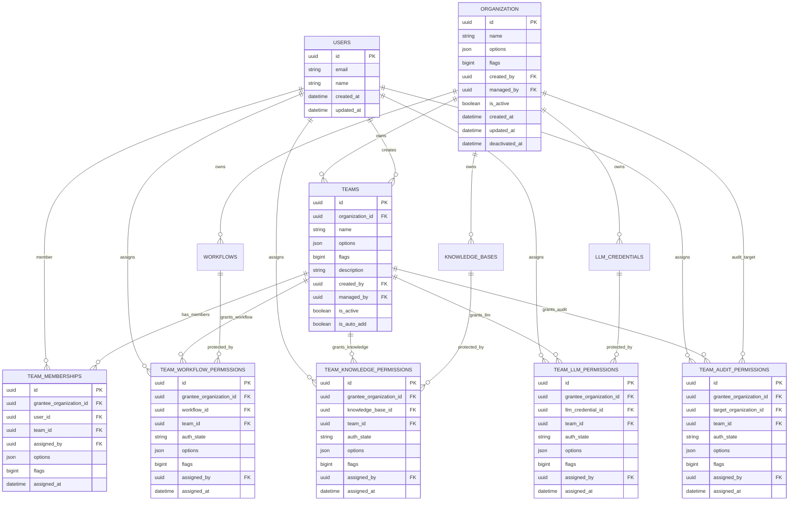

# Team Workspace Plan

## 목표

Organization, Team, 리소스별 권한을 기준으로 사용자가 접근 가능한 워크스페이스를 구성한다.

최신 기준의 핵심 구조는 다음과 같다.

```text
Organization
  -> Team
  -> TeamMembership
  -> TeamWorkflowPermission
  -> TeamKnowledgePermission
  -> TeamLLMPermission
  -> TeamAuditPermission
  -> Team Workspace
```

Organization 상하관계는 사용하지 않는다. 따라서 `organization.parent_id`와 `organization_structure`는 제거한다.

User도 직접 `organization_id`를 가지지 않는다. User가 어떤 Organization에 속하는지는 `team_memberships.grantee_organization_id`로 해석한다.

`TeamAppPermission`은 만들지 않는다. 현재 App 접근은 Workflow 접근과 역할이 겹치므로, App은 Workflow 권한을 통해 간접적으로 다룬다.

## Options / Flags 컬럼

다음 테이블은 공통으로 `options`, `flags` 컬럼을 가진다.

| 테이블 | 용도 |
| --- | --- |
| `organization` | 조직 설정값과 조직 상태 플래그 |
| `teams` | 팀 설정값과 팀 상태 플래그 |
| `team_memberships` | 멤버십 설정값과 멤버십 상태 플래그 |
| `team_workflow_permissions` | workflow 권한 설정값과 권한 row 상태 플래그 |
| `team_knowledge_permissions` | knowledge 권한 설정값과 권한 row 상태 플래그 |
| `team_llm_permissions` | LLM 권한 설정값과 권한 row 상태 플래그 |
| `team_audit_permissions` | audit 권한 설정값과 권한 row 상태 플래그 |

`options`는 `JSONB NOT NULL DEFAULT '{}'`이다.
설명, UI 설정, 외부 연동 메타데이터처럼 값이 있는 설정을 저장한다.

`flags`는 `BIGINT NOT NULL DEFAULT 0`이다.
시스템 생성 여부, 기본값 여부, 잠금 여부처럼 on/off 상태를 bitmask로 저장한다.
`flags`는 음수가 될 수 없고 DB check constraint로 `flags >= 0`을 강제한다.

## 현재 기준 모델

### Organization

조직 또는 워크스페이스 단위이다.

주요 컬럼:

| 컬럼 | 의미 |
| --- | --- |
| `id` | Organization ID |
| `name` | 조직 이름 |
| `options` | 조직 설정값 |
| `flags` | 조직 상태 bitmask |
| `created_by` | 생성자 |
| `managed_by` | 관리자 |
| `is_active` | 활성 여부 |
| `created_at` | 생성 시간 |
| `updated_at` | 수정 시간 |
| `deactivated_at` | 비활성화 시간 |

### User

사용자 계정이다.

계정 상태는 `users.deactivated_at`과 `users.last_login_at`으로 관리한다.
`deactivated_at`이 `NULL`이면 활성 계정이고, 값이 있으면 비활성화된 계정이다.
`last_login_at`은 로그인, 회원가입 후 자동 로그인, Google OAuth처럼 새 인증 세션이 발급될 때만 갱신한다.

`users.organization_id`는 사용하지 않는다.

User가 속한 Organization은 다음 관계로 구한다.

```text
users.id
  -> team_memberships.user_id
  -> team_memberships.grantee_organization_id
```

사용자가 여러 Organization의 Team에 속할 수 있으므로 이 구조가 단일 `users.organization_id`보다 자연스럽다.

### Team

조직 안에서 사용하는 사용자 묶음이다.

주요 컬럼:

| 컬럼 | 의미 |
| --- | --- |
| `id` | Team ID |
| `organization_id` | Team 소유 조직 |
| `name` | Team 이름 |
| `options` | Team 설정값 |
| `flags` | Team 상태 bitmask |
| `description` | Team 설명 |
| `created_by` | 생성자 |
| `managed_by` | 관리자 |
| `is_active` | 활성 여부 |
| `is_auto_add` | 자동 추가 여부 |
| `created_at` | 생성 시간 |
| `updated_at` | 수정 시간 |
| `deactivated_at` | 비활성화 시간 |

`Team`에는 `auth_state`가 없다.

같은 Team이라도 Workflow A에서는 `read`, KnowledgeBase B에서는 `write`, Audit C에서는 `admin`일 수 있으므로 권한 단계는 리소스별 권한 테이블에 둔다.

### TeamMembership

사용자가 어떤 Team에 속하는지 저장한다.

주요 컬럼:

| 컬럼 | 의미 |
| --- | --- |
| `id` | row ID |
| `grantee_organization_id` | Team 소속 조직 |
| `user_id` | Team에 속한 사용자 |
| `team_id` | Team |
| `assigned_by` | 부여자 |
| `assigned_at` | 부여 시간 |
| `options` | 멤버십 설정값 |
| `flags` | 멤버십 상태 bitmask |

`TeamMembership`은 멤버십만 나타내므로 `auth_state`가 없다.

`grantee_organization_id`는 `teams.organization_id`와 같아야 한다. 이 조건은 composite FK가 DB에서 강제한다.

### TeamWorkflowPermission

Team이 어떤 Workflow에 어떤 권한을 가지는지 저장한다.

| 컬럼 | 의미 |
| --- | --- |
| `id` | row ID |
| `grantee_organization_id` | Team 소속 조직 |
| `workflow_id` | Workflow |
| `team_id` | Team |
| `auth_state` | Workflow 권한 단계 |
| `assigned_by` | 부여자 |
| `assigned_at` | 부여 시간 |
| `options` | 권한 설정값 |
| `flags` | 권한 row 상태 bitmask |

### TeamKnowledgePermission

Team이 어떤 KnowledgeBase에 어떤 권한을 가지는지 저장한다.

| 컬럼 | 의미 |
| --- | --- |
| `id` | row ID |
| `grantee_organization_id` | Team 소속 조직 |
| `knowledge_base_id` | KnowledgeBase |
| `team_id` | Team |
| `auth_state` | Knowledge 권한 단계 |
| `assigned_by` | 부여자 |
| `assigned_at` | 부여 시간 |
| `options` | 권한 설정값 |
| `flags` | 권한 row 상태 bitmask |

### TeamLLMPermission

Team이 어떤 LLM Credential에 어떤 권한을 가지는지 저장한다.

| 컬럼 | 의미 |
| --- | --- |
| `id` | row ID |
| `grantee_organization_id` | Team 소속 조직 |
| `llm_credential_id` | LLM Credential |
| `team_id` | Team |
| `auth_state` | LLM 권한 단계 |
| `assigned_by` | 부여자 |
| `assigned_at` | 부여 시간 |
| `options` | 권한 설정값 |
| `flags` | 권한 row 상태 bitmask |

### TeamAuditPermission

Team이 어떤 Organization의 Audit 데이터를 볼 수 있는지 저장한다.

| 컬럼 | 의미 |
| --- | --- |
| `id` | row ID |
| `grantee_organization_id` | Team 소속 조직 |
| `target_organization_id` | Audit 대상 조직 |
| `team_id` | Team |
| `auth_state` | Audit 권한 단계 |
| `assigned_by` | 부여자 |
| `assigned_at` | 부여 시간 |
| `options` | 권한 설정값 |
| `flags` | 권한 row 상태 bitmask |

## 권한 단계

권한 단계는 문자열로 저장한다.

```text
none
read
execute
write
manage
admin
```

권한 비교는 문자열 직접 비교가 아니라 서비스 코드의 우선순위로 처리한다.

```text
none    = 0
read    = 1
execute = 2
write   = 3
manage  = 4
admin   = 5
```

`admin`은 전역 시스템 관리자 권한이 아니다. 특정 리소스에 대한 최고 권한으로 해석한다.

## Composite FK 정책

Team 소속 조직과 membership/permission row의 조직은 항상 같아야 한다.

예를 들어 다음 row는 잘못된 상태다.

```text
teams.id = team_a
teams.organization_id = org_1

team_memberships.team_id = team_a
team_memberships.grantee_organization_id = org_2
```

이를 막기 위해 `teams`에 다음 unique constraint를 둔다.

```text
UNIQUE(id, organization_id)
```

그리고 Team 관련 테이블은 다음 composite FK를 가진다.

```text
(team_id, grantee_organization_id)
  -> teams(id, organization_id)
```

적용 대상:

| 테이블 | 제약 |
| --- | --- |
| `team_memberships` | `fk_team_memberships_team_org` |
| `team_workflow_permissions` | `fk_team_workflow_permissions_team_org` |
| `team_knowledge_permissions` | `fk_team_knowledge_permissions_team_org` |
| `team_llm_permissions` | `fk_team_llm_permissions_team_org` |
| `team_audit_permissions` | `fk_team_audit_permissions_team_org` |

따라서 `TeamMembership.grantee_organization_id`는 “사용자가 속한 Team의 Organization”으로 신뢰할 수 있다.

## 기본 Admin Bootstrap 정책

서버 시작 또는 seed 실행 시 기본 admin 조직과 계정을 보장한다.

### 기본 Organization

`name = "admin"`인 Organization이 없으면 생성한다.

| 필드 | 값 |
| --- | --- |
| `id` | 랜덤 UUID |
| `name` | `admin` |
| `options` | 필요 시 `{"source": "system"}` |
| `flags` | 필요 시 system/default bitmask |
| `created_by` | 기본 admin user id |
| `managed_by` | 기본 admin user id |
| `is_active` | `True` |
| `created_at` | 서버 생성 시간 |
| `updated_at` | `created_at`과 동일 |
| `deactivated_at` | `NULL` |

### 기본 Admin User

admin Organization에 대응하는 기본 user를 생성한다.

| 필드 | 값 |
| --- | --- |
| `id` | admin Organization의 `id`와 동일 |
| `email` | `ADMIN_EMAIL`, 없으면 `admin@admin.com` |
| `name` | `ADMIN_NAME` |
| `password` | `ADMIN_PASSWORD` |
| `social_provider` | `none` |
| `social_id` | `NULL` |
| `avatar_url` | `NULL` |
| `created_at` | 서버 생성 시간 |
| `updated_at` | `created_at`과 동일 |

admin user에는 `organization_id`를 저장하지 않는다. admin Organization의 기본 Team에 `TeamMembership`을 만들어 소속을 표현한다.

운영 환경에서는 `ADMIN_NAME`, `ADMIN_PASSWORD`가 없으면 서버 시작을 실패시키는 쪽이 안전하다.

## Organization 접근 범위 정책

Organization 상하관계가 없으므로 하위 조직 범위 조회는 없다.

접근 가능한 Organization은 다음 방식으로 결정한다.

```text
SELECT DISTINCT grantee_organization_id
FROM team_memberships
WHERE user_id = :user_id
```

리소스 접근 시에는 리소스의 `organization_id`가 위 결과에 포함되는지 확인한다.

## 리소스별 조회 흐름

### Workflow 접근

```text
1. user_id 확인
2. team_memberships에서 사용자의 team_id와 grantee_organization_id 조회
3. team_workflow_permissions에서 workflow_id에 연결된 team_id 조회
4. team_id 교집합 확인
5. teams.is_active 확인
6. team_workflow_permissions.auth_state가 필요한 권한 이상인지 확인
7. workflow.organization_id와 grantee_organization_id 정책 일치 여부 확인
```

### Knowledge 접근

```text
1. user_id 확인
2. team_memberships에서 사용자의 team_id 조회
3. team_knowledge_permissions에서 knowledge_base_id에 연결된 team_id 조회
4. 교집합과 auth_state 확인
5. knowledge_bases.organization_id와 grantee_organization_id 정책 일치 여부 확인
```

### LLM 접근

```text
1. user_id 확인
2. team_memberships에서 사용자의 team_id 조회
3. team_llm_permissions에서 llm_credential_id에 연결된 team_id 조회
4. 교집합과 auth_state 확인
5. llm_credentials.organization_id와 grantee_organization_id 정책 일치 여부 확인
```

### Audit 접근

```text
1. user_id 확인
2. team_memberships에서 사용자의 team_id 조회
3. team_audit_permissions에서 target_organization_id에 연결된 team_id 조회
4. 교집합과 auth_state 확인
5. target_organization_id 기준으로 audit 권한 확인
```

## ERD



## 구현 순서

1. User 직접 Organization FK 제거
2. Organization 계층 구조 제거
3. `options` JSONB와 `flags` BIGINT 컬럼 추가
4. TeamMembership 기반 현재 Organization 조회 helper 적용
5. Team/리소스 권한 API 구현
6. 기존 workflow/knowledge/llm/audit 기능에 권한 필터 적용
