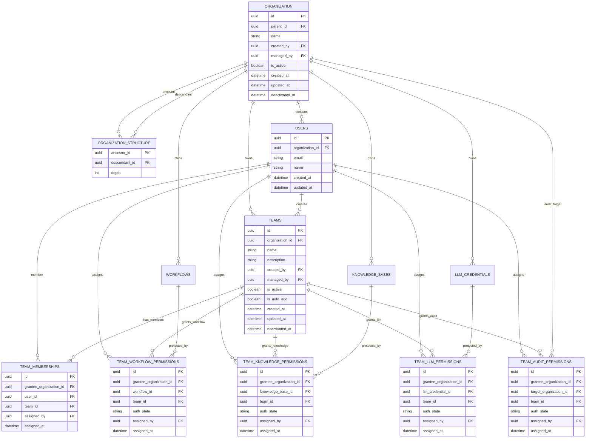

# Team Workspace Plan

## 목표

Organization, Team, 리소스별 권한을 기준으로 사용자가 접근 가능한 워크스페이스를 구성한다.

최신 기준의 핵심 구조는 다음과 같다.

```text
Organization
  -> organization_structure
  -> Team
  -> TeamMembership
  -> TeamWorkflowPermission
  -> TeamKnowledgePermission
  -> TeamLLMPermission
  -> TeamAuditPermission
  -> Team Workspace
```

Team은 사용자 묶음이고, 권한 단계는 Team 자체가 아니라 리소스별 권한 테이블에 저장한다.

`TeamAppPermission`은 만들지 않는다. 현재 App 접근은 Workflow 접근과 역할이 겹치므로, App은 Workflow 권한을 통해 간접적으로 다룬다.

## 현재 기준 모델

### Organization

조직 또는 워크스페이스 단위이다.

주요 역할:

- 조직 정보 관리
- 조직 관리자 관리
- Team의 소유 범위 제공
- Workflow, KnowledgeBase, LLM Credential, Audit 대상 조직의 소유 범위 제공
- 상위 조직이 하위 조직 리소스를 조회할 수 있는 기준 제공

주요 컬럼:

| 컬럼 | 의미 |
| --- | --- |
| `id` | Organization ID |
| `parent_id` | 상위 Organization ID |
| `name` | 조직 이름 |
| `created_by` | 생성자 |
| `managed_by` | 관리자 |
| `is_active` | 활성 여부 |
| `created_at` | 생성 시간 |
| `updated_at` | 수정 시간 |
| `deactivated_at` | 비활성화 시간 |

### OrganizationStructure

조직 계층 조회를 빠르게 하기 위한 closure table이다.

| 컬럼 | 의미 |
| --- | --- |
| `ancestor_id` | 상위 조직 |
| `descendant_id` | 하위 조직 |
| `depth` | 거리 |

예시:

```text
admin
  -> company
      -> department
```

저장되는 row:

```text
ancestor_id   descendant_id   depth
admin         admin           0
admin         company         1
admin         department      2
company       company         0
company       department      1
department    department      0
```

상위 조직에서 하위 조직 데이터를 찾을 때 `organization.parent_id`를 매번 재귀로 타지 않고 `organization_structure`를 조회한다.

### Team

조직 안에서 사용하는 사용자 묶음이다.

주요 컬럼:

| 컬럼 | 의미 |
| --- | --- |
| `id` | Team ID |
| `organization_id` | Team 소유 조직 |
| `name` | Team 이름 |
| `description` | Team 설명 |
| `created_by` | 생성자 |
| `managed_by` | 관리자 |
| `is_active` | 활성 여부 |
| `is_auto_add` | 자동 추가 여부 |
| `created_at` | 생성 시간 |
| `updated_at` | 수정 시간 |
| `deactivated_at` | 비활성화 시간 |

`Team`에는 `auth_state`가 없다.

같은 Team이라도 Workflow A에서는 `read`, KnowledgeBase B에서는 `write`, Audit C에서는 `admin`일 수 있으므로 권한 단계는 리소스별 권한 테이블에 둔다.

### TeamMembership

사용자가 어떤 Team에 속하는지 저장한다.

주요 컬럼:

| 컬럼 | 의미 |
| --- | --- |
| `id` | row ID |
| `grantee_organization_id` | Team 소속 조직 |
| `user_id` | Team에 속한 사용자 |
| `team_id` | Team |
| `assigned_by` | 부여자 |
| `assigned_at` | 부여 시간 |

`TeamMembership`은 멤버십만 나타내므로 `auth_state`가 없다.

### TeamWorkflowPermission

Team이 어떤 Workflow에 어떤 권한을 가지는지 저장한다.

| 컬럼 | 의미 |
| --- | --- |
| `id` | row ID |
| `grantee_organization_id` | Team 소속 조직 |
| `workflow_id` | Workflow |
| `team_id` | Team |
| `auth_state` | Workflow 권한 단계 |
| `assigned_by` | 부여자 |
| `assigned_at` | 부여 시간 |

### TeamKnowledgePermission

Team이 어떤 KnowledgeBase에 어떤 권한을 가지는지 저장한다.

| 컬럼 | 의미 |
| --- | --- |
| `id` | row ID |
| `grantee_organization_id` | Team 소속 조직 |
| `knowledge_base_id` | KnowledgeBase |
| `team_id` | Team |
| `auth_state` | Knowledge 권한 단계 |
| `assigned_by` | 부여자 |
| `assigned_at` | 부여 시간 |

### TeamLLMPermission

Team이 어떤 LLM Credential에 어떤 권한을 가지는지 저장한다.

| 컬럼 | 의미 |
| --- | --- |
| `id` | row ID |
| `grantee_organization_id` | Team 소속 조직 |
| `llm_credential_id` | LLM Credential |
| `team_id` | Team |
| `auth_state` | LLM 권한 단계 |
| `assigned_by` | 부여자 |
| `assigned_at` | 부여 시간 |

### TeamAuditPermission

Team이 어떤 조직 범위의 Audit 데이터를 볼 수 있는지 저장한다.

| 컬럼 | 의미 |
| --- | --- |
| `id` | row ID |
| `grantee_organization_id` | Team 소속 조직 |
| `target_organization_id` | Audit 대상 조직 |
| `team_id` | Team |
| `auth_state` | Audit 권한 단계 |
| `assigned_by` | 부여자 |
| `assigned_at` | 부여 시간 |

## 권한 단계

권한 단계는 문자열로 저장한다.

```text
none
read
execute
write
manage
admin
```

문자열 자체를 직접 비교하지 않고 서비스 코드에서 우선순위로 비교한다.

```text
none    = 0
read    = 1
execute = 2
write   = 3
manage  = 4
admin   = 5
```

권한 의미:

| 단계 | 의미 |
| --- | --- |
| `none` | 접근 없음 |
| `read` | 조회 가능 |
| `execute` | 실행 가능 |
| `write` | 수정 가능 |
| `manage` | 권한 부여, 연결 관리 가능 |
| `admin` | 해당 리소스 범위의 최고 권한 |

`admin`은 전역 시스템 관리자 권한이 아니다. 특정 리소스에 대한 최고 권한으로 해석한다.

## Composite FK 정책

Team 소속 조직과 권한 row의 조직은 항상 같아야 한다.

예를 들어 다음 row는 잘못된 상태다.

```text
teams.id = team_a
teams.organization_id = org_1

team_workflow_permissions.team_id = team_a
team_workflow_permissions.grantee_organization_id = org_2
```

이를 막기 위해 `teams`에 다음 unique constraint를 둔다.

```text
UNIQUE(id, organization_id)
```

그리고 Team 관련 테이블은 다음 composite FK를 가진다.

```text
(team_id, grantee_organization_id)
  -> teams(id, organization_id)
```

적용 대상:

| 테이블 | 제약 |
| --- | --- |
| `team_memberships` | `fk_team_memberships_team_org` |
| `team_workflow_permissions` | `fk_team_workflow_permissions_team_org` |
| `team_knowledge_permissions` | `fk_team_knowledge_permissions_team_org` |
| `team_llm_permissions` | `fk_team_llm_permissions_team_org` |
| `team_audit_permissions` | `fk_team_audit_permissions_team_org` |

서비스 코드에서도 insert 전에 조직 일치 여부를 확인한다. DB 제약은 최종 무결성 방어이고, 서비스 검사는 명확한 에러 메시지를 주기 위한 용도다.

## 기본 Admin Bootstrap 정책

서버 시작 또는 seed 실행 시 기본 admin 조직과 계정을 보장한다.

### 기본 Organization

`name = "admin"`인 Organization이 없으면 생성한다.

생성 규칙:

| 필드 | 값 |
| --- | --- |
| `id` | 랜덤 UUID |
| `name` | `admin` |
| `created_by` | 기본 admin user id |
| `managed_by` | 기본 admin user id |
| `is_active` | `True` |
| `created_at` | 서버 생성 시간 |
| `updated_at` | `created_at`과 동일 |
| `deactivated_at` | `NULL` |

### 기본 Admin User

admin Organization에 대응하는 기본 user를 생성한다.

생성 규칙:

| 필드 | 값 |
| --- | --- |
| `id` | admin Organization의 `id`와 동일 |
| `email` | `ADMIN_EMAIL`, 없으면 `admin@admin.com` |
| `name` | `ADMIN_NAME` |
| `password` | `ADMIN_PASSWORD` |
| `social_provider` | `none` |
| `social_id` | `NULL` |
| `avatar_url` | `NULL` |
| `created_at` | 서버 생성 시간 |
| `updated_at` | `created_at`과 동일 |
| `organization_id` | admin Organization의 `id` |

운영 환경에서는 `ADMIN_NAME`, `ADMIN_PASSWORD`가 없으면 서버 시작을 실패시키는 쪽이 안전하다.

### 기존 Dev User Seed 제거

현재 자동 생성되는 `dev@moduly.app` 계정 생성 로직은 제거한다.

대체 정책:

```text
dev@moduly.app 자동 생성 제거
admin Organization 생성
admin@admin.com 또는 ADMIN_EMAIL 계정 생성
admin 계정에 전체 접근 권한 부여
```

## Organization 접근 범위 정책

### 상위 조직의 하위 조직 조회

상위 Organization은 모든 하위 Organization의 데이터를 확인할 수 있다.

조회는 `organization_structure`를 기준으로 한다.

```text
organization_structure.ancestor_id = 요청자 organization_id
organization_structure.descendant_id = 리소스 organization_id
```

결과가 있으면 요청자 Organization은 해당 리소스 Organization의 조상 조직이다.

### 조직에서 만든 Team 조회

Team은 `teams.organization_id` 기준으로 소유 조직을 가진다.

조회 정책:

```text
teams.organization_id가 요청자의 organization_id이거나
teams.organization_id가 요청자 조직의 하위 조직이면 조회 가능
```

즉 상위 조직 관리자는 하위 조직에서 만든 Team도 확인할 수 있다.

### 특정 리소스의 권한 조회

특정 리소스에 붙은 Team 권한을 조회하려면 리소스 조직과 Team 조직이 모두 요청자 조직 범위 안에 있어야 한다.

Workflow 예시:

```text
team_workflow_permissions
  -> workflows.organization_id
  -> teams.organization_id
```

조회 조건:

```text
workflows.organization_id가 요청자 조직 또는 하위 조직
AND teams.organization_id가 요청자 조직 또는 하위 조직
```

이 정책은 조직 범위 확인과 행동 권한 확인을 분리한다.

```text
조직 범위 확인
= organization_structure 기준으로 접근 가능한 조직인지 확인

행동 권한 확인
= 리소스별 권한 테이블의 auth_state가 필요한 단계 이상인지 확인
```

### organization_id가 NULL인 데이터

회원가입 직후 user의 `organization_id`는 `NULL`일 수 있다.

기본 정책:

```text
organization_id가 NULL인 사용자는 guest처럼 취급한다.
Team 없이 created_by 본인 데이터만 접근한다.
TeamMembership은 Team 소속 조직이 필요하므로 organization 배정 전에는 부여하지 않는다.
```

추후 `NULL` 사용자에게도 Team 기반 접근을 주려면 별도 guest organization 또는 초대/가입 완료 플로우를 두는 편이 안전하다.

## 리소스별 조회 흐름

### Workflow 접근

```text
1. user_id 확인
2. user.organization_id 확인
3. team_memberships에서 사용자의 team_id 목록 조회
4. team_workflow_permissions에서 workflow_id에 연결된 team_id 조회
5. 두 team_id 목록의 교집합 확인
6. teams.is_active 확인
7. team_workflow_permissions.auth_state가 필요한 권한 이상인지 확인
8. organization_structure로 조직 범위 확인
```

### Knowledge 접근

```text
1. user_id 확인
2. team_memberships에서 사용자의 team_id 목록 조회
3. team_knowledge_permissions에서 knowledge_base_id에 연결된 team_id 조회
4. 교집합과 auth_state 확인
5. organization_structure로 조직 범위 확인
```

### LLM 접근

```text
1. user_id 확인
2. team_memberships에서 사용자의 team_id 목록 조회
3. team_llm_permissions에서 llm_credential_id에 연결된 team_id 조회
4. 교집합과 auth_state 확인
5. organization_structure로 조직 범위 확인
```

### Audit 접근

```text
1. user_id 확인
2. team_memberships에서 사용자의 team_id 목록 조회
3. team_audit_permissions에서 target_organization_id에 연결된 team_id 조회
4. 교집합과 auth_state 확인
5. organization_structure로 target_organization_id가 허용 범위인지 확인
```

## ERD



## 필요한 페이지

### Organization 조직 페이지

목적:

- 현재 사용자가 속한 조직 확인
- 조직 계층 확인
- 조직 생성, 수정, 비활성화
- 조직 관리자 확인 및 변경

필요 기능:

- 조직 목록 조회
- 조직 상세 조회
- 하위 조직 목록 조회
- 조직 생성
- 조직 이름 수정
- 조직 비활성화
- 조직 관리자 변경

### Team 관리 페이지

목적:

- 조직 안에서 Team 생성 및 관리

필요 기능:

- Team 목록 조회
- Team 생성
- Team 이름 수정
- Team 설명 수정
- Team 활성화 및 비활성화
- Team 관리자 변경
- 자동 추가 여부 설정

### Team 멤버 관리 페이지

목적:

- 사용자를 Team에 넣거나 제거

필요 기능:

- Team 소속 사용자 목록 조회
- 사용자 추가
- 사용자 제거
- 누가 부여했는지 확인

### Team 리소스 권한 부여 페이지

목적:

- Team에 Workflow, KnowledgeBase, LLM Credential, Audit 대상 조직 권한을 부여하거나 제거

관리 대상:

```text
Team <-> Workflow
Team <-> KnowledgeBase
Team <-> LLM Credential
Team <-> Audit target Organization
```

필요 기능:

- 리소스별 연결된 Team 목록 조회
- Team에 리소스 권한 부여
- `auth_state` 변경
- Team의 리소스 권한 제거

### Team 전용 워크스페이스

목적:

- 사용자가 속한 Team 기준으로 접근 가능한 리소스만 보여준다.

화면 구성:

```text
내 Team
  - 내가 속한 Team 목록

내 Workflow
  - 내 Team이 접근 가능한 Workflow 목록

내 Knowledge
  - 내 Team이 접근 가능한 KnowledgeBase 목록

내 LLM
  - 내 Team이 접근 가능한 LLM Credential 목록

Audit
  - 내 Team이 조회 가능한 조직 범위의 Audit 목록
```

## 필요한 API

### Organization API

- `GET /organizations`
- `GET /organizations/{organization_id}`
- `GET /organizations/{organization_id}/children`
- `POST /organizations`
- `PATCH /organizations/{organization_id}`
- `DELETE /organizations/{organization_id}`

### Team API

- `GET /organizations/{organization_id}/teams`
- `GET /organizations/{organization_id}/teams/{team_id}`
- `POST /organizations/{organization_id}/teams`
- `PATCH /organizations/{organization_id}/teams/{team_id}`
- `DELETE /organizations/{organization_id}/teams/{team_id}`

### Team Membership API

- `GET /organizations/{organization_id}/teams/{team_id}/users`
- `POST /organizations/{organization_id}/teams/{team_id}/users`
- `DELETE /organizations/{organization_id}/teams/{team_id}/users/{user_id}`

### Workflow Permission API

- `GET /organizations/{organization_id}/workflows/{workflow_id}/teams`
- `POST /organizations/{organization_id}/workflows/{workflow_id}/teams`
- `PATCH /organizations/{organization_id}/workflows/{workflow_id}/teams/{team_id}`
- `DELETE /organizations/{organization_id}/workflows/{workflow_id}/teams/{team_id}`

### Knowledge Permission API

- `GET /organizations/{organization_id}/knowledge-bases/{knowledge_base_id}/teams`
- `POST /organizations/{organization_id}/knowledge-bases/{knowledge_base_id}/teams`
- `PATCH /organizations/{organization_id}/knowledge-bases/{knowledge_base_id}/teams/{team_id}`
- `DELETE /organizations/{organization_id}/knowledge-bases/{knowledge_base_id}/teams/{team_id}`

### LLM Permission API

- `GET /organizations/{organization_id}/llm-credentials/{llm_credential_id}/teams`
- `POST /organizations/{organization_id}/llm-credentials/{llm_credential_id}/teams`
- `PATCH /organizations/{organization_id}/llm-credentials/{llm_credential_id}/teams/{team_id}`
- `DELETE /organizations/{organization_id}/llm-credentials/{llm_credential_id}/teams/{team_id}`

### Audit Permission API

- `GET /organizations/{organization_id}/audit-targets/{target_organization_id}/teams`
- `POST /organizations/{organization_id}/audit-targets/{target_organization_id}/teams`
- `PATCH /organizations/{organization_id}/audit-targets/{target_organization_id}/teams/{team_id}`
- `DELETE /organizations/{organization_id}/audit-targets/{target_organization_id}/teams/{team_id}`

### Team Workspace API

- `GET /organizations/{organization_id}/me/teams`
- `GET /organizations/{organization_id}/me/workflows`
- `GET /organizations/{organization_id}/me/knowledge-bases`
- `GET /organizations/{organization_id}/me/llm-credentials`
- `GET /organizations/{organization_id}/me/audit-targets`
- `GET /organizations/{organization_id}/teams/{team_id}/workflows`
- `GET /organizations/{organization_id}/teams/{team_id}/knowledge-bases`
- `GET /organizations/{organization_id}/teams/{team_id}/llm-credentials`
- `GET /organizations/{organization_id}/teams/{team_id}/audit-targets`

## 권한 확인 서비스

공통 입력:

```text
user_id
organization_id
resource_type
resource_id
required_auth_state
```

공통 처리:

```text
1. admin 계정이면 우선 허용
2. user.organization_id가 NULL이면 created_by 본인 데이터만 허용
3. organization_structure로 요청 organization_id가 리소스 조직 범위에 접근 가능한지 확인
4. team_memberships에서 user_id의 team_id 목록 조회
5. 리소스별 team permission table에서 resource_id에 연결된 team_id 목록 조회
6. 두 team_id 목록의 교집합 확인
7. 권한 row의 auth_state가 required_auth_state 이상인지 확인
8. teams.is_active가 True인지 확인
```

리소스별 테이블 매핑:

| 리소스 | 권한 테이블 |
| --- | --- |
| Workflow | `team_workflow_permissions` |
| KnowledgeBase | `team_knowledge_permissions` |
| LLM Credential | `team_llm_permissions` |
| Audit target Organization | `team_audit_permissions` |

## 구현 순서

### 1단계: DB 모델 및 migration 확인

- `Team`
- `TeamMembership`
- `TeamWorkflowPermission`
- `TeamKnowledgePermission`
- `TeamLLMPermission`
- `TeamAuditPermission`
- `OrganizationStructure`
- composite FK 적용 상태

### 2단계: Admin bootstrap 구현

- `name = "admin"`인 Organization이 없으면 생성
- `ADMIN_EMAIL` 또는 `admin@admin.com` user가 없으면 생성
- admin Organization id와 admin user id를 동일하게 설정
- admin Organization의 `created_by`, `managed_by`를 admin user로 설정
- admin user의 `organization_id`를 admin Organization으로 설정
- admin 계정은 전체 접근 가능하도록 권한 체크 서비스에서 처리
- 기존 `dev@moduly.app` 자동 생성 로직 제거

### 3단계: Organization structure 관리 구현

- Organization 생성 시 자기 자신 closure row 추가
- parent가 있으면 parent의 ancestor row를 기반으로 closure row 추가
- Organization 이동이 필요하면 subtree closure 재계산 정책 별도 설계
- Organization 비활성화 시 하위 조직 처리 정책 결정

### 4단계: Team 및 Membership API 구현

- Team CRUD
- TeamMembership 추가/삭제
- Team 목록 조회 시 organization_structure 범위 적용

### 5단계: 리소스별 권한 API 구현

- Workflow 권한 API
- Knowledge 권한 API
- LLM 권한 API
- Audit 권한 API
- 각 API에서 composite FK와 같은 조직 검증을 서비스 코드에서도 수행

### 6단계: 권한 체크 서비스 구현

- `auth_state` 우선순위 정의
- admin 계정 전체 접근 허용 규칙 추가
- guest 사용자 정책 적용
- resource type별 permission table 매핑
- app/workflow/knowledge/llm/audit 목록 필터링 함수 작성

### 7단계: 프론트 페이지 구현

- Organization 조직 페이지
- Team 관리 페이지
- Team 멤버 관리 페이지
- Team 리소스 권한 부여 페이지
- Team 전용 워크스페이스

### 8단계: 기존 기능에 권한 필터 적용

- workflow 목록 API
- workflow 실행 API
- workflow 수정 API
- workflow 삭제 API
- knowledge 목록/조회 API
- llm credential 목록/사용 API
- audit 조회 API

초기에는 별도 workspace API로 시작하고, 안정화 후 기존 목록 API에 통합한다.

## 우선순위

1. Admin bootstrap 정리
2. OrganizationStructure 생성/조회 로직
3. Team 관리 API
4. TeamMembership API
5. Workflow 권한 API
6. Team 전용 Workflow workspace
7. Knowledge, LLM, Audit 권한 API
8. 기존 기능 권한 필터 통합

Workflow 접근이 가장 먼저 사용자 경험에 영향을 주므로 Workflow 권한을 먼저 붙이고, Knowledge/LLM/Audit은 같은 패턴으로 확장한다.
