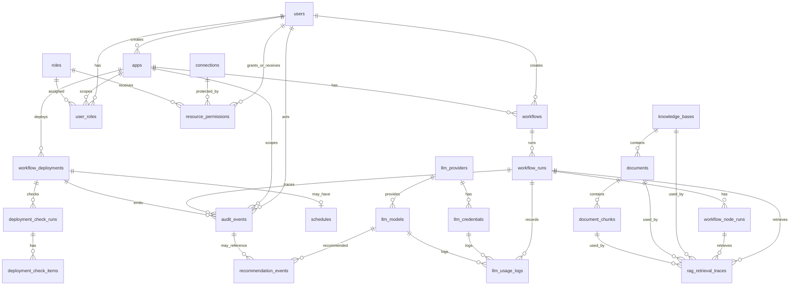
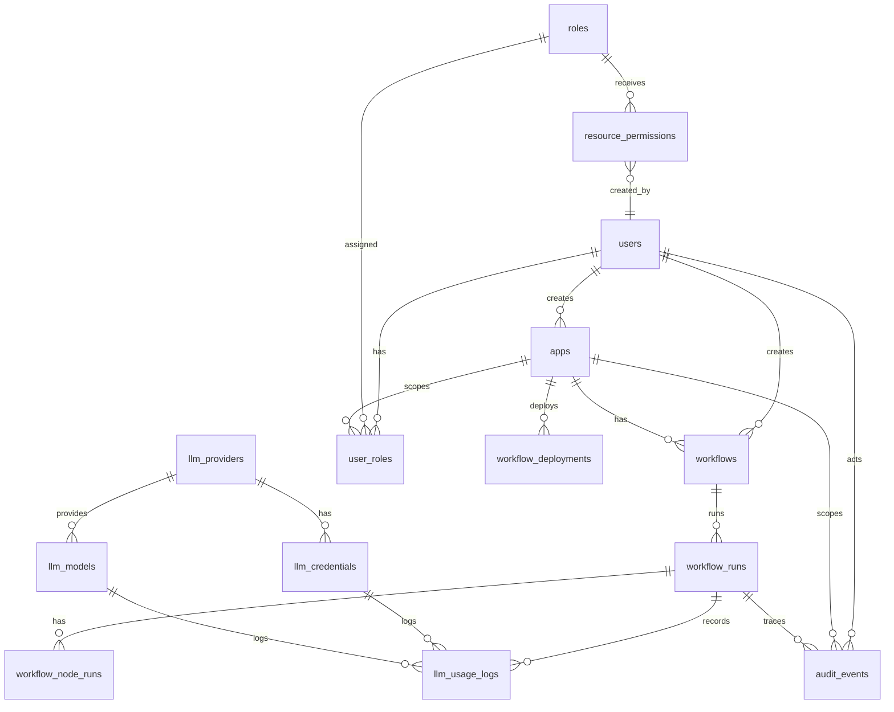
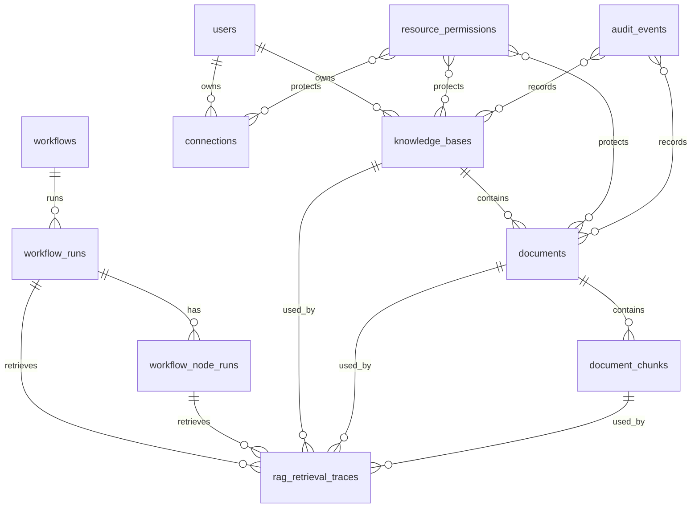
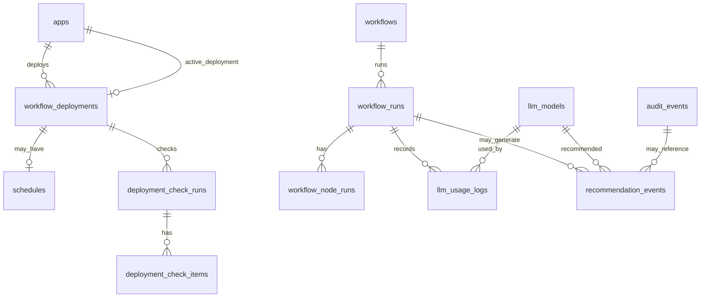

# Nodease ERD 설계 계획서

> Status: Superseded historical draft.
>
> 이 문서는 `origin/dev` ERD와 비교하기 전 작성된 초기 ERD 계획서다. 현재 최종 MVP ERD 기준으로는 활성 설계 문서가 아니다.
>
> 현재 기준 문서:
>
> - `local/erd_docs/02-final-mvp-erd-entities.md`
> - `local/erd_docs/03-permission-matrix.md`
>
> 아래 본문에 등장하는 `roles`, `user_roles`, polymorphic `resource_permissions`, `audit_events`, `rag_retrieval_traces` 신규 생성 계획은 폐기되었다. 최종 MVP에서는 dev baseline의 `organization`, `teams`, `team_*_permissions`, `audit_logs`, `trace_payloads`를 사용하고, user direct grant는 resource별 `user_*_permissions`로만 추가한다.

## 결론

Nodease ERD는 하나만 만들거나 MVP별로만 만들면 안 된다. 전체 Target ERD를 먼저 설계하고, 그 Target ERD를 MVP 1, MVP 2, MVP 3의 구현 가능한 ERD slice와 migration 순서로 나누는 방식이 맞다.

이유:

- RBAC, audit, tracing은 모든 MVP가 공유하는 기반이므로 전체 관계를 먼저 맞춰야 한다.
- 전체 ERD만 있으면 MVP 1에서 필요 없는 테이블까지 구현하려는 압박이 생긴다.
- MVP별 ERD만 있으면 나중에 `resource_permissions`, `audit_events`, `rag_retrieval_traces`, deployment 관련 테이블의 관계가 흔들릴 수 있다.
- 모든 단계를 결국 구현할 예정이라면, 전체 논리 구조는 먼저 고정하고 실제 DB 변경은 MVP 순서대로 넣는 것이 가장 안전하다.

따라서 설계 원칙은 아래처럼 잡는다.

```text
Target ERD 먼저 설계
  -> MVP 1 ERD slice 확정
  -> MVP 1 migration 구현
  -> MVP 2 ERD slice 확정
  -> MVP 2 migration 구현
  -> MVP 3 ERD slice 확정
  -> MVP 3 migration 구현
```

## 기준 문서

ERD 설계는 아래 문서를 기준으로 한다.

| 기준 | 문서 |
| --- | --- |
| 현재 Moduly 데이터 모델 | `local/docs/sections/06-data-model.md` |
| 현재 Moduly 제품 구조 | `local/docs/01-project-overview.md` |
| MVP 개발 계획 | `local/plan_docs/00-overview.md` |
| MVP 1 계획 | `local/plan_docs/01-mvp-1-foundation-llmops.md` |
| MVP 2 계획 | `local/plan_docs/02-mvp-2-governance-rag-audit.md` |
| MVP 3 계획 | `local/plan_docs/03-mvp-3-enterprise-ops.md` |
| 리스크/정합성 | `local/plan_docs/04-risk-consistency-verification.md` |
| Nodease 방향 | `local/nodease_docs` |

## 산출물 구조

최종 ERD 작업은 아래 산출물로 나누는 것을 권장한다.

```text
local/erd_docs/
  00-erd-design-plan.md        # 이 문서. ERD 설계 방법과 실행 계획
  01-target-erd.md             # 전체 Target ERD
  02-mvp-1-erd.md              # MVP 1 구현 ERD
  03-mvp-2-erd.md              # MVP 2 구현 ERD
  04-mvp-3-erd.md              # MVP 3 구현 ERD
  05-migration-plan.md         # Alembic migration 순서와 검증 기준
```

현재 문서는 계획서이며, 실제 상세 ERD 문서는 위 순서대로 별도 작성하면 된다.

## 설계 원칙

1. 기존 Moduly 테이블을 최대한 재사용한다.
2. `Project`는 MVP 1에서 새 테이블로 만들지 않고 기존 `apps`를 project boundary로 사용한다.
3. `Canvas`는 기존 `workflows`로 매핑한다.
4. RBAC는 feature가 아니라 모든 기능의 기준 좌표로 설계한다.
5. audit event는 MVP 1에서 schema를 먼저 고정한다.
6. RAG trace는 MVP 2에서 실제 저장한다.
7. dashboard는 처음부터 테이블로 고정하지 않는다. query, view, materialized view, cache table 중 어느 방식이 맞는지 MVP 3에서 결정한다.
8. deployment rollback은 별도 기능처럼 설계하지 않는다. 현재 Moduly의 `toggle` 기반 이전 deployment 활성화는 `deployment.activate_previous` audit event로 표현한다.
9. migration은 Alembic 기준으로 관리한다. 운영 환경에서 `create_all`에 의존하지 않는다.
10. 새 모델은 "이미 구현된 기반"이 아니라 "추가 개발 대상"으로 표시한다.

## 전체 Target ERD의 역할

Target ERD는 모든 MVP가 끝났을 때의 논리적 최종 구조다. 이 문서는 개발 순서를 강제하지 않고, 관계 충돌을 막는 기준선 역할을 한다.

Target ERD에서 확정해야 하는 것:

- 기존 테이블과 새 테이블의 관계
- 어떤 테이블이 project boundary인 `apps` 아래에 묶이는지
- 어떤 테이블이 `workflow_runs` 또는 `workflow_node_runs`를 기준으로 trace되는지
- RBAC가 어떤 resource type에 적용되는지
- audit event가 어떤 target/scope/run/deployment와 연결되는지
- RAG retrieval trace가 document/chunk/run/node와 어떻게 연결되는지
- MVP 3의 추천/checklist/dashboard가 실제 테이블인지, computed result인지

Target ERD에서 아직 확정하지 않아도 되는 것:

- 모든 column의 길이와 nullable 세부값
- index 전체 목록
- dashboard materialization 방식
- group/organization의 최종 제품 UX
- node-level RBAC
- MCP Gateway 전용 스키마

## Target ERD 초안

아래는 최종 방향을 설명하기 위한 논리 ERD 초안이다. 실제 상세 문서에서는 existing/new/computed 상태를 각 entity마다 표시한다.



주의:

- `deployment_check_runs`, `deployment_check_items`, `recommendation_events`는 Target 후보이며 MVP 3 상세 설계 때 저장 필요성을 다시 판단한다.
- dashboard 자체는 위 ERD에 테이블로 넣지 않는다. MVP 3에서 raw log 기반 query/view/materialized view 중 하나로 설계한다.
- `rag_retrieval_traces`는 MVP 2에서 실제 저장 테이블로 보는 것이 맞다.

## Entity 상태 분류 방법

각 entity는 ERD 문서에서 아래 상태 중 하나로 표시한다.

| 상태 | 의미 | 예시 |
| --- | --- | --- |
| Existing | 현재 Moduly에 이미 존재 | `users`, `apps`, `workflows`, `workflow_runs` |
| Existing + Column Change | 기존 테이블에 column 추가 | `knowledge_bases.classification`, `documents.meta_info.needs_reindex` |
| New MVP 1 | MVP 1에서 추가 | `roles`, `user_roles`, `resource_permissions`, `audit_events` |
| New MVP 2 | MVP 2에서 추가 | `rag_retrieval_traces` |
| New MVP 3 | MVP 3에서 추가 후보 | `deployment_check_runs`, `deployment_check_items`, `recommendation_events` |
| Computed/View | 테이블이 아니라 query/view 가능 | operations dashboard aggregates |
| Deferred | MVP 밖 또는 후순위 | node-level RBAC, MCP Gateway schema |

이 분류를 하지 않으면 Target ERD가 곧바로 구현 범위처럼 읽힌다. 반드시 entity마다 상태를 표시해야 한다.

## MVP 1 ERD 설계

MVP 1의 목표는 Foundation & LLMOps Observability다. 따라서 ERD 범위는 RBAC/resource/audit/policy skeleton과 LLM trace 조회에 집중한다.

### MVP 1에 포함할 기존 테이블

| 테이블 | 사용 이유 |
| --- | --- |
| `users` | role 부여 subject |
| `apps` | project boundary |
| `workflows` | canvas resource |
| `workflow_runs` | run 단위 관측성 |
| `workflow_node_runs` | node 단위 관측성 |
| `llm_providers` | model/provider 관계 |
| `llm_models` | model use 권한 대상 |
| `llm_credentials` | credential 관리 대상 |
| `llm_usage_logs` | token/cost/latency 원천 |
| `workflow_deployments` | deploy 권한 설계 대상. enforcement는 MVP 3 강화 |

### MVP 1에 추가할 테이블

```text
roles
  id
  name
  description
  created_at

user_roles
  id
  user_id
  role_id
  scope_type
  scope_id
  created_at

resource_permissions
  id
  resource_type
  resource_id
  subject_type
  subject_id
  permission
  created_by
  created_at

audit_events
  id
  event_type
  actor_user_id
  actor_role_snapshot
  target_type
  target_id
  scope_type
  scope_id
  workflow_id
  workflow_run_id
  node_id
  deployment_id
  policy_result
  status
  before_snapshot
  after_snapshot
  metadata
  ip_address
  user_agent
  created_at
```

### MVP 1에서 고민할 column 변경

| 대상 | 판단 |
| --- | --- |
| `workflow_runs.trace_id` | 처음부터 column을 넣을지, API/logging service에서만 전달할지 결정 |
| `workflow_node_runs.trace_id` | MVP 1에서는 nullable column 후보 |
| `llm_usage_logs.trace_id` | run/node와 이미 연결되므로 필수는 아님 |
| `llm_usage_logs.latency_ms` | 실제 DB 컬럼이 `atency_ms`로 생성될 수 있어 alias/migration 정책 필요 |

권장:

- MVP 1에서 `trace_id` column을 무리하게 모든 테이블에 넣지 않는다.
- 우선 `workflow_run_id`, `workflow_node_runs.node_id`, `llm_usage_logs.workflow_run_id`, `llm_usage_logs.node_id` 연결을 정확히 보장한다.
- `trace_id`는 API 응답과 logging context에서 먼저 도입하고, 저장 column은 migration 부담을 보고 결정한다.

### MVP 1 ERD slice



### MVP 1 설계 완료 기준

- Builder/Viewer/Admin role을 표현할 수 있다.
- Workflow read/write/execute 권한을 표현할 수 있다.
- LLM model `use` 권한을 표현할 수 있다.
- 권한 차단 event를 `audit_events`에 남길 수 있다.
- workflow execute와 LLM call을 run/node/usage log로 추적할 수 있다.
- 기존 workflow 생성/저장/실행 ERD가 깨지지 않는다.

## MVP 2 ERD 설계

MVP 2의 목표는 Governance & RAG Audit이다. MVP 1의 RBAC/audit 구조를 knowledge base, document, connection, RAG 실행 경로에 적용한다.

### MVP 2에 포함할 기존 테이블

| 테이블 | 사용 이유 |
| --- | --- |
| `knowledge_bases` | 데이터 소스 권한 대상 |
| `documents` | classification, 변경 감지, re-index 대상 |
| `document_chunks` | RAG trace 대상 |
| `connections` | 외부 DB 데이터 소스 권한 대상 |
| `workflows` | RAG node 설정을 포함하는 canvas |
| `workflow_runs` | retrieval trace 연결 기준 |
| `workflow_node_runs` | node 단위 retrieval trace 연결 기준 |
| `audit_events` | 권한 변경, policy warn/block, re-index event |

### MVP 2에 추가할 테이블

```text
rag_retrieval_traces
  id
  workflow_run_id
  node_id
  knowledge_base_id
  document_id
  chunk_id
  rank
  score
  token_count
  created_at
```

### MVP 2에서 추가할 column 후보

| 대상 | column | 이유 |
| --- | --- | --- |
| `knowledge_bases` | `classification` | KB 단위 데이터 분류 |
| `documents` | `classification` | 문서 단위 데이터 분류 |
| `documents.meta_info` | `needs_reindex` | 기존 status enum을 늘리지 않고 재색인 필요 표시 |

권장:

- `classification`은 `public/internal/confidential/pii`로 시작한다.
- `phi`, `financial`은 MVP 3 이후 확장 후보로 둔다.
- `needs_reindex`는 새 status가 아니라 `meta_info.needs_reindex=true`로 시작한다.
- partial re-index는 chunk-level incremental indexing이 아니라 변경 문서 단위 재색인으로 제한한다.

### MVP 2 ERD slice



주의:

- Mermaid상 다형 resource relation은 정확한 FK로 표현하기 어렵다. 실제 `resource_permissions`는 `resource_type/resource_id` polymorphic 구조로 시작하는 것이 현실적이다.
- `audit_events.target_type/target_id`도 polymorphic target이다. 모든 target에 FK를 강제하면 schema가 너무 무거워진다.

### MVP 2 설계 완료 기준

- Knowledge Base `use` 권한을 표현할 수 있다.
- Document/Connection 권한 확장 여지를 가진다.
- HR KB 같은 role 기반 데이터 차단 시나리오를 표현할 수 있다.
- RAG 실행 시 사용된 document/chunk/rank/score를 저장할 수 있다.
- 문서 변경 후 `meta_info.needs_reindex`를 표시할 수 있다.
- classification 변경과 re-index event가 audit으로 남는다.

## MVP 3 ERD 설계

MVP 3의 목표는 Optimization & Enterprise Operations다. 이 단계는 모든 데이터를 새 테이블로 만들기보다, 기존 log와 snapshot을 운영자가 사용할 수 있는 형태로 조합하는 것이 핵심이다.

### MVP 3에 포함할 기존/의존 테이블

| 테이블 | 사용 이유 |
| --- | --- |
| `workflow_deployments.graph_snapshot` | version diff, deploy checklist |
| `apps.active_deployment_id` | 현재 활성 배포 |
| `workflow_runs` | failure/latency aggregation |
| `workflow_node_runs` | node별 failure/latency |
| `llm_usage_logs` | cost recommendation |
| `audit_events` | policy block, permission change, deployment event |
| `rag_retrieval_traces` | RAG stale index, source risk |
| `schedules` | scheduler trigger 운영 통계 |

### MVP 3에 추가할 테이블 후보

Deploy checklist를 저장해야 한다면:

```text
deployment_check_runs
  id
  app_id
  workflow_id
  deployment_id
  checked_by
  status
  summary
  created_at

deployment_check_items
  id
  check_run_id
  check_type
  severity
  target_type
  target_id
  message
  metadata
  created_at
```

Cost recommendation을 event로 남겨야 한다면:

```text
recommendation_events
  id
  workflow_id
  workflow_run_id
  node_id
  model_id
  recommendation_type
  reason
  estimated_saving
  status
  metadata
  created_at
```

권장:

- MVP 3 초반에는 deploy checklist 결과를 response-only로 만들고, 운영 감사가 필요해지는 시점에 `deployment_check_runs/items` 저장을 결정한다.
- recommendation은 사용자가 적용/무시했는지 추적하려면 `recommendation_events`가 필요하다.
- operations dashboard는 처음부터 별도 table을 만들지 말고 raw log query로 시작한다. 성능 문제가 생기면 materialized view나 aggregate table로 승격한다.

### MVP 3 ERD slice



### MVP 3 설계 완료 기준

- deployment snapshot을 비교해서 prompt/model/config/knowledge 변경을 표시할 수 있다.
- 배포 전 checklist가 비용, 권한, PII, RAG stale index, 모델 가격 누락을 판단할 수 있다.
- 실제 usage log 기반으로 비용 추천을 생성할 수 있다.
- API/Webhook/Scheduler/App trigger mode가 정확히 기록된다.
- operations dashboard가 비용, 실패율, latency, policy block을 raw log와 일치하게 집계한다.
- Docker Compose 기준으로 migration 후 seed workflow 실행이 가능하다.

## Migration 설계 방법

ERD 설계는 문서로 끝나면 안 된다. 각 MVP ERD는 migration 단위로 떨어져야 한다.

### 공통 migration 원칙

1. Alembic migration을 기준으로 한다.
2. 운영 환경에서 `Base.metadata.create_all()`에 의존하지 않는다.
3. 기존 테이블에 column을 추가할 때는 nullable/default/backfill 순서를 분리한다.
4. JSONB column을 남용하지 않는다. 검색/필터 대상은 column으로 둔다.
5. audit 검색 필터에 필요한 column은 JSON metadata에만 넣지 않는다.
6. FK가 너무 무거운 polymorphic target은 `target_type/target_id`로 시작한다.
7. 새 index는 실제 조회 패턴을 기준으로 둔다.
8. migration마다 downgrade 가능 여부를 명시한다.

### MVP 1 migration 순서

1. `roles` 추가
2. `user_roles` 추가
3. `resource_permissions` 추가
4. `audit_events` 추가
5. seed role 추가: `Admin`, `Builder`, `Operator`, `Viewer`
6. 기존 dev user 또는 fixture user에 role 부여
7. `llm_usage_logs.latency_ms`/`atency_ms` 정책 확정
8. permission helper와 audit service 연결

MVP 1 index 후보:

- `user_roles.user_id`
- `user_roles.scope_type, scope_id`
- `resource_permissions.resource_type, resource_id`
- `resource_permissions.subject_type, subject_id`
- `audit_events.event_type`
- `audit_events.actor_user_id`
- `audit_events.workflow_run_id`
- `audit_events.created_at`

### MVP 2 migration 순서

1. `knowledge_bases.classification` 추가 후보 검토
2. `documents.classification` 추가 후보 검토
3. `rag_retrieval_traces` 추가
4. `rag_retrieval_traces.workflow_run_id` index 추가
5. `rag_retrieval_traces.knowledge_base_id` index 추가
6. `rag_retrieval_traces.document_id/chunk_id` index 추가
7. `documents.meta_info.needs_reindex` 사용 정책 문서화
8. re-index audit event type 추가

MVP 2 index 후보:

- `rag_retrieval_traces.workflow_run_id`
- `rag_retrieval_traces.node_id`
- `rag_retrieval_traces.knowledge_base_id`
- `rag_retrieval_traces.document_id`
- `rag_retrieval_traces.chunk_id`
- `knowledge_bases.classification`
- `documents.classification`

### MVP 3 migration 순서

1. trigger mode 정합성 코드 수정
2. 기존 `workflow_runs.trigger_mode` 데이터 보정 필요 여부 확인
3. deploy checklist response-only 구현
4. checklist 저장 필요 시 `deployment_check_runs/items` 추가
5. recommendation 추적 필요 시 `recommendation_events` 추가
6. dashboard query 작성
7. 성능 문제가 있으면 materialized view 또는 aggregate table 검토

MVP 3 index 후보:

- `workflow_runs.trigger_mode`
- `workflow_runs.deployment_id`
- `workflow_runs.started_at`
- `llm_usage_logs.model_id, created_at`
- `llm_usage_logs.workflow_id, created_at`
- `audit_events.policy_result, created_at`
- `recommendation_events.workflow_id`
- `recommendation_events.status`

## ERD 작성 절차

실제 ERD 문서를 만들 때는 아래 순서로 진행한다.

1. 현재 모델 추출
   - `apps/shared/db/models/*.py`
   - `local/docs/sections/06-data-model.md`
   - Alembic migration 파일

2. 현재 ERD 확정
   - existing table만으로 현재 Moduly ERD 작성
   - nullable, enum, JSONB, FK를 확인
   - 문서와 코드가 다르면 코드와 migration을 우선한다

3. Target entity 목록 작성
   - existing/new/computed/deferred 상태 표시
   - MVP 단계 표시
   - 소유 boundary 표시: user/app/workflow/run/deployment

4. 관계 유형 결정
   - 엄격 FK
   - nullable FK
   - polymorphic reference
   - JSON metadata reference
   - computed relationship

5. MVP slice 작성
   - MVP 1에서 실제 migration할 entity만 별도 표시
   - MVP 2에서 추가되는 entity/column만 표시
   - MVP 3에서 저장할지 계산할지 결정할 entity를 표시

6. migration 계획 작성
   - migration 파일 단위로 나누기
   - backfill 여부 표시
   - index 추가 순서 표시
   - downgrade 가능 여부 표시

7. 검증 시나리오 연결
   - ERD entity가 어떤 사용자 흐름을 가능하게 하는지 연결
   - demo script와 test case로 검증

## 검증 방법

### 문서 검증

- Target ERD의 모든 new entity가 어느 MVP에서 구현되는지 표시되어야 한다.
- MVP별 ERD에는 해당 MVP에서 migration하지 않는 entity가 구현 범위처럼 보이면 안 된다.
- 모든 polymorphic relation은 이유를 적어야 한다.
- 모든 JSONB 사용은 "왜 column이 아닌지"를 적어야 한다.
- 기존 Moduly 테이블명과 새 계획의 제품 용어 매핑이 명확해야 한다.

### 구현 검증

MVP별로 아래를 확인한다.

MVP 1:

- Builder는 workflow execute 가능
- Viewer는 workflow execute 불가
- 허용되지 않은 LLM model use 차단
- 권한 실패 시 `audit_events` 생성
- LLM node 실행 후 model/token/cost/latency 조회

MVP 2:

- 권한 없는 RAG workflow 실행 차단
- 권한 있는 RAG workflow 실행 성공
- `rag_retrieval_traces` 생성
- document/chunk/rank/score 조회
- 문서 변경 후 `meta_info.needs_reindex` 표시
- Audit Log에서 권한 차단/RAG/re-index event 검색

MVP 3:

- `workflow_runs.trigger_mode`가 api/webhook/scheduler/app으로 정확히 기록
- deployment diff가 prompt/model/config/knowledge 변경 표시
- deploy checklist가 warning/block 구분
- recommendation이 실제 usage log 기반으로 생성
- dashboard 집계가 raw log와 일치

## ERD 설계에서 피해야 할 것

- MVP 1에서 독립 `projects` 테이블을 성급하게 추가
- 모든 target에 FK를 강제해 audit/resource permission 모델을 과도하게 복잡하게 만드는 것
- RBAC를 UI에서만 체크하고 Workflow Engine 실행 경로에서 체크하지 않는 것
- RAG re-index를 새 document status enum으로 먼저 늘리는 것
- chunk-level incremental indexing을 MVP 2 범위로 오해하는 것
- dashboard용 aggregate table을 처음부터 확정하는 것
- "rollback"을 기존에 있는 명시 기능처럼 문서화하는 것
- "컴플라이언스 준수"라고 과장하는 것

## 상세 ERD 문서 작성 템플릿

각 ERD 문서는 아래 형식을 따른다.

```text
# 문서 제목

## 목적

## 기준 문서

## Entity 상태 요약

| Entity | 상태 | MVP | 설명 |

## ERD

Mermaid ERD

## Entity 상세

### table_name

| Column | Type | Nullable | Index | 설명 |

## 관계 상세

| From | To | 관계 | FK 여부 | 설명 |

## Migration 계획

## API/Service 영향

## 검증 시나리오

## 후순위/제외 범위
```

## 다음 작업 순서

1. `01-target-erd.md` 작성
   - 현재 Moduly ERD와 Nodease Target ERD를 한 문서에 정리
   - existing/new/computed/deferred 상태 표시

2. `02-mvp-1-erd.md` 작성
   - RBAC, audit, LLMOps trace 중심
   - migration 단위까지 확정

3. `03-mvp-2-erd.md` 작성
   - knowledge base/document/connection 권한
   - RAG retrieval trace
   - classification/re-index 정책

4. `04-mvp-3-erd.md` 작성
   - deploy checklist
   - recommendation events
   - dashboard aggregation 방식
   - trigger mode 정합성

5. `05-migration-plan.md` 작성
   - Alembic migration 순서
   - seed/backfill/index 계획
   - 검증 명령과 demo fixture

## 최종 판단

모든 단계를 구현할 예정이라도, DB를 한 번에 크게 바꾸는 방식은 피해야 한다. 전체 Target ERD는 관계 충돌을 막기 위한 설계 기준으로 먼저 만들고, 실제 구현은 MVP별 ERD와 migration으로 쪼개서 진행한다.

이 방식이 현재 계획서의 원칙인 "먼저 설계해야 나중에 덜 갈아엎는 기반"과 "각 단계는 작동하는 MVP여야 한다"를 동시에 만족한다.
