# Nodease Target ERD 설계 명세서

> Status: Superseded historical draft.
>
> 이 문서는 `origin/dev` ERD와 비교하기 전 작성된 초기 Target ERD다. 현재 최종 MVP ERD 기준으로는 활성 설계 문서가 아니다.
>
> 현재 기준 문서:
>
> - `local/erd_docs/02-final-mvp-erd-entities.md`
> - `local/erd_docs/03-permission-matrix.md`
>
> 아래 본문에 등장하는 `roles`, `user_roles`, polymorphic `resource_permissions`, `audit_events`, `rag_retrieval_traces` 신규 생성 계획은 폐기되었다. 최종 MVP에서는 dev baseline의 `organization`, `teams`, `team_*_permissions`, `audit_logs`, `trace_payloads`를 사용하고, user direct grant는 resource별 `user_*_permissions`로만 추가한다.

## 목적

이 문서는 기존 Moduly 데이터 모델을 기반으로 Nodease가 MVP 1, MVP 2, MVP 3까지 확장될 때 필요한 Target ERD를 정의한다. 목표는 한 번에 모든 DB를 구현하는 것이 아니라, 전체 관계를 먼저 맞춘 뒤 MVP별 migration으로 나누어 구현할 수 있는 기준선을 만드는 것이다.

## 기준 문서

| 구분 | 문서 |
| --- | --- |
| 현재 데이터 모델 | `local/docs/sections/06-data-model.md` |
| 현재 제품 구조 | `local/docs/01-project-overview.md` |
| ERD 설계 방법 | `local/erd_docs/00-erd-design-plan.md` |
| 개발 계획 개요 | `local/plan_docs/00-overview.md` |
| MVP 1 계획 | `local/plan_docs/01-mvp-1-foundation-llmops.md` |
| MVP 2 계획 | `local/plan_docs/02-mvp-2-governance-rag-audit.md` |
| MVP 3 계획 | `local/plan_docs/03-mvp-3-enterprise-ops.md` |
| 리스크/정합성 | `local/plan_docs/04-risk-consistency-verification.md` |

## 핵심 결정

| 결정 | 내용 |
| --- | --- |
| Project boundary | MVP 1에서는 별도 `projects` 테이블을 만들지 않고 기존 `apps`를 project boundary로 사용한다. |
| Canvas | 제품 용어 `Canvas`는 기존 `workflows`로 매핑한다. |
| RBAC 방식 | `resource_permissions`는 `resource_type/resource_id` 기반 polymorphic permission으로 시작한다. |
| Audit 방식 | `audit_events`는 `event_type`을 canonical action으로 사용하고 별도 `action` column을 두지 않는다. |
| Trace 방식 | LLM trace는 기존 `workflow_runs`, `workflow_node_runs`, `llm_usage_logs` 연결을 우선 재사용한다. |
| RAG trace | MVP 2에서 `rag_retrieval_traces`를 신규 테이블로 추가한다. |
| Rollback | 현재 Moduly에는 명시적 rollback API가 없으므로 `toggle` 기반 이전 배포 활성화는 `deployment.activate_previous` audit event로 표현한다. |
| Dashboard | MVP 3 operations dashboard는 처음부터 테이블로 고정하지 않고 query/view/materialized view 후보로 둔다. |
| Migration | Alembic migration 기준으로 관리한다. 운영 환경에서 `create_all`에 의존하지 않는다. |

## Entity 상태 요약

| Entity | 상태 | MVP | 설명 |
| --- | --- | --- | --- |
| `users` | Existing | Base | 사용자 |
| `apps` | Existing | Base | Project boundary, public/API endpoint boundary |
| `workflows` | Existing | Base | Canvas, workflow draft graph |
| `workflow_deployments` | Existing | Base | 배포 snapshot, version, type |
| `schedules` | Existing | Base | schedule deployment 실행 설정 |
| `workflow_runs` | Existing | Base | workflow 실행 이력 |
| `workflow_node_runs` | Existing | Base | node 실행 이력 |
| `knowledge_bases` | Existing + Column Change | MVP 2 | data source, classification 후보 |
| `documents` | Existing + Metadata Policy | MVP 2 | document classification, `meta_info.needs_reindex` |
| `document_chunks` | Existing | MVP 2 | RAG retrieval trace 대상 |
| `connections` | Existing | MVP 2 | DB connector permission 대상 |
| `llm_providers` | Existing | Base | LLM provider |
| `llm_models` | Existing | MVP 1 | model `use` permission 대상 |
| `llm_credentials` | Existing | MVP 1 | credential `manage/use` permission 대상 |
| `llm_rel_credential_models` | Existing | MVP 1 | credential-model 검증/표시 관계. 런타임 client 선택은 현재 provider credential 매칭 중심 |
| `llm_usage_logs` | Existing + Column/FK Risk | MVP 1 | token/cost/latency 원천. 물리 column `atency_ms`, FK `SET NULL`과 nullable 불일치 risk |
| `roles` | New | MVP 1 | Admin/Builder/Operator/Viewer |
| `user_roles` | New | MVP 1 | 사용자-role-scope 매핑 |
| `resource_permissions` | New | MVP 1 | resource별 user/role permission |
| `audit_events` | New | MVP 1 | 권한, 실행, 정책, 배포, RAG event |
| `rag_retrieval_traces` | New | MVP 2 | run/node/document/chunk retrieval lineage |
| `deployment_check_runs` | Candidate | MVP 3 | deploy checklist 저장이 필요할 때 추가 |
| `deployment_check_items` | Candidate | MVP 3 | deploy checklist item 저장이 필요할 때 추가 |
| `recommendation_events` | Candidate | MVP 3 | 비용 추천 적용/무시 추적이 필요할 때 추가 |
| operations dashboard aggregates | Computed/View | MVP 3 | raw log query, view, materialized view 후보 |
| `groups` | Deferred | After MVP 2 | role만으로 부족할 때 조직/그룹 도입 |
| node-level permissions | Deferred | After MVP 3 | MVP 범위 밖 |
| MCP Gateway schema | Deferred | After MVP 3 | MVP 범위 밖 |

## Target ERD

```mermaid
erDiagram
  users {
    uuid id PK
    string email
    string name
    string password
    string social_provider
    string social_id
    string avatar_url
    datetime created_at
    datetime updated_at
  }

  apps {
    uuid id PK
    uuid tenant_id
    uuid workflow_id FK
    uuid active_deployment_id
    uuid created_by FK
    string name
    text description
    string url_slug
    string auth_secret
    boolean is_api_enabled
    integer api_req_per_minute
    integer api_req_per_hour
    boolean is_market
    uuid forked_from
    jsonb icon
    datetime created_at
    datetime updated_at
  }

  workflows {
    uuid id PK
    uuid tenant_id
    uuid app_id FK
    uuid created_by FK
    uuid updated_by FK
    jsonb graph
    jsonb features
    jsonb env_variables
    jsonb runtime_variables
    datetime created_at
    datetime updated_at
  }

  workflow_deployments {
    uuid id PK
    uuid app_id FK
    uuid created_by FK
    integer version
    string type
    jsonb graph_snapshot
    jsonb config
    jsonb input_schema
    jsonb output_schema
    string description
    boolean is_active
    datetime created_at
  }

  schedules {
    uuid id PK
    uuid deployment_id FK
    string node_id
    string cron_expression
    string timezone
    datetime last_run_at
    datetime next_run_at
    datetime created_at
    datetime updated_at
  }

  workflow_runs {
    uuid id PK
    uuid workflow_id FK
    uuid user_id FK
    uuid deployment_id FK
    integer workflow_version
    string status
    string trigger_mode
    jsonb inputs
    jsonb outputs
    text error_message
    jsonb meta_info
    integer total_tokens
    numeric total_cost
    datetime started_at
    datetime finished_at
    float duration
  }

  workflow_node_runs {
    uuid id PK
    uuid workflow_run_id FK
    string node_id
    string node_type
    string status
    jsonb inputs
    jsonb process_data
    jsonb outputs
    text error_message
    datetime started_at
    datetime finished_at
  }

  roles {
    uuid id PK
    string name
    text description
    datetime created_at
  }

  user_roles {
    uuid id PK
    uuid user_id FK
    uuid role_id FK
    string scope_type
    uuid scope_id
    datetime created_at
  }

  resource_permissions {
    uuid id PK
    string resource_type
    uuid resource_id
    string subject_type
    uuid subject_id
    string permission
    uuid created_by FK
    datetime created_at
  }

  audit_events {
    uuid id PK
    string event_type
    uuid actor_user_id FK
    jsonb actor_role_snapshot
    string target_type
    uuid target_id
    string scope_type
    uuid scope_id
    uuid workflow_id FK
    uuid workflow_run_id FK
    string node_id
    uuid deployment_id FK
    string policy_result
    string status
    jsonb before_snapshot
    jsonb after_snapshot
    jsonb metadata
    string ip_address
    string user_agent
    datetime created_at
  }

  knowledge_bases {
    uuid id PK
    uuid user_id FK
    string name
    text description
    string embedding_model
    integer top_k
    numeric similarity_threshold
    string classification
    datetime created_at
    datetime updated_at
  }

  documents {
    uuid id PK
    uuid knowledge_base_id FK
    string filename
    string file_path
    string source_type
    string content_hash
    string status
    text error_message
    integer chunk_size
    integer chunk_overlap
    string classification
    jsonb meta_info
    string embedding_model
    datetime created_at
    datetime updated_at
  }

  document_chunks {
    uuid id PK
    uuid document_id FK
    uuid knowledge_base_id FK
    text content
    vector embedding
    integer chunk_index
    integer token_count
    jsonb metadata
  }

  connections {
    uuid id PK
    uuid user_id FK
    string name
    text description
    string type
    string host
    integer port
    string database
    string username
    text encrypted_password
    boolean use_ssh
    string ssh_host
    integer ssh_port
    string ssh_username
    string ssh_auth_type
    text encrypted_ssh_password
    text encrypted_ssh_private_key
  }

  rag_retrieval_traces {
    uuid id PK
    uuid workflow_run_id FK
    uuid workflow_node_run_id FK
    string node_id
    uuid knowledge_base_id FK
    uuid document_id FK
    uuid chunk_id FK
    integer rank
    numeric score
    integer token_count
    datetime created_at
  }

  llm_providers {
    uuid id PK
    string name
    text description
    string type
    string base_url
    string auth_type
    text doc_url
    datetime created_at
    datetime updated_at
  }

  llm_models {
    uuid id PK
    uuid provider_id FK
    string model_id_for_api_call
    string name
    string type
    integer context_window
    numeric input_price_1k
    numeric output_price_1k
    boolean is_active
    jsonb metadata
    datetime created_at
    datetime updated_at
  }

  llm_credentials {
    uuid id PK
    uuid provider_id FK
    uuid user_id FK
    uuid tenant_id
    string credential_name
    text encrypted_config
    text config_preview
    boolean is_valid
    string quota_type
    bigint quota_limit
    bigint quota_used
    datetime last_used_at
    datetime created_at
    datetime updated_at
  }

  llm_rel_credential_models {
    uuid id PK
    uuid credential_id FK
    uuid model_id FK
    boolean is_verified
    integer priority
    datetime created_at
  }

  llm_usage_logs {
    uuid id PK
    uuid user_id FK
    uuid tenant_id
    uuid credential_id FK
    uuid model_id FK
    uuid workflow_id FK
    uuid workflow_run_id FK
    string node_id
    integer prompt_tokens
    integer completion_tokens
    numeric total_cost
    integer latency_ms
    string status
    text error_message
    datetime created_at
  }

  deployment_check_runs {
    uuid id PK
    uuid app_id FK
    uuid workflow_id FK
    uuid deployment_id FK
    uuid checked_by FK
    string status
    jsonb summary
    datetime created_at
  }

  deployment_check_items {
    uuid id PK
    uuid check_run_id FK
    string check_type
    string severity
    string target_type
    string target_id
    text message
    jsonb metadata
    datetime created_at
  }

  recommendation_events {
    uuid id PK
    uuid workflow_id FK
    uuid workflow_run_id FK
    string node_id
    uuid model_id FK
    string recommendation_type
    text reason
    numeric estimated_saving
    string status
    jsonb metadata
    datetime created_at
  }

  users ||--o{ apps : creates
  users ||--o{ workflows : creates_updates
  users ||--o{ workflow_deployments : creates
  users ||--o{ workflow_runs : runs
  users ||--o{ knowledge_bases : owns
  users ||--o{ connections : owns
  users ||--o{ llm_credentials : owns
  users ||--o{ llm_usage_logs : logs
  users ||--o{ user_roles : has
  users ||--o{ audit_events : acts

  apps ||--o{ workflows : has
  apps ||--o| workflows : points_to_primary
  apps ||--o{ workflow_deployments : deploys
  apps ||--o{ user_roles : scopes
  apps ||--o{ deployment_check_runs : checks

  workflows ||--o{ workflow_runs : runs
  workflows ||--o{ llm_usage_logs : logs
  workflow_runs ||--o{ workflow_node_runs : has
  workflow_runs ||--o{ llm_usage_logs : records
  workflow_runs ||--o{ audit_events : traced_by
  workflow_runs ||--o{ rag_retrieval_traces : retrieves
  workflow_runs ||--o{ recommendation_events : generates

  workflow_node_runs ||--o{ rag_retrieval_traces : retrieves

  workflow_deployments ||--o| schedules : may_have
  workflow_deployments ||--o{ workflow_runs : runs
  workflow_deployments ||--o{ deployment_check_runs : checked_by
  workflow_deployments ||--o{ audit_events : emits

  roles ||--o{ user_roles : assigned
  roles ||--o{ resource_permissions : receives

  knowledge_bases ||--o{ documents : contains
  knowledge_bases ||--o{ document_chunks : denormalizes
  documents ||--o{ document_chunks : contains
  knowledge_bases ||--o{ rag_retrieval_traces : used_by
  documents ||--o{ rag_retrieval_traces : used_by
  document_chunks ||--o{ rag_retrieval_traces : used_by

  llm_providers ||--o{ llm_models : provides
  llm_providers ||--o{ llm_credentials : has
  llm_credentials ||--o{ llm_rel_credential_models : enables
  llm_models ||--o{ llm_rel_credential_models : enabled_by
  llm_credentials ||--o{ llm_usage_logs : logs
  llm_models ||--o{ llm_usage_logs : logs
  llm_models ||--o{ recommendation_events : recommended

  deployment_check_runs ||--o{ deployment_check_items : has
```



## 기존 테이블 명세

이 섹션은 기존 Moduly 테이블 중 Target ERD에서 직접 재사용할 테이블만 요약한다. 기존 column의 전체 정의는 `local/docs/sections/06-data-model.md`를 기준으로 한다.

### `users`

| 항목 | 명세 |
| --- | --- |
| 상태 | Existing |
| 역할 | 인증 사용자, app/workflow/KB/credential 소유자, run actor |
| 주요 관계 | `apps.created_by`, `workflows.created_by/updated_by`, `workflow_deployments.created_by`, `knowledge_bases.user_id`, `connections.user_id`, `llm_credentials.user_id`, `workflow_runs.user_id`, `llm_usage_logs.user_id` |
| 현재 필드 | `email`, `name`, `password`, `social_provider`, `social_id`, `avatar_url`, timestamps |
| ERD 결정 | 현재 모델에는 `tenant_id`가 없고 TODO만 있다. MVP 1에서는 tenant 확장 대신 `apps`를 project boundary로 사용한다. |

### `apps`

| 항목 | 명세 |
| --- | --- |
| 상태 | Existing |
| 역할 | MVP 1의 project boundary |
| 주요 관계 | `users.created_by`, `workflows.app_id`, `apps.workflow_id`, `workflow_deployments.app_id`, `apps.active_deployment_id` |
| 유지할 정책 | `AppService.create_app()`가 app 생성 시 `url_slug`, `auth_secret`, 기본 `Workflow`를 함께 생성하고 `app.workflow_id`를 연결한다. |
| 현재 구현 주의 | `workflow_id`는 `workflows.id` FK다. `active_deployment_id`는 DB FK가 아니라 nullable UUID + viewonly relationship이다. `DeploymentService.create_deployment()`는 현재 `deployment_in.is_active`와 무관하게 새 배포 id를 `app.active_deployment_id`에 대입한다. |
| ERD 결정 | 독립 `projects` 테이블은 MVP 1에서 만들지 않는다. `active_deployment_id`는 "의도상 활성 배포 포인터"지만 구현상 동기화 보정 대상이다. |

### `workflows`

| 항목 | 명세 |
| --- | --- |
| 상태 | Existing |
| 역할 | Canvas, workflow draft graph |
| 주요 관계 | `apps.app_id`, `apps.workflow_id`, `workflow_runs`, `llm_usage_logs.workflow_id` |
| 핵심 JSONB | `graph`, `features`, `env_variables`, `runtime_variables` |
| ERD 결정 | workflow node 자체를 별도 테이블로 정규화하지 않는다. node id는 `workflow_node_runs.node_id`, `llm_usage_logs.node_id`, `rag_retrieval_traces.node_id`에서 graph node를 참조한다. |

### `workflow_deployments`

| 항목 | 명세 |
| --- | --- |
| 상태 | Existing |
| 역할 | 배포 snapshot, version diff, deploy checklist 기준 |
| 주요 관계 | `apps`, `users.created_by`, `schedules`, `workflow_runs.deployment_id` |
| 핵심 column | `version`, `type`, `graph_snapshot`, `config`, `is_active` |
| 현재 구현 주의 | 생성 시 app별 version을 증가시키고, 활성 배포 생성/토글 시 같은 app의 다른 활성 배포를 비활성화한다. 단, 생성 경로에서는 `app.active_deployment_id` 대입이 `is_active` 조건 밖에 있다. |
| 현재 코드 부채 | `apps/workflow_engine/tasks.py`의 `workflow.execute_deployed` 태스크는 현재 모델에 없는 `WorkflowDeployment.workflow_id`, `deployment.graph_data`를 참조한다. 실제 활성 호출 경로는 `workflow.execute`, `workflow.execute_by_deployment` 쪽으로 보인다. |
| ERD 결정 | 명시적 rollback 테이블은 만들지 않는다. 이전 배포 활성화는 `toggle` 기반 activate 동작이며 `deployment.activate_previous` audit event로 남긴다. |

### `schedules`

| 항목 | 명세 |
| --- | --- |
| 상태 | Existing |
| 역할 | ScheduleTrigger 배포의 APScheduler 등록 정보 |
| 주요 관계 | `workflow_deployments.deployment_id`와 1:0..1 관계, `deployment_id`는 unique |
| 핵심 column | `deployment_id`, `node_id`, `cron_expression`, `timezone`, `last_run_at`, `next_run_at` |
| 현재 구현 주의 | Scheduler 실행 context는 `trigger_mode='schedule'`을 넘기지만 `RunTriggerMode` enum 값은 `scheduler`다. log 정규화에서 명시 매핑이 필요하다. |

### `workflow_runs`

| 항목 | 명세 |
| --- | --- |
| 상태 | Existing |
| 역할 | run 단위 observability, dashboard aggregation |
| 주요 관계 | `users`, `workflows`, `workflow_deployments`, `workflow_node_runs`, `llm_usage_logs`, `rag_retrieval_traces`, `audit_events` |
| 주의 | `run.py`는 REST API 실행에 `trigger_mode='api'`를 넘기지만 `DeploymentService.run_deployment()` 내부 context는 현재 `trigger_mode='app'`으로 고정한다. `log.create_run`은 `app`을 `RunTriggerMode.API`로 매핑하고 `webhook`, `schedule/scheduler`를 명시 매핑하지 않는다. Alembic enum 값은 `WEBHOOK`, `SCHEDULER`, `APP`처럼 대문자 이름으로 추가되어 있으므로 Python enum 값과 물리 enum 저장값도 함께 확인해야 한다. |
| ERD 결정 | `trace_id` column은 Target 후보지만 MVP 1 필수 migration으로 강제하지 않는다. |

### `workflow_node_runs`

| 항목 | 명세 |
| --- | --- |
| 상태 | Existing |
| 역할 | node 단위 status, latency, error, RAG/LLM trace 연결 |
| 주요 관계 | `workflow_runs`, `rag_retrieval_traces` |
| ERD 결정 | `node_id`는 workflow graph 내부 node id다. 별도 FK가 아니라 string reference로 유지한다. |

### `knowledge_bases`

| 항목 | 명세 |
| --- | --- |
| 상태 | Existing + Column Change |
| 역할 | 데이터 소스 권한과 RAG retrieval 상위 단위 |
| 주요 관계 | `users`, `documents`, `document_chunks`, `rag_retrieval_traces` |
| 추가 후보 | `classification` |
| ERD 결정 | MVP 2에서 `resource_permissions.resource_type='knowledge_base'` 대상으로 보호한다. |

### `documents`

| 항목 | 명세 |
| --- | --- |
| 상태 | Existing + Column/Metadata Policy |
| 역할 | 문서별 classification, 변경 감지, re-index 단위 |
| 주요 관계 | `knowledge_bases`, `document_chunks`, `rag_retrieval_traces` |
| 추가 후보 | `classification` |
| metadata 정책 | `meta_info.needs_reindex=true` |
| ERD 결정 | 재색인 필요 상태를 새 status enum으로 먼저 늘리지 않는다. |

### `document_chunks`

| 항목 | 명세 |
| --- | --- |
| 상태 | Existing |
| 역할 | RAG retrieval lineage의 가장 작은 추적 단위 |
| 주요 관계 | `documents`, `knowledge_bases`, `rag_retrieval_traces` |
| 주의 | SQLAlchemy 속성명은 `metadata_`, DB column은 `metadata` |
| 현재 구현 주의 | `knowledge_base_id`는 성능/검색 편의를 위해 chunk에도 직접 저장된 FK다. `documents`를 통해 유도되는 관계만이 아니라 물리 FK 관계로도 다룬다. |

### `connections`

| 항목 | 명세 |
| --- | --- |
| 상태 | Existing |
| 역할 | 외부 DB data source |
| 주요 관계 | `users`, `resource_permissions` polymorphic target |
| 현재 필드 | DB 접속 정보와 SSH tunnel 옵션을 포함하며 비밀번호/SSH private key는 encrypted text로 저장한다. |
| ERD 결정 | MVP 2에서 `resource_type='connection'`으로 권한 보호한다. |

### `llm_providers`

| 항목 | 명세 |
| --- | --- |
| 상태 | Existing |
| 역할 | OpenAI, Anthropic, Google, LlamaParse 등 provider catalog |
| 주요 관계 | `llm_models.provider_id`, `llm_credentials.provider_id` |
| 현재 필드 | `name`, `description`, `type`, `base_url`, `auth_type`, `doc_url`, timestamps |
| ERD 결정 | provider는 시스템/커스텀 타입을 모두 표현하며 model/credential의 상위 기준으로 재사용한다. |

### `llm_models`

| 항목 | 명세 |
| --- | --- |
| 상태 | Existing |
| 역할 | model `use` 권한, 가격 계산, 추천 후보 |
| 주요 관계 | `llm_providers`, `llm_usage_logs`, `recommendation_events` |
| 주의 | SQLAlchemy 속성명은 `model_metadata`, DB column은 `metadata` |

### `llm_credentials`

| 항목 | 명세 |
| --- | --- |
| 상태 | Existing |
| 역할 | provider credential, credential 관리 권한 대상 |
| 주요 관계 | `users`, `llm_providers`, `llm_usage_logs` |
| 현재 구현 주의 | `quota_limit`, `quota_used`는 `BigInteger`다. Gateway/WorkflowEngine의 `register_credential()` 경로는 현재 `encrypted_config`에 JSON 문자열을 직접 저장하며, 별도 암호화 호출은 이 경로에서 보이지 않는다. |
| ERD 결정 | credential 자체는 민감 정보이므로 audit metadata에 원문을 남기지 않는다. |

### `llm_rel_credential_models`

| 항목 | 명세 |
| --- | --- |
| 상태 | Existing |
| 역할 | credential과 model의 사용 가능 관계 |
| 주요 관계 | `llm_credentials`, `llm_models` |
| 현재 구현 주의 | 모델 목록 조회(`get_my_available_models`, embedding model 조회)는 이 테이블의 `is_verified=True`를 사용한다. 반면 `get_client_for_user()`는 현재 rel table을 엄격히 검사하지 않고 model provider와 사용자의 유효 credential을 매칭한다. |
| ERD 결정 | model `use` 권한과 별개로 credential-model 검증/표시 기반으로 재사용하되, 런타임 fail-closed enforcement를 하려면 service 로직 보강이 필요하다. |

### `llm_usage_logs`

| 항목 | 명세 |
| --- | --- |
| 상태 | Existing + Column/FK Risk |
| 역할 | token/cost/latency 원천 |
| 주요 관계 | `users`, `llm_credentials`, `llm_models`, `workflows`, `workflow_runs` |
| 주의 | SQLAlchemy 속성은 `latency_ms`지만 DB column은 `atency_ms`로 매핑되어 있다. `credential_id`, `model_id`는 nullable=False인데 FK는 `ondelete='SET NULL'`이라 물리 schema 정책이 모순될 수 있다. |
| 현재 구현 주의 | `LLMService.log_usage()`는 `workflow_run_id`와 `node_id`를 저장하지만 `workflow_id`는 직접 세팅하지 않는다. run 기반 join 또는 backfill 없이는 workflow별 usage 집계에서 `workflow_id`가 비어 있을 수 있다. |
| ERD 결정 | MVP 1에서 `latency_ms`/`atency_ms` alias 또는 rename 정책, `SET NULL`과 nullable 정책, `workflow_id` 저장/backfill 정책을 확정한다. |

## 신규 테이블 명세

### `roles`

| Column | Type | Nullable | Index | 설명 |
| --- | --- | --- | --- | --- |
| `id` | UUID | No | PK | role id |
| `name` | String | No | Unique | `Admin`, `Builder`, `Operator`, `Viewer` |
| `description` | Text | Yes | No | role 설명 |
| `created_at` | DateTimeTZ | No | No | 생성 시각 |

제약:

- `name`은 unique로 둔다.
- `admin`은 permission이 아니라 role이다.

### `user_roles`

| Column | Type | Nullable | Index | 설명 |
| --- | --- | --- | --- | --- |
| `id` | UUID | No | PK | mapping id |
| `user_id` | UUID | No | FK, Index | `users.id` |
| `role_id` | UUID | No | FK, Index | `roles.id` |
| `scope_type` | String | No | Composite | MVP 1 기본값 `app` |
| `scope_id` | UUID | No | Composite | scope 대상 id |
| `created_at` | DateTimeTZ | No | No | 생성 시각 |

권장 index:

- `(user_id)`
- `(role_id)`
- `(scope_type, scope_id)`
- `(user_id, scope_type, scope_id)`

제약:

- MVP 1에서는 `scope_type='app'` 중심으로 시작한다.
- 조직/그룹 모델은 후순위다.

### `resource_permissions`

| Column | Type | Nullable | Index | 설명 |
| --- | --- | --- | --- | --- |
| `id` | UUID | No | PK | permission id |
| `resource_type` | String | No | Composite | `app`, `workflow`, `deployment`, `knowledge_base`, `document`, `connection`, `llm_model`, `llm_credential` |
| `resource_id` | UUID | No | Composite | 대상 resource id |
| `subject_type` | String | No | Composite | `user`, `role` |
| `subject_id` | UUID | No | Composite | user id 또는 role id |
| `permission` | String | No | Composite | `read`, `write`, `execute`, `use`, `manage`, `deploy` |
| `created_by` | UUID | Yes | FK, Index | 권한 부여자 |
| `created_at` | DateTimeTZ | No | No | 생성 시각 |

권장 index:

- `(resource_type, resource_id)`
- `(subject_type, subject_id)`
- `(resource_type, resource_id, permission)`
- `(subject_type, subject_id, permission)`

제약:

- `resource_type/resource_id`는 polymorphic reference다.
- 모든 resource에 FK를 강제하지 않는다.
- MVP 1에서는 `workflow`, `llm_model` 중심으로 enforcement한다.
- MVP 2에서는 `knowledge_base`, `document`, `connection`으로 확장한다.
- MVP 3에서는 `deployment`, audit/dashboard scope까지 확장한다.

### `audit_events`

| Column | Type | Nullable | Index | 설명 |
| --- | --- | --- | --- | --- |
| `id` | UUID | No | PK | event id |
| `event_type` | String | No | Index | canonical action |
| `actor_user_id` | UUID | Yes | FK, Index | 행위자 |
| `actor_role_snapshot` | JSONB | Yes | No | event 시점 role snapshot |
| `target_type` | String | Yes | Composite | target resource type |
| `target_id` | UUID | Yes | Composite | target resource id |
| `scope_type` | String | Yes | Composite | 보통 `app` |
| `scope_id` | UUID | Yes | Composite | app id 등 |
| `workflow_id` | UUID | Yes | FK, Index | 관련 workflow |
| `workflow_run_id` | UUID | Yes | FK, Index | 관련 run |
| `node_id` | String | Yes | Index | graph node id |
| `deployment_id` | UUID | Yes | FK, Index | 관련 deployment |
| `policy_result` | String | Yes | Index | `allow`, `warn`, `block` |
| `status` | String | Yes | Index | `success`, `failure`, `blocked` 등 |
| `before_snapshot` | JSONB | Yes | No | 변경 전 snapshot |
| `after_snapshot` | JSONB | Yes | No | 변경 후 snapshot |
| `metadata` | JSONB | Yes | No | raw action, 추가 맥락 |
| `ip_address` | String | Yes | No | 요청 IP |
| `user_agent` | String | Yes | No | user agent |
| `created_at` | DateTimeTZ | No | Index | 발생 시각 |

대표 `event_type`:

| Event Type | MVP | 설명 |
| --- | --- | --- |
| `resource.read` | MVP 1 | resource 조회 |
| `resource.update` | MVP 1 | resource 변경 |
| `workflow.execute` | MVP 1 | workflow 실행 |
| `workflow.blocked` | MVP 1 | 권한/정책 차단 |
| `llm.call` | MVP 1 | LLM 호출 |
| `permission.grant` | MVP 2 | 권한 부여 |
| `permission.revoke` | MVP 2 | 권한 회수 |
| `policy.warn` | MVP 2 | 정책 경고 |
| `policy.block` | MVP 2 | 정책 차단 |
| `rag.retrieve` | MVP 2 | RAG 검색 |
| `deployment.create` | MVP 3 | 배포 생성 |
| `deployment.activate` | MVP 3 | 배포 활성화 |
| `deployment.activate_previous` | MVP 3 | 이전 배포 재활성화 |
| `recommendation.created` | MVP 3 | 비용 추천 생성 |

제약:

- `event_type`과 별도 `action` column을 중복으로 두지 않는다.
- 원시 action이 필요하면 `metadata.raw_action`에 둔다.
- prompt/input/output 원문은 기본 저장하지 않는다.
- 민감 데이터 저장이 필요하면 redaction/hash/snapshot 정책을 먼저 정의한다.

### `rag_retrieval_traces`

| Column | Type | Nullable | Index | 설명 |
| --- | --- | --- | --- | --- |
| `id` | UUID | No | PK | trace id |
| `workflow_run_id` | UUID | No | FK, Index | `workflow_runs.id` |
| `workflow_node_run_id` | UUID | Yes | FK, Index | `workflow_node_runs.id` |
| `node_id` | String | No | Index | graph node id |
| `knowledge_base_id` | UUID | No | FK, Index | `knowledge_bases.id` |
| `document_id` | UUID | No | FK, Index | `documents.id` |
| `chunk_id` | UUID | No | FK, Index | `document_chunks.id` |
| `rank` | Integer | No | Composite | retrieval 순위 |
| `score` | Numeric | Yes | No | similarity score |
| `token_count` | Integer | Yes | No | chunk token 수 |
| `created_at` | DateTimeTZ | No | Index | 생성 시각 |

권장 index:

- `(workflow_run_id)`
- `(workflow_run_id, node_id)`
- `(knowledge_base_id, created_at)`
- `(document_id)`
- `(chunk_id)`

제약:

- RAG 없는 LLM node는 이 테이블에 row를 만들지 않는다.
- retrieval 결과가 model prompt에 들어간 근거를 남기는 것이 목적이다.
- chunk-level incremental indexing을 의미하지 않는다.

### `deployment_check_runs`

| Column | Type | Nullable | Index | 설명 |
| --- | --- | --- | --- | --- |
| `id` | UUID | No | PK | check run id |
| `app_id` | UUID | No | FK, Index | app/project boundary |
| `workflow_id` | UUID | No | FK, Index | 대상 workflow |
| `deployment_id` | UUID | Yes | FK, Index | 기존 deployment와 비교할 경우 |
| `checked_by` | UUID | Yes | FK, Index | 실행자 |
| `status` | String | No | Index | `pass`, `warn`, `block` |
| `summary` | JSONB | Yes | No | check summary |
| `created_at` | DateTimeTZ | No | Index | 생성 시각 |

결정:

- MVP 3 초반에는 response-only로 시작 가능하다.
- 운영 감사나 이력 비교가 필요하면 저장 테이블로 추가한다.

### `deployment_check_items`

| Column | Type | Nullable | Index | 설명 |
| --- | --- | --- | --- | --- |
| `id` | UUID | No | PK | item id |
| `check_run_id` | UUID | No | FK, Index | `deployment_check_runs.id` |
| `check_type` | String | No | Index | `cost`, `permission`, `pii`, `rag_stale`, `model_price` |
| `severity` | String | No | Index | `info`, `warn`, `block` |
| `target_type` | String | Yes | Composite | node, model, knowledge_base 등 |
| `target_id` | UUID/String | Yes | Composite | 대상 id |
| `message` | Text | No | No | 사용자 표시 메시지 |
| `metadata` | JSONB | Yes | No | 추가 근거 |
| `created_at` | DateTimeTZ | No | No | 생성 시각 |

결정:

- `target_id`는 workflow graph node id를 담을 수 있으므로 UUID로 고정하지 않는 방안을 검토한다.

### `recommendation_events`

| Column | Type | Nullable | Index | 설명 |
| --- | --- | --- | --- | --- |
| `id` | UUID | No | PK | recommendation id |
| `workflow_id` | UUID | No | FK, Index | 대상 workflow |
| `workflow_run_id` | UUID | Yes | FK, Index | 근거 run |
| `node_id` | String | Yes | Index | 대상 node |
| `model_id` | UUID | Yes | FK, Index | 추천 대상 또는 현재 model |
| `recommendation_type` | String | No | Index | `cheaper_model`, `prompt_token_warning`, `cache_candidate` |
| `reason` | Text | No | No | 추천 이유 |
| `estimated_saving` | Numeric | Yes | No | 예상 절감액 |
| `status` | String | No | Index | `created`, `applied`, `ignored`, `dismissed` |
| `metadata` | JSONB | Yes | No | 추천 근거 |
| `created_at` | DateTimeTZ | No | Index | 생성 시각 |

결정:

- 실제 usage log 기반 추천만 저장한다.
- 품질 점수는 MVP 3까지 rule-based 또는 사용자 평가 중심으로 제한한다.

## Column 변경 명세

### `knowledge_bases.classification`

| 항목 | 명세 |
| --- | --- |
| Type | String 또는 Enum |
| Nullable | Yes 또는 default `internal` |
| MVP | MVP 2 |
| 값 | `public`, `internal`, `confidential`, `pii` |
| 목적 | KB 단위 데이터 분류와 policy decision |

권장:

- 초기에는 String + validation으로 시작한다.
- enum migration 부담이 크면 DB enum보다 application enum을 우선한다.

### `documents.classification`

| 항목 | 명세 |
| --- | --- |
| Type | String 또는 Enum |
| Nullable | Yes |
| MVP | MVP 2 |
| 값 | `public`, `internal`, `confidential`, `pii` |
| 목적 | 문서별 policy warn/block |

권장:

- `knowledge_bases.classification`을 기본값처럼 상속하되, 문서별 override를 허용한다.

### `documents.meta_info.needs_reindex`

| 항목 | 명세 |
| --- | --- |
| Type | JSONB field |
| MVP | MVP 2 |
| 값 | boolean |
| 목적 | 기존 document status를 늘리지 않고 재색인 필요 표시 |

권장:

- `status`는 기존 `pending/indexing/completed/failed/waiting_for_approval` 흐름을 유지한다.
- MVP 2 partial re-index는 변경 문서 단위로 제한한다.

### `workflow_runs.trigger_mode`

| 항목 | 명세 |
| --- | --- |
| Type | 기존 `RunTriggerMode` |
| MVP | MVP 3 |
| 목적 | API/Webhook/Scheduler/App 실행 통계와 audit 신뢰도 |
| 리스크 | 현재 log 정규화가 `webhook`, `schedule/scheduler`, `app`을 정확히 기록하지 않을 수 있음 |

권장:

- schema 변경보다 코드 정규화 수정이 우선이다.
- `DeploymentService.run_deployment()`가 인자로 받은 `trigger_mode`를 내부 `execution_context`에 반영하도록 수정해야 한다.
- `log.create_run` 정규화 map에 `webhook`, `schedule`, `scheduler`, `app`을 Python enum 의도에 맞게 명시해야 한다.
- 기존 데이터 보정 migration 필요 여부는 실제 데이터 확인 후 결정한다.

### `llm_usage_logs.latency_ms` / `atency_ms`

| 항목 | 명세 |
| --- | --- |
| Type | Integer |
| MVP | MVP 1 |
| 목적 | LLM latency 관측성 |
| 리스크 | SQLAlchemy 속성명은 `latency_ms`지만 DB column은 `atency_ms`로 명시 매핑되어 있음 |

권장:

- 실제 DB column을 확인한다.
- 이미 `atency_ms`로 생성되어 있으면 migration으로 rename할지, alias로 유지할지 결정한다.
- ERD 문서에서는 논리명 `latency_ms`를 사용하고, 물리 DB column 차이를 리스크로 표시한다.
- `credential_id`, `model_id`는 현재 nullable=False이므로 FK `SET NULL`과 맞지 않는다. 삭제 정책을 `RESTRICT/CASCADE`로 바꾸거나 column nullable을 허용하는 migration 중 하나를 선택해야 한다.
- `workflow_id`는 column이 있지만 현재 usage logging 경로에서 직접 세팅되지 않는다. workflow별 비용 집계를 안정화하려면 `workflow_run_id` join으로 계산할지, log 저장 시 `workflow_id`를 채울지 결정해야 한다.

## Existing Entity 코드 검증 결과

이번 검증은 `apps/shared/db/models/*.py`, `apps/shared/alembic/versions/*.py`, `apps/gateway/services/app_service.py`, `apps/gateway/services/deployment_service.py`, `apps/log_system/tasks.py`, `apps/gateway/services/llm_service.py`, `apps/workflow_engine/services/llm_service.py`, `apps/workflow_engine/tasks.py`를 기준으로 수행했다.

| 항목 | 코드 근거 | 문서 반영 |
| --- | --- | --- |
| `apps` | `AppService.create_app()`가 app 생성 시 `url_slug`, `auth_secret`, 기본 `Workflow`를 생성하고 `workflow_id`를 연결 | `apps` 설명에 app 생성 정책 반영 |
| `apps.workflow_id` | 모델과 initial migration 모두 `workflows.id` FK로 정의. App 생성/복제 시 대표 workflow id를 대입하고 삭제 전 순환 참조를 끊음 | `apps.workflow_id -> workflows` 관계를 명시 |
| `apps.active_deployment_id` | DB FK 없이 nullable UUID이며 viewonly relationship. 배포 생성 경로에서 `is_active`와 무관하게 새 deployment id를 대입 | "의도상 활성 배포 포인터이나 구현상 동기화 보정 대상"으로 명시 |
| `workflow_deployments` | `DeploymentService._deactivate_other_deployments()`와 `toggle_deployment()`가 app별 단일 활성화 정책을 수행 | 배포 활성화/이전 배포 활성화 설명 보정 |
| `workflow.execute_deployed` | `apps/workflow_engine/tasks.py`의 해당 태스크는 현재 모델에 없는 `WorkflowDeployment.workflow_id`, `deployment.graph_data`를 참조. 실제 호출 검색 결과 활성 경로는 `workflow.execute`, `workflow.execute_by_deployment` 중심 | ERD에는 없는 column을 추가하지 않고 코드 부채로 표시 |
| `schedules` | `deployment_id` unique, active deployment만 scheduler에 등록. 실행 context는 `trigger_mode='schedule'` | schedule trigger mode 정규화 리스크 명시 |
| `workflow_runs.trigger_mode` | `run.py`는 `api`를 넘기지만 `run_deployment()`가 `"app"`으로 고정. `log.create_run`은 `app`을 API로 매핑하고 webhook/schedule을 명시 매핑하지 않음 | MVP 3 수정 대상으로 구체화 |
| `document_chunks.knowledge_base_id` | 모델과 initial migration 모두 `documents` 외에 `knowledge_bases`로 직접 FK를 둠 | Mermaid/관계 명세에 직접 관계 추가 |
| `llm_credentials.quota_*` | 모델과 initial migration은 `quota_limit`, `quota_used`를 `BigInteger`로 생성 | ERD 타입을 `bigint`로 보정 |
| `llm_credentials.encrypted_config` | Gateway/WorkflowEngine `register_credential()`가 `{"apiKey", "baseUrl"}` JSON 문자열을 직접 저장하고, 같은 서비스가 `json.loads()`로 읽음 | credential 저장 경로의 암호화 구현 확인 필요로 표시 |
| `llm_rel_credential_models` | available model 조회는 rel table을 쓰지만 `get_client_for_user()`는 provider credential 매칭 중심 | 런타임 fail-closed enforcement로 과장하지 않도록 정정 |
| `llm_usage_logs` | `latency_ms` 속성은 물리 column `atency_ms`. `credential_id/model_id` nullable=False와 FK `SET NULL`이 같이 존재 | Column/FK risk로 격상 |
| `llm_usage_logs.workflow_id` | column은 있지만 `LLMService.log_usage()`는 현재 `workflow_id`를 직접 저장하지 않음 | workflow별 usage 집계 정책 결정 필요로 반영 |

## 관계 명세

| From | To | 관계 | FK 여부 | 설명 |
| --- | --- | --- | --- | --- |
| `users` | `apps` | 1:N | Yes | app creator |
| `users` | `workflows` | 1:N | Yes | workflow creator/updater |
| `users` | `workflow_deployments` | 1:N | Yes | deployment creator |
| `users` | `workflow_runs` | 1:N | Yes | run actor |
| `users` | `knowledge_bases` | 1:N | Yes | KB owner |
| `users` | `connections` | 1:N | Yes | DB connection owner |
| `users` | `llm_credentials` | 1:N | Yes | credential owner |
| `users` | `llm_usage_logs` | 1:N | Yes | usage actor |
| `apps` | `workflows` | 1:N | Yes | app 내 workflow, `workflows.app_id` |
| `apps.workflow_id` | `workflows` | 1:0..1 | Yes | 대표 workflow pointer |
| `apps` | `workflow_deployments` | 1:N | Yes | app별 배포 |
| `apps.active_deployment_id` | `workflow_deployments` | 1:0..1 | No DB FK, viewonly relationship | 현재 활성 배포 포인터. 구현상 동기화 보정 대상 |
| `workflow_deployments` | `schedules` | 1:0..1 | Yes | schedule deployment |
| `workflow_deployments` | `workflow_runs` | 1:N | Nullable FK | deployed run |
| `workflows` | `workflow_runs` | 1:N | Yes | workflow 실행 |
| `workflows` | `llm_usage_logs` | 1:N | Nullable FK | workflow usage. 현재 저장 경로에서는 비어 있을 수 있음 |
| `workflow_runs` | `workflow_node_runs` | 1:N | Yes | node 실행 |
| `workflow_runs` | `llm_usage_logs` | 1:N | Nullable FK | LLM 사용량 |
| `llm_providers` | `llm_models` | 1:N | Yes | provider model catalog |
| `llm_providers` | `llm_credentials` | 1:N | Yes | provider credential |
| `llm_credentials` | `llm_rel_credential_models` | 1:N | Yes | credential-model availability |
| `llm_models` | `llm_rel_credential_models` | 1:N | Yes | credential-model availability |
| `llm_models` | `llm_usage_logs` | 1:N | Yes | model 사용량 |
| `llm_credentials` | `llm_usage_logs` | 1:N | Yes | credential 사용량 |
| `users` | `user_roles` | 1:N | Yes | user role assignment |
| `roles` | `user_roles` | 1:N | Yes | role assignment |
| `roles/users` | `resource_permissions` | 1:N | Polymorphic subject | role/user 권한 |
| `resource_permissions` | resource target | N:1 | Polymorphic target | 여러 resource type 보호 |
| `users` | `audit_events` | 1:N | Yes | actor |
| `audit_events` | target resource | N:1 | Polymorphic target | event 대상 |
| `workflow_runs` | `audit_events` | 1:N | Nullable FK | run 관련 event |
| `workflow_deployments` | `audit_events` | 1:N | Nullable FK | deployment event |
| `knowledge_bases` | `documents` | 1:N | Yes | KB 문서 |
| `knowledge_bases` | `document_chunks` | 1:N | Yes | chunk에 denormalized FK 저장 |
| `documents` | `document_chunks` | 1:N | Yes | 문서 chunk |
| `workflow_runs` | `rag_retrieval_traces` | 1:N | Yes | retrieval trace |
| `workflow_node_runs` | `rag_retrieval_traces` | 1:N | Nullable FK | node run trace |
| `document_chunks` | `rag_retrieval_traces` | 1:N | Yes | retrieved chunk |
| `workflow_deployments` | `deployment_check_runs` | 1:N | Nullable FK | 배포 전후 check |
| `deployment_check_runs` | `deployment_check_items` | 1:N | Yes | check item |
| `workflow_runs` | `recommendation_events` | 1:N | Nullable FK | usage 기반 추천 |

## Permission 명세

### Resource Type

| Resource Type | 기존 모델 | MVP | Permission |
| --- | --- | --- | --- |
| `app` | `apps` | MVP 1 | `read`, `write`, `manage` |
| `workflow` | `workflows` | MVP 1 | `read`, `write`, `execute`, `manage` |
| `deployment` | `workflow_deployments` | MVP 3 | `read`, `deploy`, `manage` |
| `knowledge_base` | `knowledge_bases` | MVP 2 | `read`, `use`, `manage` |
| `document` | `documents` | MVP 2 | `read`, `use`, `manage` |
| `connection` | `connections` | MVP 2 | `read`, `use`, `manage` |
| `llm_model` | `llm_models` | MVP 1 | `read`, `use`, `manage` |
| `llm_credential` | `llm_credentials` | MVP 1 | `read`, `use`, `manage` |

### Permission Vocabulary

| Permission | 의미 |
| --- | --- |
| `read` | 조회 가능 |
| `write` | 수정 가능 |
| `execute` | 실행 가능 |
| `use` | 다른 리소스에서 참조/사용 가능 |
| `manage` | 권한/설정 관리 가능 |
| `deploy` | deployment 생성/활성화 가능 |

## MVP별 구현 범위

### MVP 1

구현 대상:

- `roles`
- `user_roles`
- `resource_permissions`
- `audit_events`
- `llm_usage_logs.latency_ms`/`atency_ms` 정책 확정

기존 테이블 재사용:

- `users`
- `apps`
- `workflows`
- `workflow_runs`
- `workflow_node_runs`
- `llm_providers`
- `llm_models`
- `llm_credentials`
- `llm_usage_logs`
- `workflow_deployments`

MVP 1에서 구현하지 않는 것:

- RAG trace 저장
- 데이터 소스 권한 enforcement 완성
- PII 자동 탐지
- 배포 전 checklist
- node-level RBAC

### MVP 2

구현 대상:

- `rag_retrieval_traces`
- `knowledge_bases.classification`
- `documents.classification`
- `documents.meta_info.needs_reindex` 정책
- data source permission enforcement
- audit log search

기존 테이블 재사용:

- `knowledge_bases`
- `documents`
- `document_chunks`
- `connections`
- `workflow_runs`
- `workflow_node_runs`
- `audit_events`
- `resource_permissions`

MVP 2에서 구현하지 않는 것:

- 전체 CDC
- OIDC/SSO
- node-level detailed permission
- 완전 자동 PII redaction
- 컴플라이언스 리포트

### MVP 3

구현 후보:

- `deployment_check_runs`
- `deployment_check_items`
- `recommendation_events`
- operations dashboard query/view/materialized view

기존 테이블 재사용:

- `workflow_deployments.graph_snapshot`
- `apps.active_deployment_id`
- `workflow_runs`
- `workflow_node_runs`
- `llm_usage_logs`
- `audit_events`
- `rag_retrieval_traces`
- `schedules`

MVP 3에서 구현하지 않는 것:

- 정교한 ML 기반 품질 평가
- 실제 과금/결제
- 정식 SOC 2/ISO 인증 대응
- 완전한 MCP Gateway
- 전체 CDC 실시간 sync

## Migration 순서

### MVP 1 Migration

1. `roles` 생성
2. `user_roles` 생성
3. `resource_permissions` 생성
4. `audit_events` 생성
5. role seed 추가: `Admin`, `Builder`, `Operator`, `Viewer`
6. dev/demo user role seed 추가
7. `llm_usage_logs.latency_ms`/`atency_ms` 실제 DB 상태 확인
8. 필요 시 latency column rename 또는 compatibility alias 결정

### MVP 2 Migration

1. `knowledge_bases.classification` 추가
2. `documents.classification` 추가
3. `rag_retrieval_traces` 생성
4. retrieval trace index 추가
5. `documents.meta_info.needs_reindex` 사용 정책 문서화
6. re-index 관련 event type seed 또는 constant 추가

### MVP 3 Migration

1. `workflow_runs.trigger_mode` 정규화 코드 수정
2. 기존 run 데이터 보정 필요 여부 확인
3. deploy checklist를 response-only로 먼저 구현
4. 저장 필요 시 `deployment_check_runs`, `deployment_check_items` 생성
5. recommendation 추적 필요 시 `recommendation_events` 생성
6. dashboard 성능 요구가 생기면 materialized view 또는 aggregate table 추가

## Index 설계

### MVP 1 Index

| Table | Index |
| --- | --- |
| `user_roles` | `user_id` |
| `user_roles` | `role_id` |
| `user_roles` | `scope_type, scope_id` |
| `resource_permissions` | `resource_type, resource_id` |
| `resource_permissions` | `subject_type, subject_id` |
| `resource_permissions` | `resource_type, resource_id, permission` |
| `audit_events` | `event_type` |
| `audit_events` | `actor_user_id` |
| `audit_events` | `workflow_run_id` |
| `audit_events` | `deployment_id` |
| `audit_events` | `policy_result, created_at` |
| `audit_events` | `created_at` |

### MVP 2 Index

| Table | Index |
| --- | --- |
| `rag_retrieval_traces` | `workflow_run_id` |
| `rag_retrieval_traces` | `workflow_run_id, node_id` |
| `rag_retrieval_traces` | `knowledge_base_id, created_at` |
| `rag_retrieval_traces` | `document_id` |
| `rag_retrieval_traces` | `chunk_id` |
| `knowledge_bases` | `classification` |
| `documents` | `classification` |

### MVP 3 Index

| Table | Index |
| --- | --- |
| `workflow_runs` | `trigger_mode` |
| `workflow_runs` | `deployment_id` |
| `workflow_runs` | `started_at` |
| `llm_usage_logs` | `model_id, created_at` |
| `llm_usage_logs` | `workflow_id, created_at` |
| `recommendation_events` | `workflow_id` |
| `recommendation_events` | `status` |
| `deployment_check_runs` | `app_id, created_at` |
| `deployment_check_items` | `check_run_id` |

## API / Service 영향

| 영역 | 영향 |
| --- | --- |
| Gateway API | permission dependency, audit event write, audit search API 추가 |
| Workflow save | workflow `write` 권한 체크 |
| Workflow execute | workflow `execute`, model `use`, data source `use` 체크 |
| Workflow Engine | LLM node와 RAG retrieval 직전 policy check 필요 |
| Log System | trigger mode 정규화, run/node/usage log 연결 검증 |
| LLM API | model/credential `use` 권한 체크 |
| RAG API | KB/document classification, re-index 상태, retrieval trace 조회 |
| Deployment API | deploy/manage 권한, activate event, checklist |
| Dashboard API | raw log 기반 aggregation |

## 검증 시나리오

### MVP 1

1. Builder role 사용자는 workflow를 생성/수정/실행할 수 있다.
2. Viewer role 사용자는 workflow를 조회할 수 있지만 수정/실행은 차단된다.
3. 허용되지 않은 LLM model 사용은 실행 전 또는 LLM node 실행 시 차단된다.
4. 차단 결과는 `audit_events.event_type='workflow.blocked'` 또는 `policy.block`으로 남는다.
5. LLM node 실행 후 `workflow_runs`, `workflow_node_runs`, `llm_usage_logs`를 조합해 model/token/cost/latency/status를 조회할 수 있다.

### MVP 2

1. Admin이 HR KB를 만들고 `classification='confidential'`로 지정한다.
2. HR role만 KB `use` 권한을 가진다.
3. 권한 없는 사용자의 RAG workflow 실행은 차단된다.
4. 권한 있는 사용자의 RAG workflow 실행은 성공한다.
5. 실행 후 `rag_retrieval_traces`에서 document/chunk/rank/score를 조회한다.
6. 문서 변경 후 `documents.meta_info.needs_reindex=true`가 표시된다.
7. re-index event와 permission event를 audit log에서 검색한다.

### MVP 3

1. Workflow 수정 후 deploy checklist를 실행한다.
2. Checklist가 비용, 권한, PII/confidential, RAG stale index, 모델 가격 누락을 warning/block으로 표시한다.
3. Version diff가 prompt/model/config/knowledge base 변경을 표시한다.
4. 실제 `llm_usage_logs` 기반으로 비용 추천을 생성한다.
5. API/Webhook/Scheduler/App 실행 후 `workflow_runs.trigger_mode`가 정확히 기록된다.
6. Operations dashboard가 raw log와 동일한 비용/실패율/latency/policy block 집계를 보여준다.

## 설계상 제외 범위

- MVP 1에서 독립 `projects` 테이블 추가
- node-level RBAC 전체 구현
- 복잡한 OIDC/IdP/조직 계층
- row-level permission
- 모든 target에 대한 강제 FK
- RAG chunk-level incremental indexing
- 전체 CDC 실시간 동기화
- 완전 자동 PII redaction
- 정식 컴플라이언스 인증 리포트
- MCP Gateway 전체 제품화
- 대규모 멀티테넌트 과금 시스템

## 확인해야 할 열린 결정

| 항목 | 현재 판단 | 결정 시점 |
| --- | --- | --- |
| `trace_id` column 저장 여부 | API/logging context 우선, column은 선택 | MVP 1 구현 전 |
| `roles/user_roles`를 실제 table로 둘지 enum/string으로 줄일지 | table 권장 | MVP 1 migration 전 |
| `classification`을 DB enum으로 둘지 string으로 둘지 | string + application validation 권장 | MVP 2 migration 전 |
| `llm_credentials.encrypted_config` 실제 암호화 적용 | 현재 등록/사용 경로는 JSON 문자열 직접 저장/로드로 보임. 암호화 계층 적용 여부 확인 필요 | MVP 1 보안 구현 전 |
| `deployment_check_*` 저장 여부 | response-only 먼저 가능 | MVP 3 checklist 구현 시 |
| `recommendation_events` 저장 여부 | 적용/무시 추적 필요 시 저장 | MVP 3 recommendation 구현 시 |
| dashboard materialization | raw query 우선 | MVP 3 성능 검증 후 |
| group 모델 | deferred | MVP 2 이후 |

## 최종 기준

이 Target ERD는 Nodease 최종 구현의 논리 기준이다. 단, 실제 구현은 아래 순서를 따른다.

```text
MVP 1: roles/user_roles/resource_permissions/audit_events + LLM trace 정합성
MVP 2: data classification + rag_retrieval_traces + re-index metadata
MVP 3: deploy checklist/recommendation/dashboard 저장 여부 결정
```

이 순서를 지키면 전체 관계는 미리 정합성을 확보하면서도, 각 단계는 독립적으로 작동하는 MVP로 배포할 수 있다.
